## UNITY FOR GAMES E-BOOK

# 2 D G A M E A R T , A N I M A T I O N , A N D L I G H T I N G F O R A R T I S T S

## **Contents**

| Painting the Mask Map 86                   |
|--------------------------------------------|
| Setting Fresnel light 86                   |
| 2D Tilemap 88                              |
| 2D Sprite Shape 89                         |
| 2D PSD Importer for animated characters 90 |
| Advanced visual effects 92                 |
| Main Module properties 95                  |
| Emission 95                                |
| Shape 95                                   |
| Color over Lifetime 95                     |
| Size Over Lifetime 95                      |
| Rotation Over Lifetime 95                  |
| Noise 95                                   |
| Renderer 96                                |
| Randomized particles 96                    |
| Using the Shader Graph 97                  |
| Reflections and refractions 105            |
| Post-processing. 110                       |
| Local Volumes 112                          |
| Bloom 114                                  |
| Chromatic Aberration 114                   |
| Color Grading 115                          |
| Lens Distortion . 116                   |
| Vignette 116                               |
| Film Grain 117                             |
| Panini Projection 117                      |
| Conclusion. 118                            |

## **Introduction**

2D games evoke nostalgia for people who grew up playing them in the 1980s and '90s. But as [made-with-Unity titles](https://youtu.be/IjJ9j_HYgGI?utm_source=demand-gen&utm_medium=pdf&utm_campaign=asset-links-gmg-choose-unity-for-2d&utm_content=clean-code-that-scales--ebook) such as *Cuphead*, *Hollow Knight*, *Among Us*, *Skul: The Hero Slayer,* and the *Ori* series show, there is no limit to how innovative today's 2D games can be.

The evolution of hardware, graphics, and game development software makes it possible to create 2D games with real-time lights, high-resolution textures, and an almost unlimited sprite count. The flatness of 2D graphics frees artists to create cartoonish and fantastical art that looks great on any device.

This is our biggest, most comprehensive 2D game development guide. It's intended for developers and artists with intermediate Unity experience who want to make a commercial 2D game, whether they work independently or with a team.

This guide was written with input from Unity 2D experts to help up-and-coming creators understand the key decisions they should make at the start of a project and get the most out of the Unity 2D toolset.

Topics covered include setting up your project, round-tripping between Unity and your digital content creation (DCC) software, sprite creation, and layer sorting for level design, camera setup, animation, lights, and visual effects, plus many optimization tips along the way.

Even if you are new to Unity, you'll find plenty of useful tips and practices in the guide. However, we suggest you start with the beginner tutorials and courses available for free at [Unity Learn.](https://learn.unity.com/?utm_source=demand-gen&utm_medium=pdf&utm_campaign=asset-links-gmg-choose-unity-for-2d&utm_content=2d-game-art,-animation-and-lighting-ebook) We hope you enjoy this guide and wish you the best of luck with your game development. The future is bright for 2D creators.

Some beautiful 2D games made with Unity – clockwise from top left: *Ori and the Will of the Wisps* by Moon Studios, *Cuphead* by Studio MDHR, *MegaSphere* by AK Games *Hollow Knight* by Team Cherry

#### Author

Jarek Majewski is a professional 2D artist and self-taught Unity developer with extensive C# scripting skills. He has created art for iOS, Xbox Indie Live, and Nintendo Switch™ games. His game *Ultimate Action Hero,* currently in development, placed second in the [2019 Unity 2D Challenge.](https://blog.unity.com/community/announcing-the-unity-2d-challenge-winners?utm_source=demand-gen&utm_medium=pdf&utm_campaign=asset-links-gmg-choose-unity-for-2d&utm_content=2d-game-art,-animation-and-lighting-ebook) Jarek was the art director for *[Dragon Crashers](https://blog.unity.com/technology/get-to-know-dragon-crashers-our-latest-2d-sample-project?utm_source=demand-gen&utm_medium=pdf&utm_campaign=asset-links-gmg-choose-unity-for-2d&utm_content=2d-game-art,-animation-and-lighting-ebook)*, a 2D demo project developed together with 2D experts from Unity. The demo project uses the 2D features available in Unity 2020 LTS.

Jarek worked closely with numerous Unity experts and employees to write this definitive guide to creating 2D games.

#### Unity contributors

[Eduardo Oriz](https://twitter.com/EduOriz) led the production of this guide. He is a senior content marketing manager at Unity with many years of experience working with Unity development teams, including the 2D tools team, and a broad understanding of what Unity offers to game developers and studios.

[Rus Scammell](https://twitter.com/rustumscammell) is the product manager on Unity's 2D development team. Rus has over 15 years' experience in game and software development. He uses his extensive knowledge of games technology to ensure that Unity 2D tools and workflows are accessible to artists, programmers, and game designers.

[Andy Touch](https://twitter.com/andytouch) is a senior content developer at Unity who has worked on many projects, including *[Lost Crypt](https://blog.unity.com/technology/download-our-new-2d-sample-project-lost-crypt?utm_source=demand-gen&utm_medium=pdf&utm_campaign=asset-links-gmg-choose-unity-for-2d&utm_content=2d-game-art,-animation-and-lighting-ebook)* and *Dragon Crashers*. Ever since he downloaded Unity, added 3D physics to 100 cubes and watched them bounce around, Andy has been addicted to experimenting with game technology. Before joining Unity, Andy taught game development to university students.

Finally, thanks to supporting contributors, including copywriters, editors, and graphic designers, and the countless others at Unity who helped to produce, refine, and share this guide.

Please note that the tips and workflows in this e-book are based on the 2D toolset in the Unity 2020 LTS version, however.... using new versions of Unity, including Unity 2021 LTS.

\*Nintendo Switch is a trademark of Nintendo.

## **Project setup: 2D rendering**

Unity provides [three render pipelines:](https://docs.unity3d.com/Manual/render-pipelines-overview.html?utm_source=demand-gen&utm_medium=pdf&utm_campaign=asset-links-gmg-choose-unity-for-2d&utm_content=2d-game-art,-animation-and-lighting-ebook) the Built-In Render Pipeline and two Scriptable Render Pipelines (SRPs). The two SRPs are the [Universal Render](https://docs.unity3d.com/Packages/com.unity.render-pipelines.universal@12.1/manual/index.html?utm_source=demand-gen&utm_medium=pdf&utm_campaign=asset-links-gmg-choose-unity-for-2d&utm_content=2d-game-art,-animation-and-lighting-ebook)  [Pipeline](https://docs.unity3d.com/Packages/com.unity.render-pipelines.universal@12.1/manual/index.html?utm_source=demand-gen&utm_medium=pdf&utm_campaign=asset-links-gmg-choose-unity-for-2d&utm_content=2d-game-art,-animation-and-lighting-ebook) (URP) and the [High Definition Render Pipeline](https://docs.unity3d.com/Packages/com.unity.render-pipelines.high-definition@10.7/manual/index.html?utm_source=demand-gen&utm_medium=pdf&utm_campaign=asset-links-gmg-choose-unity-for-2d&utm_content=2d-game-art,-animation-and-lighting-ebook) (HDRP). URP applies to all platforms, while HDRP is designed to be used in games targeting high-end PCs and consoles.

URP is used in this book because it provides a graphics pipeline for [2D Lighting,](https://docs.unity3d.com/Packages/com.unity.render-pipelines.universal@12.1/manual/Lights-2D-intro.html?utm_source=demand-gen&utm_medium=pdf&utm_campaign=asset-links-gmg-choose-unity-for-2d&utm_content=2d-game-art,-animation-and-lighting-ebook) allowing you to create 2D lights and lighting effects, including [Freeform,](https://docs.unity3d.com/Packages/com.unity.render-pipelines.universal@12.1/manual/LightTypes.html#freeform?utm_source=demand-gen&utm_medium=pdf&utm_campaign=asset-links-gmg-choose-unity-for-2d&utm_content=2d-game-art,-animation-and-lighting-ebook) [Sprite](https://docs.unity3d.com/Packages/com.unity.render-pipelines.universal@12.1/manual/LightTypes.html#sprite?utm_source=demand-gen&utm_medium=pdf&utm_campaign=asset-links-gmg-choose-unity-for-2d&utm_content=2d-game-art,-animation-and-lighting-ebook), [Spot,](https://docs.unity3d.com/Packages/com.unity.render-pipelines.universal@12.1/manual/LightTypes.html#spot?utm_source=demand-gen&utm_medium=pdf&utm_campaign=asset-links-gmg-choose-unity-for-2d&utm_content=2d-game-art,-animation-and-lighting-ebook) and [Global](https://docs.unity3d.com/Packages/com.unity.render-pipelines.universal@12.1/manual/LightTypes.html#global?utm_source=demand-gen&utm_medium=pdf&utm_campaign=asset-links-gmg-choose-unity-for-2d&utm_content=2d-game-art,-animation-and-lighting-ebook). The URP is also compatible with the [Shader Graph](https://docs.unity3d.com/Packages/com.unity.shadergraph@10.7/manual/index.html), [post](https://docs.unity3d.com/Packages/com.unity.render-pipelines.universal@12.1/manual/integration-with-post-processing.html?utm_source=demand-gen&utm_medium=pdf&utm_campaign=asset-links-gmg-choose-unity-for-2d&utm_content=2d-game-art,-animation-and-lighting-ebook)[processing effects,](https://docs.unity3d.com/Packages/com.unity.render-pipelines.universal@12.1/manual/integration-with-post-processing.html?utm_source=demand-gen&utm_medium=pdf&utm_campaign=asset-links-gmg-choose-unity-for-2d&utm_content=2d-game-art,-animation-and-lighting-ebook) and the camera stacking feature.

To use the 2D Renderer, you'll first need to install the 2D Project template from the Unity Hub and the URP. The 2D template comes with several project settings that are optimized for a 2D game:

- The images are imported as Sprites and set to [Sprite](https://docs.unity3d.com/Manual/SpritePacker.html?utm_source=demand-gen&utm_medium=pdf&utm_campaign=asset-links-gmg-choose-unity-for-2d&utm_content=2d-game-art,-animation-and-lighting-ebook) mode
- The [Scene view](https://docs.unity3d.com/Manual/UsingTheSceneView.html?utm_source=demand-gen&utm_medium=pdf&utm_campaign=asset-links-gmg-choose-unity-for-2d&utm_content=2d-game-art,-animation-and-lighting-ebook) is set to 2D
- The default scene does not include a light
- The camera's default position is at 0, 0, –10
- The camera is set to [Orthographic](https://docs.unity3d.com/Manual/class-Camera.html?utm_source=demand-gen&utm_medium=pdf&utm_campaign=asset-links-gmg-choose-unity-for-2d&utm_content=2d-game-art,-animation-and-lighting-ebook)
- In the [Lighting](https://docs.unity3d.com/Manual/LightingOverview.html?utm_source=demand-gen&utm_medium=pdf&utm_campaign=asset-links-gmg-choose-unity-for-2d&utm_content=2d-game-art,-animation-and-lighting-ebook) window settings:
	- All Global Illumination is disabled
	- Skybox material is set to none
	- Ambient Source is set to Color

| Create a new project with Unity 2020.3.19f1 |                              |                            |                    |                                                | - | 0      | × |
|---------------------------------------------|------------------------------|----------------------------|--------------------|------------------------------------------------|---|--------|---|
|                                             | Templates                    |                            |                    | Settings                                       |   |        |   |
|                                             | 0                            | 1                          | 0                  | Project Name * New Awesome 2D Unity Project |   |        |   |
|                                             | 11 2D                     | 3D                         | High Definition RP | Location * C:\Projects                      |   |        |   |
|                                             | 0                            | 14                         | 14 പ്ര          |                                                |   |        |   |
|                                             | Universal Render Pipeline | 2D Platformer Microgame | Karting Microgame  |                                                |   |        |   |
|                                             | 14                           | 中                          | 中                  |                                                |   |        |   |
|                                             |                              |                            |                    | CANCEL                                         |   | CREATE |   |

The Unity Hub window

#### **Choose 2D packages from the Package Manager**

If you have used Unity before, you know that many features are available as [modular packages.](https://docs.unity3d.com/2021.2/Documentation/Manual/upm-ui.html?utm_source=demand-gen&utm_medium=pdf&utm_campaign=asset-links-gmg-choose-unity-for-2d&utm_content=2d-game-art,-animation-and-lighting-ebook) You can see which versions of each package are available via **Window > Package Manager** in the Editor. You can install, remove, disable, or update packages for each project here as well. The packages included in the 2D Template are [2D Animation](https://docs.unity3d.com/Packages/com.unity.2d.animation@5.0/manual/index.html?utm_source=demand-gen&utm_medium=pdf&utm_campaign=asset-links-gmg-choose-unity-for-2d&utm_content=2d-game-art,-animation-and-lighting-ebook), [2D Pixel Perfect](https://docs.unity3d.com/Packages/com.unity.2d.pixel-perfect@4.0/manual/index.html?utm_source=demand-gen&utm_medium=pdf&utm_campaign=asset-links-gmg-choose-unity-for-2d&utm_content=2d-game-art,-animation-and-lighting-ebook), [2D PSD Importer](https://docs.unity3d.com/Packages/com.unity.2d.psdimporter@4.1/manual/index.html?utm_source=demand-gen&utm_medium=pdf&utm_campaign=asset-links-gmg-choose-unity-for-2d&utm_content=2d-game-art,-animation-and-lighting-ebook), and [2D](https://docs.unity3d.com/Packages/com.unity.2d.spriteshape@5.1/manual/index.html?utm_source=demand-gen&utm_medium=pdf&utm_campaign=asset-links-gmg-choose-unity-for-2d&utm_content=2d-game-art,-animation-and-lighting-ebook)  [SpriteShape.](https://docs.unity3d.com/Packages/com.unity.2d.spriteshape@5.1/manual/index.html?utm_source=demand-gen&utm_medium=pdf&utm_campaign=asset-links-gmg-choose-unity-for-2d&utm_content=2d-game-art,-animation-and-lighting-ebook)

Next, you will need to install the URP through the Package Manager.

| Package Manager                                               |          | : ■×                                                                                                                                                                                                                               |
|---------------------------------------------------------------|----------|------------------------------------------------------------------------------------------------------------------------------------------------------------------------------------------------------------------------------------|
| + + Packages: Unity Registry + Sort: Name ↓ ▼ WHILE DEGIME | 6.0.6    | 8 9                                                                                                                                                                                                                                |
| Remote Config                                                 | 1.4.0    | Universal RP                                                                                                                                                                                                                       |
| Scriptable Build Pipeline                                     | 1.19.3   |                                                                                                                                                                                                                                    |
| Shader Graph                                                  | 10.6.0   | Unity Technologies Version 10.6.0 - July 08, 2021                                                                                                                                                                               |
| Test Framework                                                | 1.1.29 G | View documentation · View changelog · View licenses                                                                                                                                                                                |
| TextMesh Pro                                                  | 3.0.6 V  |                                                                                                                                                                                                                                    |
| Timeline                                                      | 1.4.8 V  | The Universal Render Pipeline (URP) is a prebuilt Scriptable Render Pipeline, made by Unity. URP provides artist-friendly workflows that let you quickly and easily create optimized graphics across a range of platforms, from |
| Unity Distribution Portal                                     | 2.0.0    | mobile to high-end consoles and PCs. More                                                                                                                                                                                       |
| Unity Recorder                                                | 2.5.7 V  | Registry Unity                                                                                                                                                                                                                     |
| Unity Ul                                                      | 1.0.0 V  |                                                                                                                                                                                                                                    |
| Universal RP                                                  | 10.6.0   |                                                                                                                                                                                                                                    |
| Version Control                                               | 1.9.0 V  |                                                                                                                                                                                                                                    |
| Visual Effect Graph                                           | 10.6.0   |                                                                                                                                                                                                                                    |
| Visual Studio Code Editor                                     | 1.2.4 V  |                                                                                                                                                                                                                                    |
| Last update Nov 11, 13:45                                     | C +      | Instal                                                                                                                                                                                                                             |

Install URP from the Package Manager

Creating a URP asset

#### **Create a new URP Asset**

To use the URP, create a [URP Asset](https://docs.unity3d.com/Packages/com.unity.render-pipelines.universal@12.1/manual/universalrp-asset.html?utm_source=demand-gen&utm_medium=pdf&utm_campaign=asset-links-gmg-choose-unity-for-2d&utm_content=2d-game-art,-animation-and-lighting-ebook) and assign the asset in the Graphics settings.

Right-click in the Project window (or click in the Assets menu in the Toolbar), and choose **Assets > Create > Rendering > Universal Render Pipeline > Pipeline Asset (Forward Renderer)**.

A Renderer Asset is created at the same time as a URP Asset, and you will need to replace this with the 2D Renderer Asset. To replace it, right-click in the Project window or click in the Assets menu, then choose **Assets > Create > Rendering > Universal Render Pipeline > 2D Renderer**.

#### **Assign the 2D Renderer**

Click on the URP Asset, and, in the Inspector, assign the 2D Renderer Asset to the **Renderer List.** Click on the circular button at the right end of the field to select it from the list.

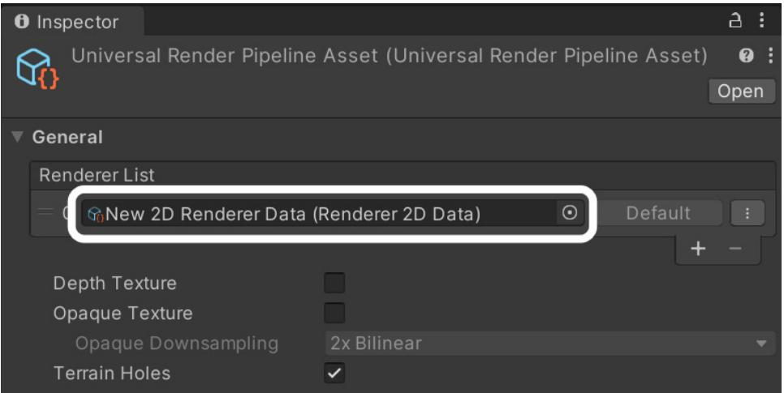

Setting a new renderer in the Inspector view for the URP asset

Now that you have the URP and 2D Renderer Assets lined up, assign the 2D Renderer to the Scriptable Render Pipeline Settings in the project. Open the Project Settings window (**Edit > Projects Settings**), go to the Graphics section, and assign the Pipeline Asset here.

Assign the Universal Render Pipeline Assets in Project Settings

The 2D Renderer is now set up and ready to go. You can also adjust the rendering settings by switching to the Quality category in Project settings. Read more about rendering setting[s](https://docs.unity3d.com/Packages/com.unity.render-pipelines.universal@10.7/manual/Setup.html?utm_source=demand-gen&utm_medium=pdf&utm_campaign=asset-links-gmg-choose-unity-for-2d&utm_content=2d-game-art,-animation-and-lighting-ebook) [here](https://docs.unity3d.com/Packages/com.unity.render-pipelines.universal@10.7/manual/Setup.html?utm_source=demand-gen&utm_medium=pdf&utm_campaign=asset-links-gmg-choose-unity-for-2d&utm_content=2d-game-art,-animation-and-lighting-ebook).

**Note:** If you start a new project in Unity 2021 or later, the 2D template, called 2D (URP), comes with the 2D Renderer already set up, so you won't have to complete these steps.

## **The art for your game**

During the art concept phase, you'll need to make many decisions that will impact the technical side of your project.

In game design, it's a common practice to mock up a screenshot or series of images to show the game's art style, action, and UI. Mockups are a quick way to determine if the concept is viable and get a sense of how the final game would look.

You can also explore multiple art directions with simple thumbnail mockups. These mockups would have simplified shapes and focus more on the overall look, camera angle, object sizes, color palette, and contrast. Using thumbnails is a great way to present different approaches to the team for testing and iteration.

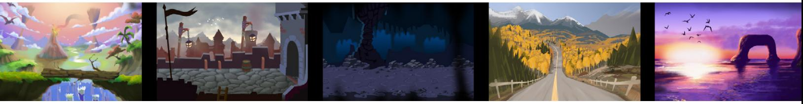

Testing ideas by drawing simple thumbnails

A few things to consider when making a mockup:

- What will be the camera angle and perspective of your game?
- What will be the size of the player character in relation to the screen size of your target platform?
- Does your art style fit the target platform, theme, and audience? For example, will this style appeal to casual gamers, young players, strategy fans, and so on?
- How does the art style fit with the overall graphics approach?
	- If the gameplay requires fast reaction times, then it's a good idea to make elements such as the player character, enemies, and projectiles visible against the background at first glance.
	- Mobile games should be brighter and have higher contrast to be visible in the sunlight and smaller screens.
- What are the size, position, and visibility of GUI elements?

## Technical considerations

There are also important technical questions to consider in the mockup stage. These include:

- **Animation:** What elements will you animate with skeletal animation? Which ones will have frame-by-frame animation or be animated with a shader?
- **Environment:** Will you create it with Tilemap or Sprite Shapes? Or, do you want to place platform sprites in the scene manually? You can paint your mockup to mimic the look of these tools so that you can use the mockups directly in your game.
- **Sorting:** Plan your sprite sorting by grouping mockup layers similarly to how you anticipate the sorting will be done in Unity. It might take some time, but you'll avoid having to sort through potentially thousands of sprites later in production.
- **Lighting:** Will your sprites be lit with lighting and shadows painted onto them or with real-time lighting? One tip is to paint images with no lighting, then add shadows and lights on separate layers in your image-editing software. That way, you can always change the look of the lighting later in production if necessary.

Take the time in this stage to create assets that are as close as possible to what they will look like in the final game. This allows you to move from concept to game production more quickly.

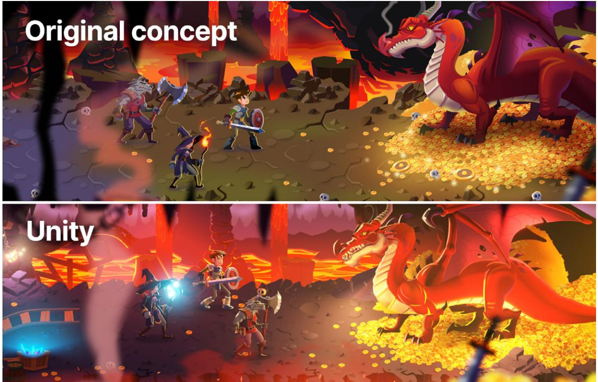

A comparison of the original concept art and the final version of *Dragon Crashers*. You can read about the process for creating the art for the demo in [this blog post](https://blog.unity.com/games/2d-art-creation-in-dragon-crashers).

## **Choose the perspective**

There are different perspectives, or views, available for a 2D game. The umbrella term for perspective options is graphical projection, which refers to a method of casting a 3D world onto a 2D plane. You can see the different perspectives illustrated here.

#### **Parallel projections**

With these types of projections, the lines that are parallel in the 3D world are also parallel when projected onto a 2D surface. Additionally, they have no vanishing points, which means objects are the same size no matter their distance from the camera. This is useful in games because you don't have to scale your assets or draw them in different sizes.

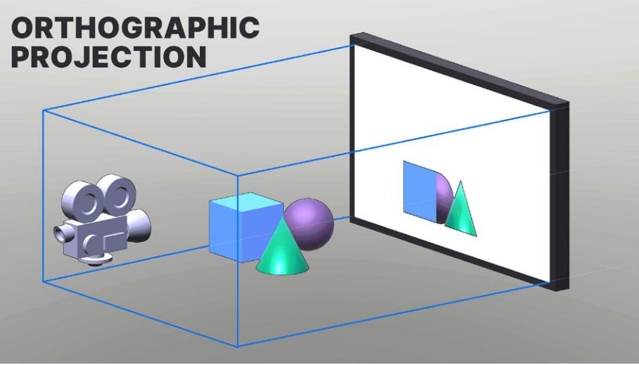

This diagram illustrates how Orthographic projection works. Note that all the projection rays from the camera are parallel to one another and perpendicular to the image plane.

In Orthographic projection, the rays are perpendicular (orthogonal) to the image plane, while in oblique projection, rays intersect with the projection plane at an oblique angle to produce the projected image.

There are two subcategories of Orthographic projection: primary and axonometric.

#### **Primary projection**

In primary projection, there is one dimension perpendicular to the view plane. Since all the lines in this dimension are parallel, it's not visible in the final projection. This kind of projection is the easiest to draw because you need to draw only two dimensions. Games will use one of two types of primary projections, side view or top-down.

Side view is used in platformers, shooters, and *Metroidvania*-style games. The X and Y axis of the 3D world are drawn on the screen with the Z axis omitted. Game artists tend to scale down distant objects visible in the background to provide a sense of depth.

Side view perspective in the 1991 version of *Sonic The Hedgehog™* by Sega

In top-down perspective, the camera aims down, perpendicular to the ground. There aren't many true top-down games, and this perspective is often confused with ¾ or isometric projections. Top-down works best for shooters, but it's not the most interesting view from which to view human characters.

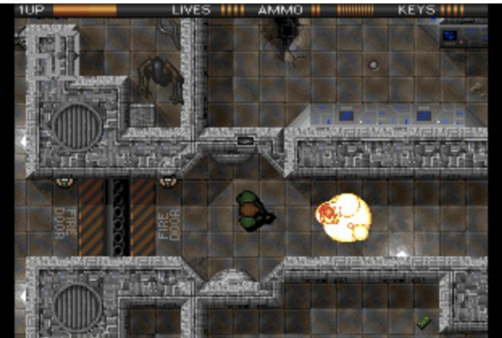

Top-down perspective in *Alien Breed*™ by Team17, released in 1992 for the Amiga

#### **Axonometric projection**

In axonometric projection, the 3D world is rotated around one or more axes to show multiple sides of objects.

There are three main types of axonometric projection.

Isometric, dimetric and trimetric projection

**Isometric projection**: This projection is the most elegant of the three options. The angle between any two of the three coordinate axes is at 120 degrees, and the X and Y lines are each at a 30-degree angle from the horizontal axis.

Most of the old games referred to as isometric are in fact dimetric. Isometric projection angles don't look great in pixel art, which is why there aren't many games with true isometric projection.

**Dimetric projection:** This perspective uses projection where two angles are identical, with the X and Y lines angled at 26.6 degrees. Dimetric has been the most common option because it looked better on the older hardware, where the lines formed a clear 2:1 pixel ratio.

You can use this projection to show more or less of the top surface.

**Trimetric projection:** With this projection, each angle is different.

Trimetric projection in *Crystal Castles* by Atari, released in 1983

#### **Three-quarter (¾) projection**

This projection is often confused with top-down. In 3/4 projection, the camera tilts slightly on the X axis to reveal a partial view of the front of objects and characters.

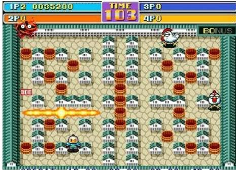

¾ projection in *Bomberman World*, released in 1991 by Hundson Soft

#### **Oblique projection**

In oblique projection, rays intersect with the projection plane at an oblique angle to produce the projected image. The most common oblique projection variant is the cabinet projection, which is often used in beat 'em up games.

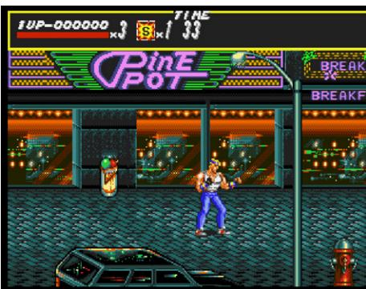

Oblique projection view in *Streets of Rage: Mega Drive*, released in 1991 by Sega

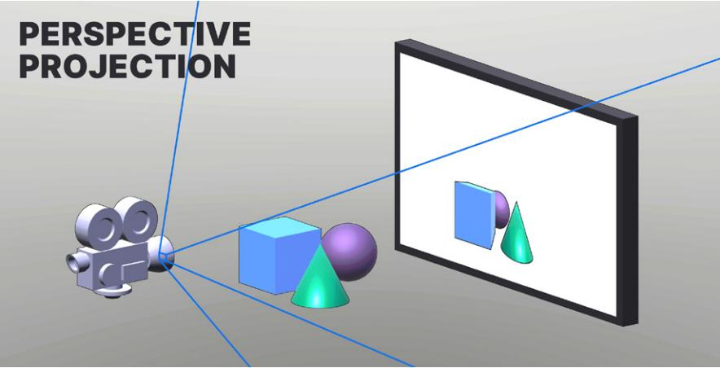

Perspective projection, where the projection rays are coming from the center of the projection camera.

### Perspective projection

Perspective projection uses vanishing points to replicate the way objects farther away appear smaller. A vanishing point is a point on the plane of a perspective drawing where the two-dimensional projections or drawings of mutually parallel lines in three-dimensional space appear to converge.

Depending on the number of vanishing points, you can have one- , two- or three-point perspectives. With the advent of 3D graphics, these projections are less common in 2D games, although they still work well for adventure games or games with static backgrounds.

How do you choose the correct perspective for your project? Does gameplay determine the art style or vice versa? In most cases, developers choose an art style and camera projection based on assumptions made when the idea for their game crystallizes. It will be a decision based on many criteria, including:

- Gameplay and genre
- Target platform
- Scene readability for example choosing a higher camera angle for better visibility of character and enemy units
- Budget top-down and isometric games can require more character animations for multiple angles and more advanced coding
- Target audience

You can also base your game on an art style. For example, imagine a game based on ancient Egyptian hieroglyphs. In this case, the art theme will determine some camera and gameplay rules, namely, that it must be a side-view game with a primary perspective.

If you're new to 2D development or on a tight budget, it's better to choose one of the primary projections: top-down or side-view. They're easier to both draw and code. With only two dimensions visible, you have less to worry about, and it's easier to set up sprite sorting in these views.

Remember, in the end, your projection doesn't need to be 100% accurate and follow all the real-world rules strictly, as is the case in 3D space. The most important thing is that it needs to look good and enhance the gameplay.

## **Resolution of your assets**

Unity's 2D tools have evolved from an editor built initially for 3D games. As a result, there are some unique features. For example, 2D sprites in the Scene aren't bound tightly to screen resolution. Sprites in Unity are textures drawn onto a mesh and are easily scalable. The camera in 2D games is also scalable and can zoom in and out as you want.

Therefore, creating 2D content in Unity requires a different approach to that of working in traditional raster graphics software such as Adobe Photoshop, Affinity Photo by Serif, GIMP, or Krita. In these conventional apps, you have a specific document canvas size available with a set resolution, and all layers are bound to this resolution. There is a 1:1 ratio between the pixel size of each layer and the document pixel size.

When drawing game assets, the pixel size is consistent, and the image looks great because it's always constrained to the pixel grid. However, in Unity, the sprites can have a different resolution. The camera zoom level will also affect the final look.

In Unity, however, screen and asset resolution are independent of each other, so you need to calculate the resolution of your sprites.

You start with your target platforms because the capabilities of the hardware determine the maximum resolution you can set.

For mobile devices, the resolution range is broad, but a safe assumption is 1920x1080, since this will allow you to target devices from low- to high-end.

For PCs, the majority of desktop gamers use full HD (1920x1080), while only 2% have 4K screens, according to a [survey from Steam](https://store.steampowered.com/hwsurvey/Steam-Hardware-Software-Survey-Welcome-to-Steam). For laptops specifically, there are a lot of users who play games at lower resolutions such as 1366x768. You might also want to consider supporting ultra-wide screens, making sure you test screen ratios like 21:9 to ensure the camera won't display unwanted areas of your level.

For consoles, 4K is more common because of the high adoption rate of 4K TVs. The Nintendo Switch offers 1280x720 resolution in handheld mode and up to 1920x1080 when connected to an external screen via HDMI.

As you can see, the resolution range can be very broad. If you are looking to support a particular device, this comprehensive [article](https://en.wikipedia.org/wiki/List_of_common_resolutions) can help you find the proper target resolution.

To target full HD or 4K, keep a couple of best practices in mind (these rules don't apply to pixel art):

- Paint art in the highest resolution for your target devices
- Stick to one resolution for all assets, and scale down later if necessary to support lower-end devices

Don't scale up raster art because it can result in pixelation and blurriness, lowering visual quality. Always start from the highest resolution supported, then scale the art's resolution down when exporting from a graphics application. You'll find out more on how to do this in the section on [working between DCC](#page-23-0)  [tools and Unity,](#page-23-0) or you can try using [Variant Sprite Atlas](#page-21-0) scaling.

One helpful trick is drawing your art at twice the size you need, then scaling it to 50% when you export to Unity. This technique will make your sprites look polished and crisp, and brush lines won't look so shaky. Don't overdo it on the details, since the art will be scaled down. This is a good trick for hiding the small imperfections resulting from hand-drawn art. Of course, if you want a handdrawn visual style for your game, then don't try this.

One you've chosen the resolution, test the look of your art in the Game view to see how it will appear on target devices.

To keep it simple, calculate sprite resolution in Orthographic view instead of perspective. Set their scale to 1,1,1 and Z depth to 0 for easy visualization.

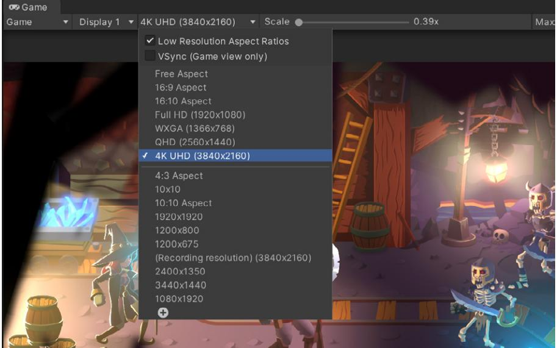

You can easily preview how the game looks at different ratios and resolutions in Game view.

Use the Unity grid and units to maintain consistent placement and appearance of your sprites, as well as to calculate camera zoom and object sizes.

A Unity unit is visualized by the grid in the Scene view. Assume that 1 Unity unit is equal to 1 meter. Set your base sizes first, and keep them consistent across your game.

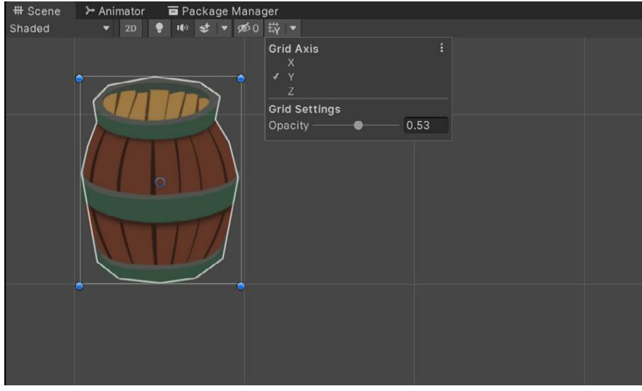

Unity's Grid in the Scene View

Start with the size of your player character. Keep the height of the player character between 0.5 and 2 units. If you're using [Tilemap,](https://docs.unity3d.com/Manual/class-Tilemap.html?utm_source=demand-gen&utm_medium=pdf&utm_campaign=asset-links-gmg-choose-unity-for-2d&utm_content=2d-game-art,-animation-and-lighting-ebook) set the tile size to 1 unit.

Characters and objects that are too small or large compared to other visual elements in a game will lead to strange transform numbers and issues with physics calculations.

Once you've established the sizes of your base objects in the main scene (Player character, enemies, collectibles, level hazards), choose your zoom level by setting the size property of the orthographic camera. After that, check the camera size value. When you multiply this value by 2, you'll get the camera vertical size in Unity units.

| ▼ ■ √ Camera    |              |      | 8 花 |  |   |  |
|-----------------|--------------|------|-----|--|---|--|
| Render Type     | Base         |      |     |  | > |  |
| ▼ Projection    |              |      |     |  |   |  |
| Projection      | Orthographic |      |     |  | D |  |
| Size            | 5            |      |     |  |   |  |
| Clipping Planes | Near         | 0.3  |     |  |   |  |
|                 | Far          | 1000 |     |  |   |  |
|                 |              |      |     |  |   |  |

The size of the orthographic camera is expressed in units that express the vertical size of the camera from the center to the top.

If the camera size equals 5, its height is equal to 10 units. For example, if you target 4K resolution, then the screen (or camera) height is 2160 pixels. With a simple calculation, you can determine how many pixels per unit (PPU) your art needs:

#### **2160 : 10 = 216 Max Vertical Resolution : (Orthographic Camera Size \*2) = Sprites PPU**

So every sprite in your game needs to have around 216 PPU to look good at a native 4K resolution.

That's a simple example. If you want your camera to zoom in and out, you'll need to account for that. If you set the maximum zoom percentage to size 3 in Orthographic view, the PPU needs to be 360 (2160 : (3 \*2)).

| O Inspector                                             |                    |  a         |
|---------------------------------------------------------|--------------------|---------------|
| (48) 1999 Sprite_Barrel (Texture 2D) Import Settings |                    | �花 :          |
| 1773                                                    |                    | Open          |
| Texture Type                                            | Sprite (2D and UI) | V             |
| Texture Shape                                           | 2D                 | D             |
| Sprite Mode                                             | Single             | V             |
| Packing Tag                                             |                    |               |
| Pixels Per Unit                                         | 216                |               |
| Mesh Type                                               | Tight              |               |
| Extrude Edges                                           |                    |               |
| Pivot                                                   | Center             | D             |
| Generate Physics Shape                                  | V                  |               |
|                                                         |                    | Sprite Editor |

Setting the PPU for a sprite

If you're using skeletal animation, set the resolution of sprites slightly higher than the suggested PPU. Doing this is necessary because the meshes of the skeleton are rotated, stretched, and warped, sometimes to extremes, which can produce results that look bad. Aim for a lower resolution when the camera is zoomed in.

**Tip:** When you set the PPU value of your game, apply a grid in your graphics software for reference. This is useful when using Tilemap because you will have the tile size in pixels and can to snap to a grid.

Setting the grid in Affinity Photo to match your game's PPU

You don't have to be strict with these numbers. Often, you can save memory by using a slightly lower sprite resolution than suggested. Cut out elements that aren't essential, such as background sprites.

Also, test your game on devices to check how it looks. In many cases, the benefits of using high-resolution assets aren't apparent. Instead, you can allocate this drawing time and device memory to other, more essential game elements like the main characters, visual effects, or UI. On mobile devices, game size is crucial, so check which assets can be scaled down and keep memory limitations in mind. Read more about 2D asset resolution in this [blog post.](https://blog.unity.com/technology/choosing-the-resolution-of-your-2d-art-assets?utm_source=demand-gen&utm_medium=pdf&utm_campaign=asset-links-gmg-choose-unity-for-2d&utm_content=2d-game-art,-animation-and-lighting-ebook)

#### Sprite Atlas

The Unity [Sprite Atlas](https://docs.unity3d.com/Manual/class-SpriteAtlas.html?utm_source=demand-gen&utm_medium=pdf&utm_campaign=asset-links-gmg-choose-unity-for-2d&utm_content=2d-game-art,-animation-and-lighting-ebook) feature has two main advantages.

**Pack multiple sprites into one texture to reduce draw calls:** Each mesh with different materials or textures is drawn on the screen separately. Every sprite (which is a mesh) you put on the screen adds to the rendering time and can reduce a game's framerate.

Use Sprite Atlas to consolidate several Textures into a single, combined Texture. Unity can then call this single Texture to issue a single draw call instead of multiple ones. The packed Textures are accessed all at once, resulting in smaller performance overhead.

**Scale down sprites depending on device type:** In Unity, it's efficient to scale an entire Sprite Atlas instead of individual sprites and assign the scaled atlas to different devices.

To build a new Sprite Atlas, right-click in the Project window (or select the Assets menu in the toolbar), and choose **Create > 2D > Sprite Atlas**. Be sure to give it a descriptive name. Then, in the Objects for Packing option, select the sprites you want to include, or include the entire folder. The Include in Build option should be checked by default. You now have your first Sprite Atlas.

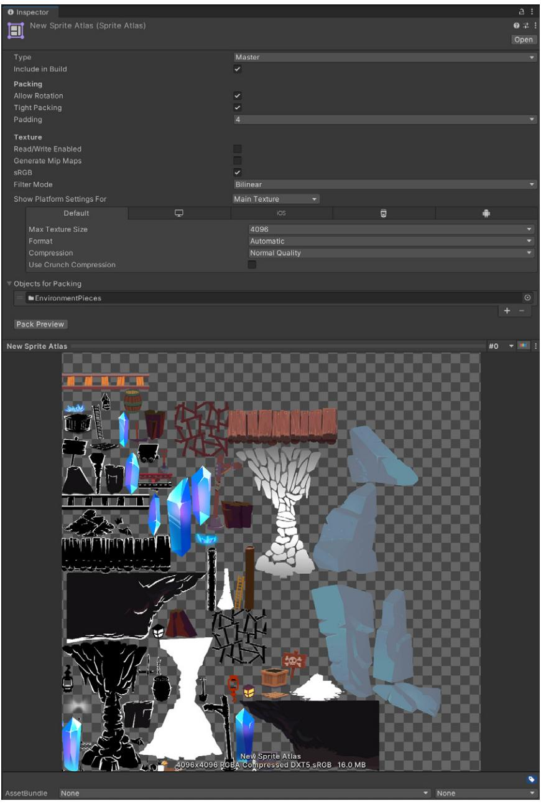

A Sprite Atlas in Unity

### Variant Sprite Atlas

Use a [Variant Sprite Atlas](https://docs.unity3d.com/Manual/MasterVariantAtlases.html?utm_source=demand-gen&utm_medium=pdf&utm_campaign=asset-links-gmg-choose-unity-for-2d&utm_content=2d-game-art,-animation-and-lighting-ebook) to scale down sprites for specific devices. Create a Master Sprite Atlas as above, then change its Type to Variant in the Inspector (see the image below).

A Variant Sprite Atlas doesn't contain sprites itself. It relies on a Master Sprite Atlas, which you can choose in the Master Atlas field. Scale this atlas and all its sprites by choosing a value in the Scale Value field, between the range of 0.1 to 1.

| 0 Inspector                     |                   | വ    |
|---------------------------------|-------------------|------|
| New Sprite Atlas (Sprite Atlas) |                   | � 花  |
|                                 |                   | Open |
| Type                            | Variant           | œ    |
| Master Atlas                    | 到Environment      | O    |
| Include in Build                | >                 |      |
| Variant                         |                   |      |
| Scale                           | 0.5               |      |
| Texture                         |                   |      |
| Read/Write Enabled              |                   |      |
| Generate Mip Maps               |                   |      |
| sRGB                            | V                 |      |
| Filter Mode                     | Bilinear          |      |
| Show Platform Settings For      | Main Texture > |      |
| Default F                    | 阅 iOS          | டு   |
| Format                          | Automatic         | >    |
| Compression                     | Normal Quality    | >    |
| Use Crunch Compression          |                   |      |
| Pack Preview                    |                   |      |

Setting up a Variant Sprite Atlas

In a project that includes both a Master and a Variant Sprite Atlas, if both have the option Include in Build checked, the Texture used by mutual Sprites can come from either Sprite Atlas (refer to Scenario 3 in the [Resolving different](https://docs.unity3d.com/Manual/SpriteAtlasScenarios.html?utm_source=demand-gen&utm_medium=pdf&utm_campaign=asset-links-gmg-choose-unity-for-2d&utm_content=2d-game-art,-animation-and-lighting-ebook)  [Sprite Atlas scenarios](https://docs.unity3d.com/Manual/SpriteAtlasScenarios.html?utm_source=demand-gen&utm_medium=pdf&utm_campaign=asset-links-gmg-choose-unity-for-2d&utm_content=2d-game-art,-animation-and-lighting-ebook) section of Unity documentation).

To automatically load Sprite Textures from the Variant Atlas instead of the Master Atlas, enable Include in Build for the Variant Atlas only, and disable it for the Master Atlas. The build then automatically loads the Variant Sprite Atlas instead of the Master Atlas at runtime.

## Drawing in vector apps

Art created in vector-based software such as Adobe Illustrator or Affinity Designer by Serif is not constrained by resolution. This is a significant advantage because you can change the size of your art assets at any time, without worrying about incorrect resolution settings.

You will still need to export your vector-based art to Unity as a PNG file. It's the same export workflow as that for raster or pixel art.

Vector art made in Affinity Designer – the left side of this illustration shows the vector view in the app, and the right shows the pixel view after export.

## Working between DCC tools and Unity

You do a great deal of work on your art before moving it into Unity. You work hard to make all the characters, elements, props, and background art as beautiful and true to your vision as can be – so it's only natural that you want to get it all into Unity as quickly as possible.

Avoid exporting each layer one-by-one as a PNG file because this will take a long time. Instead, follow these tips for exporting your game sprites efficiently from different graphics software.

#### **From Adobe Photoshop**

Export and save layers as individual files using a variety of formats, including PSD, BMP, JPEG, PDF, Targa, and TIFF. Layers are automatically named as they are saved – set options to control the generation of names.

To export layers as files, do the following:

- 
- 1. From the menu, select **File > Export > Export Layers To Files**.

Getting ready to export from Adobe Photoshop

2. Under Destination, in the Export Layers To Files dialog box, click Browse to select a destination for the exported files. By default, the generated files are saved in the sample folder as the source file.

| Export Layers To Files                                                  |        |
|-------------------------------------------------------------------------|--------|
| Destination:                                                            |        |
| C:\Projects Browse                                                   | Run    |
| File Name Prefix:                                                       | Cancel |
| export_                                                                 |        |
| Visible Layers Only                                                     |        |
| File Type: PNG-24 >                                               |        |
| Include ICC Profile                                                     |        |
| PNG-24 Options:                                                         |        |
| Transparency Interlaced V Trim Layers                                   |        |
| Please specify the format and location for saving each layer as a file. |        |
|                                                                         |        |

The Export Layers to Files dialog box

- 3. If you want your sprites to have a common file name prefix, enter it in the text field–for example, tile\_wood01.png, tile\_bricks01.png, and so on.
- 4. To export the layers only visible in the Layers panel, select Visible Layers Only.
- 5. Choose PNG-24 as a File Type. You don't need to include an ICC profile, so uncheck that.
- 6. Check the Transparency and Trim Layers options in the PNG options section, and uncheck Interlaced.
- 7. Click Run, and after a short wait, the sprites should export to the folder you specified.
- 8. Use these steps to export a limited amount of layers quickly. Note that all layers are exported separately. This method does not take layer groups into account, so if you have a character or object that consists of multiple layers, merge them before exporting.

Let's look at [how](https://helpx.adobe.com/photoshop/using/generate-assets-layers.html) to export sprites with multiple layers from Photoshop. It requires more setup, but this approach allows greater control over the exported images.

To start, you'll need the names of the layers or layer groups from which you want to generate sprites. For example, the image below shows a sprite of a barrel consisting of a normal map and mask map. Each sprite is in a separate folder that has been saved as a PNG file.

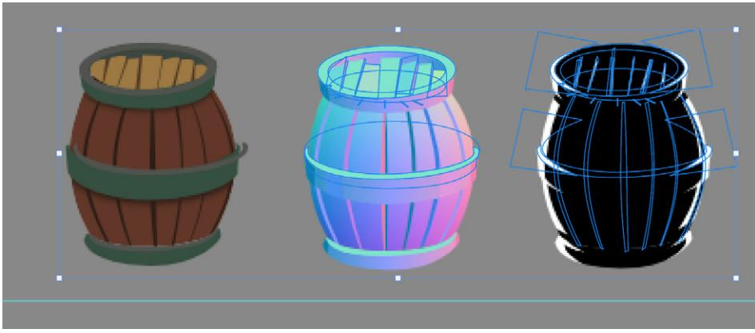

A sprite with both a normal map and a mask map

Select **File > Generate > Image Assets** from the menu. Photoshop will create a folder as a PSD file and export all the layers or groups saved as PNG files. If you haven't saved a PSD file yet, it will create a folder on your desktop.

A benefit of this method is that if you change any layer or folder which is marked for export, the image asset will be exported in the background automatically.

Specify the folder for every sprite by adding its name and a slash before the layer name. In this case, to group all three barrel sprites into one folder, you would add "barrel/" before the layer names.

Exporting multiple layers of the same sprite from Photoshop

To change the sprite's size, add the specified dimensions or scale in percent before the layer name, for example, "50% barrel/barrel.png" or "80 x 160 barrel/ barrel.png". When specifying dimensions, Photoshop will use pixels as the default unit.

#### **Exporting from Affinity Photo or Affinity Designer**

Both Affinity Photo and Affinity Designer provide a dedicated mode for exporting, called [Export Persona](https://www.creativebloq.com/how-to/affinity-designer-how-to-use-the-export-persona). Let's go through the steps for using it.

Switch to Export Persona by clicking its icon in the top left of the application toolbar, as seen in the image below.

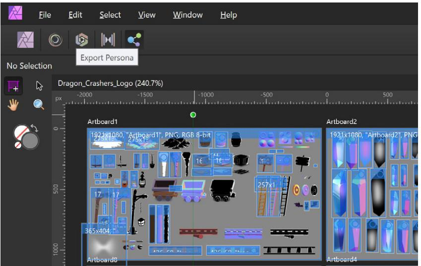

Export Persona in Affinity Photo

To export a sprite, create a slice from a layer or layer group. Switch to the Layers tab on the right, select a layer to export, and click the Create Slice button.

Switch to the Slices tab, select the slices to export, and be sure that the Export preset is set to Single PNG for all the slices, as seen in the following image.

Set the Export present to Single PNG in Affinity Photo

Click Export Slice, and choose a destination folder when prompted. You can save time by exporting the sprites directly to the Assets folder in your Unity project.

After choosing a destination folder, the Continuous option becomes available, which allows you to export slices whenever you change a layer.

To have better control over the exported sprites, set the export options manually for every splice by clicking the arrow icon to the left of the slice name.

Setting export options for sprites

Choose a subfolder for your sprite in the Path section. In this example, all of the barrel sprites are in the "barrel" subfolder. PNG is the file format, and resolution scaling is set at 1x, which means no scaling, so the sprites are exported at 100% their size. You can also output multiple sizes at once by clicking the "+" button.

For multiplatform games, choose additional sizes for your sprites that can be used when building your project for other devices. For example, choose 2x for scaling to get "Retina" sprites.

Another "+" button on the bottom of the expanded window allows you to add additional file formats if you want to export JPG files alongside the PNG sprites.

| II Export Options , x            | Export Layers - Krita | ×                                     |
|-------------------------------------|-----------------------|---------------------------------------|
| Mode: Selection Defaults Preset: | Documents:            | C:/Projects/normalmap_v6.psd          |
| File format: PNG                 |                       |                                       |
| Pixel format: Use document format   |                       | Refresh                               |
| Resampler: Bilinear Matte:    | Initial directory:    | C:/Projects/Export                    |
|                                     | Export options:       | Export filter layers                  |
| ICC Profile:                        |                       | V Export in batchmode                 |
| Embed ICC profile                   |                       | V Group as layer                   |
| Include bleed                       |                       | V Ignore invisible layers             |
| Palettised                          |                       | V Adjust export size to layer content |
| Palette:                            | Export size:          | - dpi: 72 - 1080 1920           |
| Colours:                            | Images extensions:    | PNG A                              |
| Embed metadata                      |                       | OK Cancel                          |

Export Options window in Affinity apps Exporting sprites from Krita

#### **Exporting from Krita**

Be sure to save your document, and select **Tools > Scripts > Export Layers.** In the pop-up window, select the Initial directory. This will be where sprite files are exported.

In Export options, check the Adjust export size option to layer content. This will crop layers to their size, leaving no empty pixels padding. There are a couple of optional settings:

- Group as layer: This option will export groups rather than individual layers, a good choice for when your sprites consist of multiple layers. Note that the exporter will only check for the highest groups in the hierarchy, so your sprites cannot be grouped in another group.
- Ignore invisible layers: This is handy when you want to exclude some sprites from exporting by turning off their visibility.

Choose PNG as Image extensions, click OK, and the sprites will be exported to the your selected folder.

## Import Photoshop PSD files into Unity

Exporting to PNG file format is the most convenient workflow for sprites, but you can also import PSD files directly into Unity. By default, this will flatten the PSD layers into one image.

This method is convenient to use for background art sprites. Edit and paint layers, and, when you save the file, the changes will be instantly visible in the Editor. Then you will have your PSD source file directly in the Unity project, and the file can be included in source control.

Unity's [2D PSD Importer](https://docs.unity3d.com/Packages/com.unity.2d.psdimporter@4.1/manual/index.html?utm_source=demand-gen&utm_medium=pdf&utm_campaign=asset-links-gmg-choose-unity-for-2d&utm_content=2d-game-art,-animation-and-lighting-ebook) package gives you the option of importing layers as separate sprites. This package was designed for use with 2D animation, but you can use it to import multiple regular sprites contained in one PSD file. You can also make frame-by-frame animations. Find more on how to use this package in the [2D Animation](#page-53-0) section or [this](https://blog.unity.com/technology/how-to-speed-up-2d-art-workflows-with-2d-psd-importer?utm_source=demand-gen&utm_medium=pdf&utm_campaign=asset-links-gmg-choose-unity-for-2d&utm_content=2d-game-art,-animation-and-lighting-ebook) blog post.

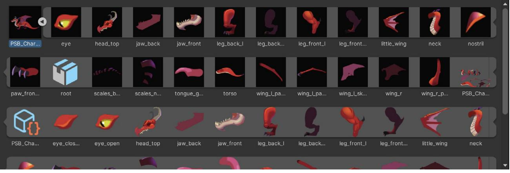

A multi-layer Photoshop file imported in Unity

## **Level design**

There are many ways to prototype levels, so choose the methods that suit your creative style and workflow best.

Sketching out ideas on paper will probably always be popular because it's simple, direct, portable, and cheap. In the early days, it was also a necessity to communicate the placement of tiles and game elements to the team.

Modern games like *Hollow Knight* use paper for level design and art concept. See the process in this Rockpapershotgun [article](https://www.rockpapershotgun.com/hollow-knight-concept-art) 

This was the best way to design levels for many years, and it's still very useful. However, now you can test ideas earlier and more vigorously by sketching them out in Unity. Let's look at the tools available.

## White boxing

White boxing, a well-known term from 3D level design, involves placing plain white cubes to test out level design ideas quickly. The reason designers white box is to map out ideas for game flow without any distracting details.

This method can also be applied to 2D graphics by using 2D geometric figures or other prototyping tools.

In white boxing, the focus should be on only the things the player will interact with, such as the ground, enemies, level hazards, and pickups. All of these things can be made from the simplest forms, then color-coded to distinguish between them more easily. For example, enemies and other hazards could be colored red, pickups green, switches blue, and so on.

Start with the collision/interaction layer, which includes the ground, walls, and platforms that the player jumps on.

#### **White boxing with basic sprites**

Start with the default 2D assets available in Unity, which come in simple geometric shapes.

Right-click in the Project window (or click on the Assets menu in the toolbar), and choose **Assets > Create > 2D > Sprites.** All of the shapes come with predefined collision shapes, so you only need to add a Polygon Collider 2D component to a sprite shape to make it be affected by gravity or collisions.

All the sprites available in the Sprite Creator

The selected sprites will be created in the folder that's currently opened in the Project window.

Use different shapes for different purposes. For example, use a capsule for your player, circles for pickups, hexagons for enemies, and squares for the ground or walls. Tint each category of sprite a different color with the color property available in the Sprite Renderer.

For sprites to use 2D Physics collisions, add a corresponding Collider 2D component that will match the object's overall shape along with a 2D Rigidbody. Choose the Dynamic body type for the Rigidbody to react to gravity, forces, or collision.

For precise placement, snap the sprites to the grid by holding down Ctrl as you move them. This will move them in 0.25-unit increments.

## 2D Sprite Shape

[2D Sprite Shape](https://docs.unity3d.com/Packages/com.unity.2d.spriteshape@5.1/manual/index.html?utm_source=demand-gen&utm_medium=pdf&utm_campaign=asset-links-gmg-choose-unity-for-2d&utm_content=2d-game-art,-animation-and-lighting-ebook) is a tool that allows you to create paths and tile sprites along them. These paths work similarly to the well-known pen tool used in graphics software. They are Bézier curves that can be edited directly in the scene and optionally closed and filled with tiling texture.

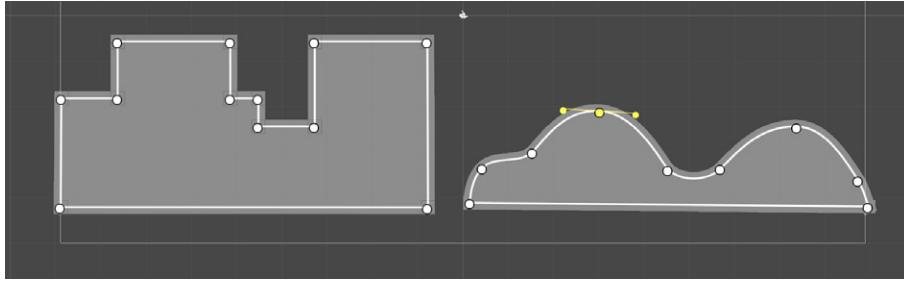

Linear and Continuous Sprite Shape objects

Sprite Shape is a handy prototyping feature in Unity because it makes it efficient to create and edit new sprite shapes.

If you choose to create your 2D project with the 2D Template, then Sprite Shape is installed by default. Otherwise, you can install it using the Package Manager.

|               | File Edit Assets GameObject Component Window Help |               |                      |         |
|---------------|---------------------------------------------------|---------------|----------------------|---------|
| 3 ← → 0 | Create Empty                                      | Ctrl+Shift+N  | 书                    |         |
| E Hierarchy   | Create Empty Child                                | Alt+Shift+N   | a                 | # Scene |
| + ▼           | Create Empty Parent                               | Ctrl+Shift+G  |                      | Shaded  |
| V & Place     | 2D Object                                         | >             | Sprites              | >       |
| Mai           | 3D Object                                         | >             | Physics              | >       |
| G Squ         | Effects                                           | >             | Tilemap              | >       |
| Circ Cap   | Light                                             | >             | Sprite Shape         | >       |
| Sisor         | Audio                                             | >             | Pixel Perfect Camera |         |
| CHex          | Video                                             | >             | Sprite Mask          |         |
| GHex 89-5  | UI                                                | >             |                      |         |
| GGIO          | Volume                                            | >             |                      |         |
| Clos          | Camera                                            |               |                      |         |
| Clo           | Center On Children                                |               |                      |         |
|               | Make Parent                                       |               |                      |         |
|               | Clear Parent                                      |               |                      |         |
|               | Set as first sibling                              | Ctr +=        |                      |         |
|               | Set as last sibling                               | Ctr +-        |                      |         |
|               | Move To View                                      | Ctr + Alt + F |                      |         |

To make a new Sprite Shape, click on the GameObject menu, **2D Object > Sprite Shape,** and select either Open or Closed Shape.

Creating a Sprite Shape

To modify the Sprite Shape, select it, then click the Edit button in the Inspector.

| T & Sprite Shape Controller (Script) |                                                                                                                                                                               | 9 2 |   |
|--------------------------------------|-------------------------------------------------------------------------------------------------------------------------------------------------------------------------------|--------|---|
| Profile                              | Sprite Shape Profile (Sprite Shape) 8 Edit Spline                                                                                                                       |        | O |
| Tangent Mode                         | 8 8 8                                                                                                                                                                   |        |   |
| Position                             | Y 2.78 X 10.76                                                                                                                                                             |        |   |
| Height                               |                                                                                                                                                                               |        |   |
| Corner                               | Automatic                                                                                                                                                                     |        | œ |
| Sprite Variant                       | O                                                                                                                                                                             |        |   |
| Snapping                             |                                                                                                                                                                               |        |   |
| Spline                               |                                                                                                                                                                               |        |   |
| Detail                               | High Quality                                                                                                                                                                  |        | œ |
| Is Open Ended                        | ﺍﻟﻤﺴﺎﻋﺪ ﺍﻟﻤﺴﺘﻮﻯ ﺍﻟﻤﺴﺘﻮﻯ ﺍﻟﻤﺴﺘﻮﻯ ﺍﻟﻤﺴﺘﻮﻯ ﺍﻟﻤﺴﺘﻮﻯ ﺍﻟﻤﺴﺘﻮﻯ ﺍﻟﻤﺴﺘﻮﻯ ﺍﻟﻤﺴﺘﻮﻯ ﺍﻟﻤﺴﺘﻮﻯ ﺍﻟﻤﺴﺘﻮﻯ ﺍﻟﻤﺴﺘﻮﻯ ﺍﻟﻤﺴﺘﻮﻯ ﺍﻟﻤﺴﺘﻮﻯ ﺍﻟﻤﺴﺘﻮﻯ ﺍﻟﻤﺴﺘﻮﻯ ﺍﻟﻤﺴﺘﻮﻯ ﺍﻟﻤﺴﺘﻮﻯ ﺍﻟﻤﺴﺘﻮﻯ ﺍﻟﻤﺴﺘﻮﻯ ﺍﻟﻤﺴﺘﻮﻯ ﺍﻟﻤﺴﺘ |        |   |
| Adaptive UV                          | < < <                                                                                                                                                                         |        |   |
| Optimize Geometry                    |                                                                                                                                                                               |        |   |
| Enable Tangents                      |                                                                                                                                                                               |        |   |
| Cache Geometry                       |                                                                                                                                                                               |        |   |
| Corner Threshold                     |                                                                                                                                                                               | 30     |   |
| Fill                                 |                                                                                                                                                                               |        |   |
| Fill Tessellation (C# Job)           |                                                                                                                                                                               |        |   |
| Stretch UV                           |                                                                                                                                                                               |        |   |
| Pixel Per Unit                       | 256                                                                                                                                                                           |        |   |
| Worldspace UV                        |                                                                                                                                                                               |        |   |

Modifying a Sprite Shape in the Inspector window

Left-click on any part of the Sprite Shape to add or delete points with the delete key. By selecting a point, you can change its mode by selecting one of the three Tangent Mode buttons:

- **Linear:** Creates no curve, with straight lines on both sides of the points
- **Continuous:** Creates a curve around the point with handles that face opposite directions
- **Broken:** Creates a curve around the point with handles that can move independently

You can also select how the corners around the points look. The snapping tool is another useful option that snaps the points to the grid.

Add a Polygon Collider 2D Component for physics. The default properties should be sufficient for prototyping purposes.

| T & Sprite Shape Controller (Script) |                                     | 2     | 2 | : |
|--------------------------------------|-------------------------------------|-------|---|---|
| Profile                              | Sprite Shape Profile (Sprite Shape) |       |   | O |
|                                      | r. Edit Spline                   |       |   |   |
| Spline                               |                                     |       |   |   |
| Detail                               | High Quality                        |       |   |   |
| Is Open Ended                        | 1-1                                 |       |   |   |
| Adaptive UV                          | 1                                   |       |   |   |
| Optimize Geometry                    | V                                   |       |   |   |
| Enable Tangents                      | >                                   |       |   |   |
| Corner Threshold                     |                                     | 30    |   |   |
| Fill                                 |                                     |       |   |   |
| Fill Tessellation (C# Job)           |                                     |       |   |   |
| Stretch UV                           |                                     |       |   |   |
| Pixel Per Unit                       | 256                                 |       |   |   |
| Worldspace UV                        |                                     |       |   |   |
| Collider                             |                                     |       |   |   |
| Update Collider                      | >                                   |       |   |   |
| Offset                               |                                     | 0 0.5 |   |   |
| Optimize Collider                    | V                                   |       |   |   |
| Detail                               | High Quality                        |       |   |   |
| ▼ 4 + Polygon Collider 2D            |                                     | 9 花   |   | : |
| Edit Collider                        | 80                                  |       |   |   |
| Material                             | None (Physics Material 2D)          |       |   | 0 |
| Is Trigger                           |                                     |       |   |   |
| Used By Effector                     |                                     |       |   |   |
| Used By Composite                    | 000                                 |       |   |   |
| Auto Tiling                          |                                     |       |   |   |
| Offset Points                     | × 0 Y O                          |       |   |   |
| ▶ Info                               |                                     |       |   |   |
|                                      |                                     |       |   |   |

Adding a Polygon Collider 2D Component

By following these steps, you can create Sprite Shapes that can interact with one another and be easily modified through their Inspectors.

#### Tilemaps

The [Tilemap](https://docs.unity3d.com/Manual/class-Tilemap.html?utm_source=demand-gen&utm_medium=pdf&utm_campaign=asset-links-gmg-choose-unity-for-2d&utm_content=2d-game-art,-animation-and-lighting-ebook) feature is great for quick prototyping. Tilemap offers a way to create a game world using small sprites, called tiles, placed on a grid. Instead of laying out a game world that is one big image, you can split it into brick-like chunks that are repeated through a whole level.

Tilemaps can help save on memory and CPU power because tiles that are not visible on the screen can be disabled. A brush tool makes it efficient to paint them on a grid, and they can also be scripted to use some painting rules. They come with automatic collision generation for efficient testing and editing.

A visual representation of the background and sprite tiles of a retro 8-bit game that are loaded into VRAM. The console cleanly keeps backgrounds and sprites loaded on separate pages.

The 2D Tilemap Editor is installed with the 2D Project Template or from the Package Manager.

Installing the [2D Tilemap Extras](https://docs.unity3d.com/Packages/com.unity.2d.tilemap.extras@1.8/manual/index.html?utm_source=demand-gen&utm_medium=pdf&utm_campaign=asset-links-gmg-choose-unity-for-2d&utm_content=2d-game-art,-animation-and-lighting-ebook) package provides reusable 2D and Tilemap editor scripts that you can use for your own projects, and these can also serve as a base for creating custom brushes and tiles. Get the package by enabling Preview Packages in Project Settings (**Edit > Project Settings**). In the Package Manager, turn on the Enable Preview Packages option located in the Advanced Settings box.

View Preview Packages in the Package Manager

Install samples, along with the 2D Tilemap Extras to see examples using the scripts that come with the package. You can read more about the [Scriptable Brushes](https://docs.unity3d.com/Packages/com.unity.2d.tilemap.extras@1.8/manual/Brushes.html?utm_source=demand-gen&utm_medium=pdf&utm_campaign=asset-links-gmg-choose-unity-for-2d&utm_content=2d-game-art,-animation-and-lighting-ebook) and [Scriptable Tiles](https://docs.unity3d.com/Packages/com.unity.2d.tilemap.extras@1.8/manual/Tiles.html?utm_source=demand-gen&utm_medium=pdf&utm_campaign=asset-links-gmg-choose-unity-for-2d&utm_content=2d-game-art,-animation-and-lighting-ebook) included in the package in the Unity documentation.

Once both packages are installed, open the Tile Palette window via **Window > 2D > Tile Palette**.

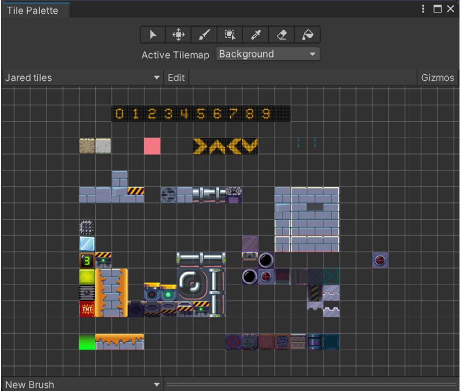

This window will hold all the tiles and tools to help you paint or edit Tilemaps.

Tile Palette window with a palette loaded

Create a new Palette by clicking the Create New Palette button. A dropdown window with options will appear. Give the palette a name, set its options, click Create, and save it to a selected folder.

| Create New Palette |             | >     | Edit   |     |   |  |
|--------------------|-------------|-------|--------|-----|---|--|
| Create New Palette |             |       |        |     |   |  |
| Name               | New Palette |       |        |     |   |  |
| Grid               | Rectangle   |       |        |     | V |  |
| Cell Size          | Automatic   |       |        |     | > |  |
|                    | × 1         | Y 1   |        | ZO  |   |  |
| Sort Mode          | Default     |       |        |     |   |  |
| Sort Axis          | X 0         | YO YO |        | Z 1 |   |  |
| Cancel             |             |       | Create |     |   |  |
|                    |             |       |        |     |   |  |
|                    |             |       |        |     |   |  |
|                    |             |       |        |     |   |  |

Creating a new palette

Now, add tiles to the palette. Drag a sprite, texture, or Tile Asset into the Palette window. Use one of the simple Sprite Shapes you created earlier, and place it in the empty part of the window. Choose a file in which to create the asset. You should now see your sprite in the grid of the palette.

Dragging a sprite into a palette creates a new tile.

Now, create a Tilemap to paint the tiles. Click the menu item **Gameobject > 2D Object > Tilemap > Rectangular**.

Creating a Tilemap

You have created a Grid and a Tilemap within it. Rename the Tilemap to something more descriptive. The Grid can hold multiple Tilemaps, and it's possible to have multiple Grids per scene, for example, with different cell sizes. For now, leave all the default settings of the Grid component.

The Tilemap GameObject has two components: Tilemap and Tilemap Renderer. Leave the settings as they are. If you need to, change the Sorting Layer settings to fit your layer structure.

| Tilemap V                |                      |       |        | 北 ? |    |
|-----------------------------|----------------------|-------|--------|--------|----|
| Animation Frame Rate        | 1                    |       |        |        |    |
| Color                       |                      |       |        |        | 00 |
| Tile Anchor                 | × 0.5                | Y 0.5 | Z O    |        |    |
| Orientation                 | XY                   |       |        |        | >  |
| Offset                      | X 0                  | Y O   | Z 0 |        |    |
| Rotation                    | X 0                  | Y O   | Z 0 |        |    |
| Scale                       | × 1                  | Y 1   | Z 1    |        |    |
| J / Tilemap Renderer >   |                      |       |        | 2 2 |    |
| Sort Order                  | Bottom Left          |       |        |        | D  |
| Mode                        | Chunk                |       |        |        | œ  |
| Detect Chunk Culling Bounds | Auto                 |       |        |        | D  |
| Chunk Culling Bounds        | X 0                  | Y O   | ZO     |        |    |
| Mask Interaction            | None                 |       |        |        | >  |
| Material                    | · Sprite-Lit-Default |       |        |        | O  |
| Additional Settings >    |                      |       |        |        |    |
| Sorting Layer               | Default              |       |        |        | œ  |
| Order in Layer              | 0                    |       |        |        |    |
| Rendering Layer Mask        | Layer1               |       |        |        | D  |

Tilemap and Tilemap Renderer components

With your Tilemap and Tile on a palette, you are ready to start painting. Click on the brush tool in the Palette window toolbar, and select a tile to paint.

Tilemap with painted placeholder tiles

Next, you can create a prototype for a level. Add a Tilemap Collider 2D to the Tilemap for physics. This will add colliders to each of the tiles based on the collider type set in the Tile Asset.

Add a Composite Collider 2D to combine the colliders into one, resulting in smoother collision behavior with geometry set as Outline. The tiles will behave like a continuous terrain rather than as individual tiles. This setup also brings a slight performance boost. However, if you plan for your game to add or remove tiles at runtime, you might want to keep a collider on each tile.

Remember to check the Used by Composite option on the Collider 2D component, and set the Rigidbody 2D Type to static so it doesn't fall.

| C Rigidbody 2D 2          |                            | ?) | 14 |   |  |
|---------------------------------|----------------------------|----|----|---|--|
| Body Type                       | Static                     |    |    | > |  |
| Material                        | None (Physics Material 2D) |    |    | 0 |  |
| Simulated                       | >                          |    |    |   |  |
| Info A                       |                            |    |    |   |  |
| ▼ Tilemap Collider 2D           |                            | 2  | 20 |   |  |
| Max Tile Change Count 1000      |                            |    |    |   |  |
| Extrusion Factor                | 1e-05                      |    |    |   |  |
| Used By Composite               | V                          |    |    |   |  |
| Offset                          | X 0 Y O                 |    |    |   |  |
| Info A                       |                            |    |    |   |  |
| O D Composite Collider 2D |                            | 0  | 14 |   |  |
| Material                        | None (Physics Material 2D) |    |    | O |  |
| Is Trigger                      |                            |    |    |   |  |
| Used By Effector                |                            |    |    |   |  |
| Offset                          | Y O X 0                 |    |    |   |  |
| Geometry Type                   | Outlines                   |    |    |   |  |
| Generation Type                 | Synchronous                |    |    |   |  |
| Vertex Distance                 | 0.0005                     |    |    |   |  |
| Offset Distance                 | 5e-05                      |    |    |   |  |
| Edge Radius                     | O                          |    |    |   |  |
| > Info                          |                            |    |    |   |  |

Collider 2D component on a Tilemap GameObject

Let's look at the different Palette tools (the keyboard shortcuts are noted in brackets).

Tile Palette tools

- **Selection (S)**: Click to select one tile, or drag to select tiles within a rectangular area.
- **Move (M)**: Move the selected tiles.
- **Brush (B)**: Paint on an Active Tilemap (select one from the Active Tilemap dropdown) with the selected tile and brush.
- **Fill Selection (U)**: Drag to fill a rectangular area using a selected tile.
- **Tile Sampler (I)**: Pick a tile from a Tilemap, and set it as active to paint.
- **Eraser (D)**: Delete tiles from a Tilemap.
- **Fill (G)**: Fill an area with a tile (the area needs to be bordered with other tiles).

With these tools alone, you can paint and edit tiles efficiently. Additionally, the Tilemap Extras Asset provides useful scripts such as Rule Tile.

## Rule Tile

This is a scripted tile that recognizes its surroundings and selects the appropriate image, for example, a ground tile with grass on top and a shadow on the bottom.

The 2D Tilemap Extras package comes with a Dungeon Rule Tile sample located in **Assets > Samples > 2D Tilemaps Extras > "version number" > Dungeon Rule Tile > Tiles**. Drag it onto the Tile Palette to start painting.

Rule Tile automatically recognizes where adjacent tiles are and where there should be borders. It chooses the proper sprite for you, so you don't have to select different tiles to paint the borders.

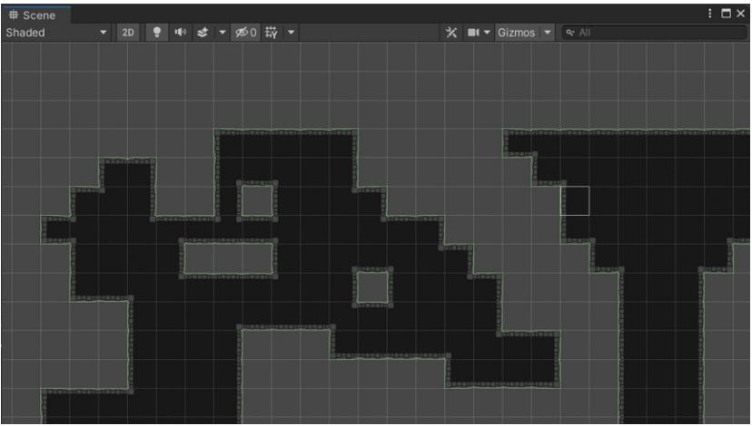

Painting Tilemaps

The Rule Tile asset in the Inspector

The Rule Tile Inspector provides a list of rules for which sprite to choose based on the adjacent tiles. There's a matrix and a sprite on the right side of each rule. The sprite will be used when neighbor tiles are on all sides where the green arrows are pointing.

Learn more about the Rule Tile feature [here.](https://docs.unity3d.com/Packages/com.unity.2d.tilemap.extras@1.6/manual/RuleTile.html)

This is just one example of how to use the Rule Tile. You can also replace the sprites that come with this sample or create a new Rule Tile that matches your game's needs.

You can find ready-made Tilemap templates that are available from the community and the Asset Store. A few good ones to check out include [TileMap](https://pandaroo.itch.io/tilemap-auto-rule-tile-unity-template)  [Auto Rule](https://pandaroo.itch.io/tilemap-auto-rule-tile-unity-template) by Pandaroo, [2D PixelArt – Isometric Blocks](https://assetstore.unity.com/packages/3d/environments/2d-pixelart-isometric-blocks-115039) by Devil's Work.shop, and both [Pixel Art Platformer](https://assetstore.unity.com/packages/2d/environments/pixel-art-platformer-village-props-166114) and [Pixel Art Top Down](https://assetstore.unity.com/packages/2d/environments/pixel-art-top-down-basic-187605#content) by Cainos.

Learn more about Tilemap best practices in [this](https://www.youtube.com/watch?v=rKlvgkDHWfQ?utm_source=demand-gen&utm_medium=pdf&utm_campaign=asset-links-gmg-choose-unity-for-2d&utm_content=2d-game-art,-animation-and-lighting-ebook) video, and optimizing Tilemap performance in [this](https://unity.com/how-to/optimize-performance-2d-games-unity-tilemap?utm_source=demand-gen&utm_medium=pdf&utm_campaign=asset-links-gmg-choose-unity-for-2d&utm_content=2d-game-art,-animation-and-lighting-ebook) article.

## Sprite Shape level design

Grid or tile-based design is well-suited to a retro 2D visual style, especially when you're using pixel art. It's also great for side-scrolling horizontal platformers, topdown RPGs, and non-organic shapes such as buildings and castles.

The grid-based design makes pathfinding and level creation more straightforward. Pathfinding is simpler when constrained to a grid. It makes it easier to maintain constant distances when you're designing levels. If your character's jump is 3 units high, for example, you can easily plan where to put platforms, and the player will be able to estimate if he can make the jump or not instantly.

Individual tiles can be animated, for example by adding a waterfall, burning torch, spinning fan, and so on. You can make slopes with Tilemaps, but they will be straight surfaces with angles like 45 or 26.5 degrees.

When you want a more organic, less block-based style, use [2D Sprite Shape](https://docs.unity3d.com/Packages/com.unity.2d.spriteshape@5.1/manual/index.html?utm_source=demand-gen&utm_medium=pdf&utm_campaign=asset-links-gmg-choose-unity-for-2d&utm_content=2d-game-art,-animation-and-lighting-ebook). With this setup, you're not constrained to a grid or particular angle. You can make any shape you want using curves. Terrains, hills, grassy fields, and smooth surfaces are all suited to Sprite Shape, which lends a modern look to your scenes compared to the crisper pixel-art style.

Turn on the snapping tool to set any angle or curve easily and place elements precisely.

On the left, *Skul: The Hero Slayer,* by SouthPAW Games is a Tilemap-based game, while *Oddmar*, by Mobge LTD on the right, is a spline-based game.

Levels and elements created with Tilemaps or Sprite Shapes are easy to edit later. Depending on your visual style, you can use both systems in your game.

Both Tilemaps and Sprite Shapes can be modified during runtime to create exciting new gameplay possibilities. For example, Tilemaps can be destructive, and Sprite Shape can be morphed – the possibilities are endless. Read more about the options in the [Tilemap API](https://docs.unity3d.com/ScriptReference/Tilemaps.Tilemap.html?utm_source=demand-gen&utm_medium=pdf&utm_campaign=asset-links-gmg-choose-unity-for-2d&utm_content=2d-game-art,-animation-and-lighting-ebook) and [SpriteShape API](https://docs.unity3d.com/ScriptReference/U2D.SpriteShapeRenderer.html?utm_source=demand-gen&utm_medium=pdf&utm_campaign=asset-links-gmg-choose-unity-for-2d&utm_content=2d-game-art,-animation-and-lighting-ebook) docs.

## Orthographic or Perspective Camera

For most 2D games, you'll want to set your camera to orthographic mode. It's the default choice for 2D projects because lines of one dimension are parallel, and you work only in two dimensions. The orthographic mode works for all styles – pixel art games, puzzles, 2D isometric, top-down, platformers.

Although 2D games have no real depth, the illusion of depth can be created using the parallax effect. The parallax effect scrolls multiple layers in the background and foreground at different speeds when the camera moves. The intent is to mimic human depth perception, wherein objects farther away appear to move more slowly than those closer to us.

In 2D, this is usually done with a script that moves layers with a percentage of camera movement speed. It requires some manual setup to adjust the speed of each parallax layer.

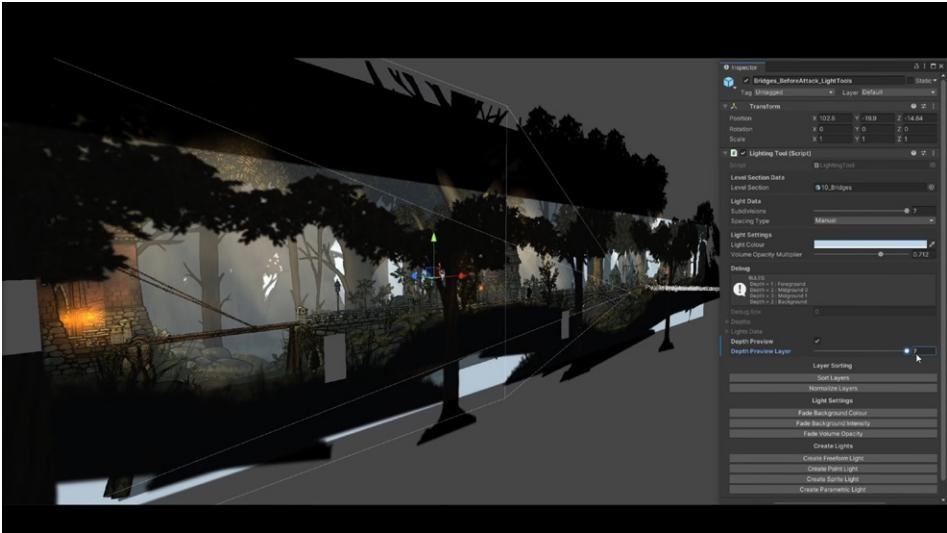

Perspective camera setup in *[Tails of Iron](https://store.steampowered.com/app/1283410/Tails_of_Iron/)* By Oddbug Studio. Learn how they created the lighting in their game with Unity.

If orthographic mode is suitable for all 2D game styles, why even use perspective mode?

One reason is that this offers access to parallax effects out of the box since, as the name suggests, a Perspective camera uses a perspective viewpoint. You don't need to use scripts to handle the scrolling of parallax layers. Instead, you position elements further from the camera on the Z axis and scale them up to account for perspective based on their relative distance from the camera.

Parallaxed sprites don't move with the camera every frame, so background objects can be marked as static for batching. Adding some 3D objects into your scene can provide more depth as well.

Orthographic mode with scripted parallax effects requires you to set up the scrolling speeds on all layers manually. The depth effect can break if layers have incorrect scrolling speeds, and editing a parallax level requires additional coding.

Suppose you're making a *Metroidvania*-style game with scenes that include multiple points of entry. In this case, the parallax effect can break because the camera can start at a different position on the X axis than where you edited parallax elements.

Once it's set up, the Perspective camera will work for parallax effects. The only downside is that you need to scale sprites as you move them along the Z axis. Also, approach allows the scene to be split into smaller scenes for [additive](https://blog.unity.com/technology/achieve-better-scene-workflow-with-scriptableobjects?utm_source=demand-gen&utm_medium=pdf&utm_campaign=asset-links-gmg-choose-unity-for-2d&utm_content=2d-game-art,-animation-and-lighting-ebook)  [loading,](https://blog.unity.com/technology/achieve-better-scene-workflow-with-scriptableobjects?utm_source=demand-gen&utm_medium=pdf&utm_campaign=asset-links-gmg-choose-unity-for-2d&utm_content=2d-game-art,-animation-and-lighting-ebook) like a room system that allows for dynamic world loading.

The camera you choose doesn't impact the art creation process, but it does determine how the levels are set up. And, if they're set up correctly, orthographic and perspective parallax will look the same to the player.

To sum up, an orthographic mode is the best choice in most cases, except when you're using advanced scrolling and parallax. In that case, go with perspective mode.

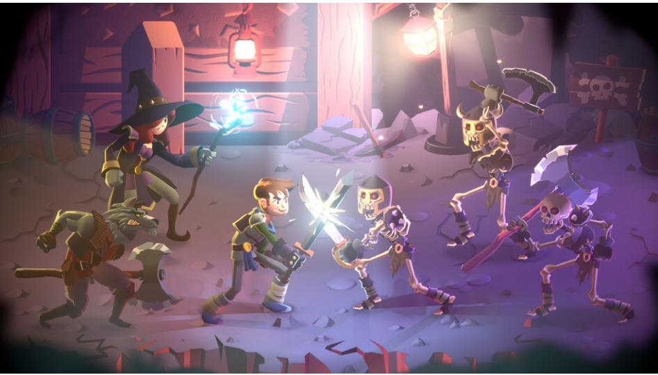

Orthographic mode camera in *Dragon Crashers*

## Mixing 2D and 3D

If your project uses the Built-In Render Pipeline or the Universal Render Pipeline (URP), it's easy to mix 2D and 3D elements in the same Scene. 2D Rendering uses [Sorting Layers](https://docs.unity3d.com/Manual/2DSorting.html?utm_source=demand-gen&utm_medium=pdf&utm_campaign=asset-links-gmg-artist-expansion&utm_content=technical-artist-ebook) and [Sorting Groups](https://docs.unity3d.com/Manual/2DSorting.html?utm_source=demand-gen&utm_medium=pdf&utm_campaign=asset-links-gmg-choose-unity-for-2d&utm_content=2d-game-art,-animation-and-lighting-ebook) to define the order for rendering game elements. Adding the Sorting Group component to a 3D GameObject allows you to easily integrate 3D and 2D objects into the same game. You can have them interact with one another by using a common physics system (either 2D or 3D Physics, depending on the best approach for the game) and mixing 2D and 3D lighting systems through the Camera Stacking feature in URP.

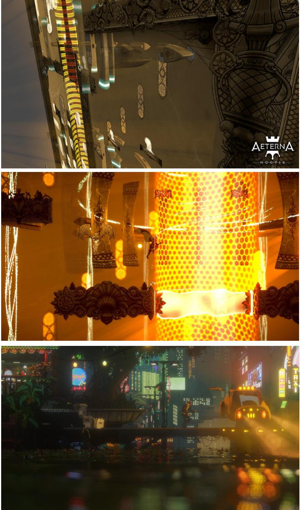

Introducing 3D assets in the background of a 2D game can add nice depth to a scene without compromising the gameplay. Top and middle images are from the upcoming *Metroidvania*-style game *Aeterna Noctis,* by Aeternum Game Studios S.L.. Bottom image is from *Last Night* by Odd Tales.

## Camera Stacking

Camera Stacking allows you to layer camera outputs and combine them in one final image. You can combine 2D, 3D, and UI objects with Camera Stacking.

At least two cameras are required in the scene for stacking. Choose which one will be the Base Camera for the image you want to be rendered first, and any additional cameras need to be set to Overlay.

| ▼ Camera        |           | 9 花 |   |
|-----------------|-----------|-----|---|
| Render Type     | Base      |     | D |
| ▼ Projection    | V Base |     |   |
| Projection      | Overlay   |     | ▶ |
| Size            | 5         |     |   |
| Clipping Planes | Near 0.3  |     |   |

Setting up Camera Stacking

The Base Camera needs to know which cameras overlay on top and in what order. To do that, go to the Stack option, and select a camera to overlay with the **+** button. Change the rendering order of Overlay Cameras as needed by dragging them up or down in the list.

| Target Eye | Both    |   | > |
|------------|---------|---|---|
| ▼ Stack    |         |   |   |
| = Camera 2 | Overlay |   |   |
| Camera 1   | Overlay |   |   |
|            |         | + | - |
|            |         |   |   |

Selecting cameras to be rendered as overlays

Use layers to set which objects are rendered by each of the cameras. By default, cameras render every layer, but you can change that by selecting which layers are rendered by the camera in the Culling Mask option on a Camera component.

| Culling Mask      | Default |                |  |
|-------------------|---------|----------------|--|
| Occlusion Culling |         | Nothing        |  |
| Environment       |         | Everything     |  |
| Background Type   | >       | Default        |  |
| Volumes           |         | TransparentFX  |  |
| Mask              |         | Ignore Raycast |  |
| Trigger           |         | Water          |  |
| Update Mode       |         |                |  |

Choosing layers to render in the camera's Culling Mask option

Now, select the GameObjects you want the camera to render, and change their layer to match the one set earlier. That way, objects are categorized to be rendered by different cameras, such as a 3D background and 2D platform layers.

## Cinemachine for 2D

Once you've selected the camera type, you'll need to set it up to follow the gameplay. Unity's [Cinemachine](https://docs.unity3d.com/Packages/com.unity.cinemachine@2.8/manual/index.html?utm_source=demand-gen&utm_medium=pdf&utm_campaign=asset-links-gmg-choose-unity-for-2d&utm_content=2d-game-art,-animation-and-lighting-ebook) system provides the functionality to do this and much more, such as confining the camera to level bounds, setting up camera transitions, noise, and so on. This section highlights some of the core Cinemachine functionality for 2D games.

To get started, install Cinemachine from the Package Manager. Choose version 2.7.1 or later.

Cinemachine doesn't create new Unity cameras in a scene. Instead, when a new Cinemachine Virtual Camera or vcam is added to a scene, the [CinemachineBrain](https://docs.unity3d.com/Packages/com.unity.cinemachine@2.8/manual/CinemachineBrainProperties.html?utm_source=demand-gen&utm_medium=pdf&utm_campaign=asset-links-gmg-choose-unity-for-2d&utm_content=2d-game-art,-animation-and-lighting-ebook) component is added to the main camera, along with a new GameObject with the default name CM vcam.

The Cinemachine Brain monitors all active Virtual Cameras in the scene. Animate the vcams with keyframes, blend or smoothly transition between the cameras, or create a combination of the two to animate one camera while transitioning to another. All of the animation will be processed by the Cinemachine Brain and applied to the main camera – think of it as a powerful animation system that drives your main camera.

To create a 2D virtual camera, click on **Cinemachine > Create 2D Camera**. This will create a Virtual Camera set up for a 2D environment. If it's your first Virtual Camera in the scene, it will also add a Cinemachine Brain Component to your main camera.

| ▼ + √ CinemachineVirtualCamera |                                  | (?) |   |
|--------------------------------|----------------------------------|-----|---|
| Status: Standby                | Solo                             |     |   |
| Game Window Guides             | >                                |     |   |
| Save During Play               |                                  |     |   |
| Priority                       | 10                               |     |   |
| Follow                         | J. Unit_Wolfman_Oriz (Transform) | 0   | 8 |
| Look At                        | None (Transform)                 | 0   | 8 |
| Standby Update                 | Round Robin                      |     | D |
| v Lens                         |                                  |     |   |
| Orthographic Size              | 5                                |     |   |
| Near Clip Plane                | 0.3                              |     |   |
| Far Clip Plane                 | 1000                             |     |   |
| Dutch                          |                                  | - 0 |   |
| Transitions                    |                                  |     |   |
| Body A                      | Framing Transposer               |     | ▶ |
| Aim                            | Do nothing                       |     | D |
| Noise                          | none                             |     | D |
| Extensions                     |                                  |     |   |
| Add Extension                  | (select)                         |     |   |
|                                | Add Component                    |     |   |
|                                |                                  |     |   |

Creating a Cinemachine Virtual Camera

Cinemachine needs an object to follow, so assign a player character in the Follow field. To ensure that you are operating on a 2D plane and that the camera isn't panning or tilting, check that the Look At field is empty and Body is set to Framing Transposer. Finally, set the Lens properties for your projects. Keep in mind that some options will be inherited from the main camera's properties.

Expand the Body properties field to find useful options to modify how the Virtual Camera follows its target, such as Offset, Damping, Dead, and Soft Zones. Experiment with these options during Play Mode, and the changes will be saved if you check the Save During Play option.

There is also an extension for the Virtual Camera, the CinemachineConfiner2D, which, when activated, limits the camera from moving outside Level bounds, ensuring the player will see only the parts that you want them to see. It also ensures you don't need to design unnecessary parts of the level.

To add CinemachineConfiner2D, select CinemachineConfiner2D from the Add Extension dropdown menu.

Adding CinemachineConfiner2D extension

Cinemachine2DConfiner requires a Collider 2D (Composite or Polygon) as a Bounding Shape 2D. Create an empty GameObject, and add a Composite Collider 2D and Box Collider 2D. A RigidBody 2D will be added automatically; set its Body Type to Static. Also, check the Used by Composite option on the Box Collider 2D. Now, drag this GameObject into the Bounding Shape 2D field of the CinemachineConfiner2D script. Don't forget to edit the size of the Box Collider 2D so that it's larger than the size of the camera.

Now the camera's frustum won't go out the bounding box of the collider. For more details, check the Cinemachine Confiner 2D [documentation.](https://docs.unity3d.com/Packages/com.unity.cinemachine@2.8/manual/CinemachineConfiner2D.html?utm_source=demand-gen&utm_medium=pdf&utm_campaign=asset-links-gmg-choose-unity-for-2d&utm_content=2d-game-art,-animation-and-lighting-ebook)

### Draw order

In a 2D game, all sprites and objects have the same depth. How can you sort them so that some appear in front of others?

Unity sorts Renderers according to a priority order that depends on their types and usages. You can specify the render order of Renderers using their [Render Queue.](https://docs.unity3d.com/Manual/SL-SubShaderTags.html?utm_source=demand-gen&utm_medium=pdf&utm_campaign=asset-links-gmg-choose-unity-for-2d&utm_content=2d-game-art,-animation-and-lighting-ebook) In general, there are two main queues: the [Opaque queue](https://docs.unity3d.com/ScriptReference/Rendering.RenderQueue.Geometry.html?utm_source=demand-gen&utm_medium=pdf&utm_campaign=asset-links-gmg-choose-unity-for-2d&utm_content=2d-game-art,-animation-and-lighting-ebook) and the [Transparent queue.](https://docs.unity3d.com/ScriptReference/Rendering.RenderQueue.Transparent.html?utm_source=demand-gen&utm_medium=pdf&utm_campaign=asset-links-gmg-choose-unity-for-2d&utm_content=2d-game-art,-animation-and-lighting-ebook) 2D Renderers are mainly within the Transparent queue and include the [Sprite](https://docs.unity3d.com/Manual/class-SpriteRenderer.html)  [Renderer,](https://docs.unity3d.com/Manual/class-SpriteRenderer.html) [Tilemap Renderer,](https://docs.unity3d.com/Manual/class-TilemapRenderer.html?utm_source=demand-gen&utm_medium=pdf&utm_campaign=asset-links-gmg-choose-unity-for-2d&utm_content=2d-game-art,-animation-and-lighting-ebook) and [Sprite Shape Renderer](https://docs.unity3d.com/ScriptReference/Experimental.U2D.SpriteShapeRenderer.html?utm_source=demand-gen&utm_medium=pdf&utm_campaign=asset-links-gmg-choose-unity-for-2d&utm_content=2d-game-art,-animation-and-lighting-ebook) types.

2D Renderers within the Transparent Queue generally follow a priority order. When two or more objects occupy the same space, Unity goes through this list and checks which object should be drawn on top. When there's a tie, and both objects have the same value, the next criteria on the list is evaluated. The priority order is:

- 1. Sorting Layer and Order in Layer
- 2. Specify Render Queue
- 3. Distance to Camera
- 4. Sorting Group
- 5. Material/Shader

When all of the above values are the same for both objects and a tiebreaker is needed, this process must choose which one to render on top. It's not an ideal solution, so make sure to set a distinct sorting order using Sorting Layers and Sorting Groups.

### Sorting Layers

The most important sorting criteria are [Sorting Layers](https://docs.unity3d.com/Manual/2DSorting.html). All 2D Renderers have this option, and it's the first thing you need to set up. There is a default sorting layer which you can edit by opening Project Settings, then specifying Tags and Layers options.

| Project Settings                                                                                                                                 |                               |   |                     |
|--------------------------------------------------------------------------------------------------------------------------------------------------|-------------------------------|---|---------------------|
|                                                                                                                                                  |                               | Q |                     |
| Adaptive Performance Audio                                                                                                                    | Tags and Layers               |   | 2 2 8         |
| Burst AOT Settings Device Simulator Editor                                                                                                 | > Tags Sorting Layers D |   |                     |
| Graphics                                                                                                                                         | Layer                         |   | Background          |
| Input Manager                                                                                                                                    | Layer                         |   | Default             |
| Package Manager                                                                                                                                  | Layer                         |   | Main                |
| Physics Physics 2D                                                                                                                            | Layer                         |   | Characters          |
| Player                                                                                                                                           | Layer                         |   | Foreground          |
| Preset Manager Quality                                                                                                                        | Layer                         |   | UI - Number Display |
| Scene Template                                                                                                                                   | Layer                         |   | UI - Unit Display   |
| Script Execution Order Services Do Tags and Layers TextMesh Pro Do Time Timeline Version Control XR Plugin Management | A Layers                   |   | +                   |

Editing the Sorting Layer

Add, delete, or change the order by dragging the handle on the left of the Layers. Layers that are higher on the list are rendered first and will appear further away from the camera.

Plan the Sorting Layers structure, even when designing a mockup to organize your scene early on. Set a sprite's sorting group as soon as you place it in the scene. These practices will help you to avoid a situation later in your project development when you suddenly realize you have to change sorting settings on potentially thousands of sprites.

#### **Avoid creating too many Sorting Layers**

2D Lights rely on Sorting Layers, so consider lighting when you set the Sorting Layers structure. Know beforehand how you want the lights to behave in your game and what groups will be affected by them.

For example, if you're making an isometric game and plan to have torches that use 2D Lights, will the torches affect their entire surroundings or only the walls? Will characters be affected, or will they be drawn in front of the light? Will you need a Sorting Layer just for the objects that will receive light? Keep these kinds of questions in mind when you're editing Sorting Layers, and learn more about planning lighting in the [2D Lights](#page-71-0) section.

Be wary of using too many Sorting Layers, which can cause you to lose oversight of all the details. When you need to sort renderers further, use Order in Layer. This allows you to sort objects that are on the same layer easily.

#### **Transparency Sort Mode**

You might want a fake 3D view in your game, such as an axonometric or oblique projection for an isometric, top-down game with a bit of an angle, or a cabinet projection in brawler games. If so, you'll need to custom sort the renderers by Distance to Camera (point 3 on the sorting priority list above).

Choose a custom axis to sort objects. In the case of a top-down game or brawler, sort objects on the Y axis, so higher characters will be rendered below other characters, giving the illusion that they are further away. To edit this option, find the 2D Renderer Asset created when setting up URP, and change its Transparency Sort Mode option to Custom Axis, then set its Transparency Sort Axis value to 0, 1, 0.

Sorting sprites on the Y axis, the value (X:0, Y:1) 1 tells Unity to follow a downward vector (as in [Vector2.](https://docs.unity3d.com/ScriptReference/Vector2.html?utm_source=demand-gen&utm_medium=pdf&utm_campaign=asset-links-gmg-choose-unity-for-2d&utm_content=2d-game-art,-animation-and-lighting-ebook) [down](https://docs.unity3d.com/ScriptReference/Vector2.html?utm_source=demand-gen&utm_medium=pdf&utm_campaign=asset-links-gmg-choose-unity-for-2d&utm_content=2d-game-art,-animation-and-lighting-ebook)) for the sorting criteria. The sprites at the top will be drawn first, and the ones at the bottom later, making them visible at the front.

## Sorting Group

Even if you follow the previous steps and sort on the Y axis, the appearance of your character's parts might still display incorrectly.

Parts of the characters that are on the same Sorting Layer are mixed between two characters.

It's not a bug. This is just how sorting works. Sorting doesn't know which parts belong to which character if they are on the same Sorting Layer. Fortunately, Sorting Group is the fourth criteria on the sorting priority list. Sorting Group is a component that groups Renderers that share a common root for sorting purposes. All Renderers within the same Sorting Group share the same Sorting Layer, Order in Layer, and Distance to Camera.

When using characters or other objects that consist of a couple of sprites, put this script on its Parent object (highest in the hierarchy), and set Sorting Layer and Order in Layer just like on any other 2D Renderer. You can see an example of this in this [Unite Now technical session.](https://youtu.be/DCAH1rlwAr4?t=1073?utm_source=demand-gen&utm_medium=pdf&utm_campaign=asset-links-gmg-choose-unity-for-2d&utm_content=2d-game-art,-animation-and-lighting-ebook)

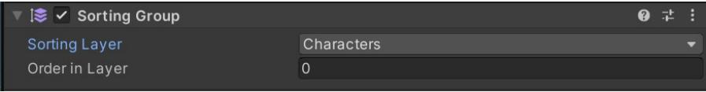

Creating a Sorting Group in the parent GameObject to ensure that this object and its child objects get sorted as a single element avoiding potential conflicts between its parts and other sprites in the game

The Sorting Group makes the characters appear as they should.

You can also nest Sorting Groups. If you have weapons consisting of multiple sprites that you want to be generated randomly, put them in Sorting Groups to make them display correctly in characters' hands.

#### Optimization tips

- Consider using Tilemaps when your scene consists of many sprites. This enables you to trade many Sprite Renderers (they have an overhead) for just one Tilemap Renderer.
- Mark your level colliders as Static for batching.
- Put sprites that will likely be together on the scene in a Sprite Atlas.
- Simplify sprites' meshes by using the Custom Outline option in the Sprite Editor.
- Cache Sprite Shape geometry by enabling Cache Geometry option (it appears when the Edit Spline button is on).

## **2D Animation**

2D animation can be the most time-consuming and challenging part of developing art for a game. Creating stunning animated characters requires considerable animation knowledge of timing, momentum, kinematics, and more. Polishing every frame can take a long time, and storing and displaying these frames requires a lot of memory. Changing the timing or any part of a character can require every frame to be redrawn.

Historically, 3D animation has been more straightforward than 2D. You make a 3D model, rig it by adding a skeleton, set up bone weights, and animate it by setting keyframes that the software interpolates between. You make adjustments by editing the keyframes.

Thankfully, Unity has developed a toolset that brings greater efficiency to [2D](https://docs.unity3d.com/Packages/com.unity.2d.animation@5.0/manual/index.html?utm_source=demand-gen&utm_medium=pdf&utm_campaign=asset-links-gmg-choose-unity-for-2d&utm_content=2d-game-art,-animation-and-lighting-ebook)  [animation](https://docs.unity3d.com/Packages/com.unity.2d.animation@5.0/manual/index.html?utm_source=demand-gen&utm_medium=pdf&utm_campaign=asset-links-gmg-choose-unity-for-2d&utm_content=2d-game-art,-animation-and-lighting-ebook), in many ways by mimicking the straightforward ease of the 3D animation process. The 2D Animation package allows you to import your character artwork directly from Photoshop into Unity.

## Design, import and rig

The most vital element in a game is the player's character, so take enough time to think through the character's design. There are a few key aspects to consider while planning.

#### **Perspective**

The perspective you choose will impact how the game characters look and are animated. In most game views, characters can be drawn in profile. A slight rotation into a ¾ view allows more facial features to be shown.

When using an isometric or ¾ top-down perspective, you can create a similar view, but with a camera tilted a bit from the top to show facial detail. In this perspective, the character will be drawn facing multiple directions. Depending on your desired outcome and budget, you can choose from one of three commonly-used options:

- 4 directions
- 6 directions
- 8 directions

Different ways to handle top-down character animations

No matter which you choose, you will have to decide whether right- or leftfacing animations will have to be flipped to face the opposite direction. In this case, you'll need to draw respectively:

- 3 directions: right, up, down
- 3 directions: right, right-up, right-down
- 5 directions: right, right-up, up, right-down, down

If the animations are flipped, the character's hands will flip to match. If the character faces right and holds a sword in their right hand and a shield in their left, when the character is flipped to be left-facing, both weapons will have switched hands. Decide whether to accept this trade-off or spend more time making all of the animations face in the right direction.

If you're designing a traditional side-scrolling beat-'em-up game, you can simply use one facing direction. Characters moving up and down will look like they're sidestepping.

Ultimately, it's up to you whether or not your character looks good in the game's environment after testing. Your vision is more important than having a realistic view angle and perspective.

#### **Reskinning characters**

Another benefit to the 2D Animation package is that multiple characters can share the same skeleton and animations. Once you have designed, rigged, and animated one base character, you can then simply swap its skin.

Save time by planning ahead. Draw concepts of all the characters that will share the same skeleton, then check whether the skeleton will fit all of them. Do this by drawing a skeleton on a separate layer and overlaying it onto every character. Bear in mind that the layer count must be the same for all characters.

**Note:** In Unity 2021.1 and newer versions, a new feature called [Skeleton sharing](https://docs.unity3d.com/Packages/com.unity.2d.animation@6.0/manual/ex-skeleton-sharing.html) streamlines this process.

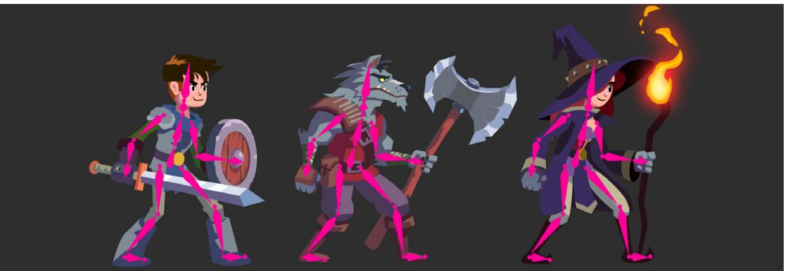

Overlaying skeleton drawing in an image-editing application

#### **Performance**

Skeletal 2D animation requires more processing power than a frame-by-frame approach, which is essentially sprite swapping. A good performance tip is to install Unity's [Burst and Collections](https://docs.unity3d.com/Packages/com.unity.2d.animation@5.0/manual/index.html#optional-performance-boost?utm_source=demand-gen&utm_medium=pdf&utm_campaign=asset-links-gmg-choose-unity-for-2d&utm_content=2d-game-art,-animation-and-lighting-ebook) packages from the Package Manager. This will improve the runtime performance of the animated sprite's deformation.

Next, determine the resources you'll need for your target platforms and how many characters will be onscreen at once.

For example, with an adventure game where there will be two or three characters on the screen, you can be less conservative with the character detail. You'll have the luxury of making additional bones and layers, as well as advanced IK – moving eyes, fingers, and more.

However, a mobile RPG or shooter with big battles and more than 10 characters should have simpler rigs. It would be reasonable, for example, to have one bone per limb instead of two, or to have a whole face sprite swap instead of having moving eyes on a different layer.

When designing game art, take care to plan ahead how many layers you'll need and how characters will be animated because it's almost impossible to change these elements later in production.

#### **General 2D animation rules**

Here are some good rules to go by when designing a character that will be rigged and animated later.

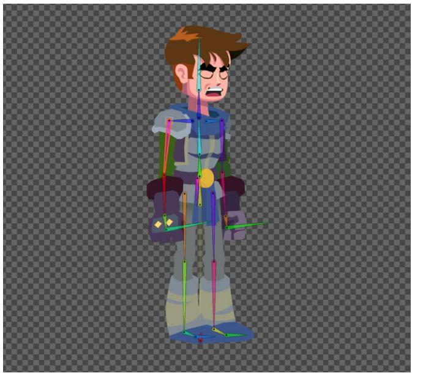

An example of a neutral character pose: Legs and arms can be any position, but they should be unbent. Straining bent limbs will cause pixel stretching.

- Draw the character in a neutral position with arms and legs straight. If the parts of the body are drawn bent, it can cause issues when you're animating.
- Make the resolution a little higher than your game's PPU suggests. While resolution can look good at rest, rotating and stretching images can cause pixelation.
- If 2D Lighting will be used extensively in your game and you want to make the most of the normal maps, don't paint the light and shadow onto your sprite. Instead, paint some nondirectional shadows. This technique is called ambient occlusion. Your sprite will look better, but avoid using any directional light like sunlight.
- Body part layers swapped using the Sprite Swap feature should be grouped accordingly. For example, all layers with mouth positions should be placed in a group called "mouth" in the image-editing app.

Now that you know what to consider during designing, start up your graphic app of choice and start painting. Learn more about Sprite Swap by visiting the documentation page [here](https://docs.unity3d.com/Packages/com.unity.2d.animation@5.0/manual/SpriteSwapIntro.html?utm_source=demand-gen&utm_medium=pdf&utm_campaign=asset-links-gmg-choose-unity-for-2d&utm_content=2d-game-art,-animation-and-lighting-ebook).

### Importing a character into Unity

Once completed, your character needs to be imported into Unity. The quickest way to import is through the 2D PSD Importer. This will import all of the character's layers as sprites and place them exactly as they were painted in the app.

If you're using the 2D project template in Unity, the importer should be already installed. If not, install it using Package Manager.

The exporting process simply requires files to be saved as PSB format. This is a format similar to Photoshop's PSD, but PSB allows for larger file sizes. If you're using Photoshop, select this format in the Save dialog box. If you're using another app, just export the project as a PSD file, and change the filename extension to PSB before importing into Unity.

Importing into Unity is the same as with other assets. Save the file to the Assets folder, or drag it into the Project window.

When an imported PSB file is selected, it will show options similar to the sprite import settings but with additional settings for 2D animation and rigging.

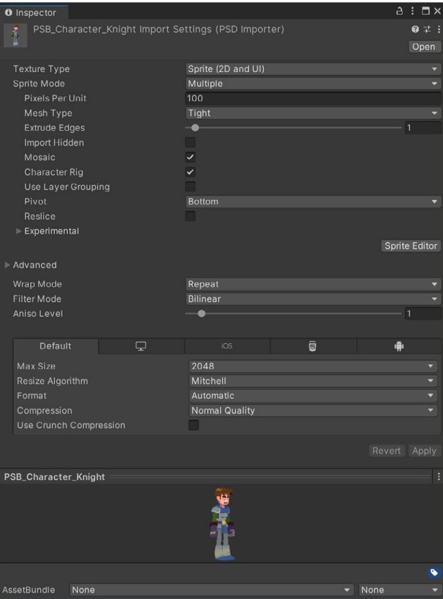

The Inspector for a character

The key options to set are:

- Import Hidden: This option imports all layers from a PSB file, including hidden layers.
- Mosaic: This setting is only available if the Texture Type is set to Multiple. It makes sprites from imported layers and puts them onto a texture atlas. Leave this option enabled if you want to rig a character.
- Character Rig: This option generates a character Prefab with the same layers hierarchy and position as in the PSB file. This must be on.
- Use Layer Grouping: This adds layer grouping from the PSB file. Turn it on to group parts of a character, such as sprite swapped parts.

After setting the options, click Apply. This finalizes the character Prefab, which can now be dragged into a Scene.

## Building a character

To start rigging a character, click the Sprite Editor button in the Inspector to access the Sprite Import Settings.

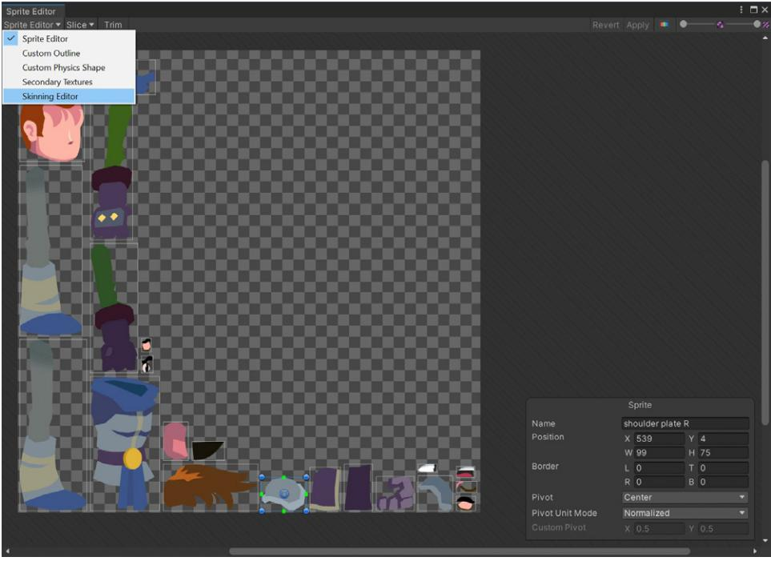

How to choose tools in Sprite Editor's window

Select [Skinning Editor](https://docs.unity3d.com/Packages/com.unity.2d.animation@5.0/manual/SkinningEditor.html?utm_source=demand-gen&utm_medium=pdf&utm_campaign=asset-links-gmg-choose-unity-for-2d&utm_content=2d-game-art,-animation-and-lighting-ebook) from the drop-down menu in the top-left corner of the Sprite Editor window.

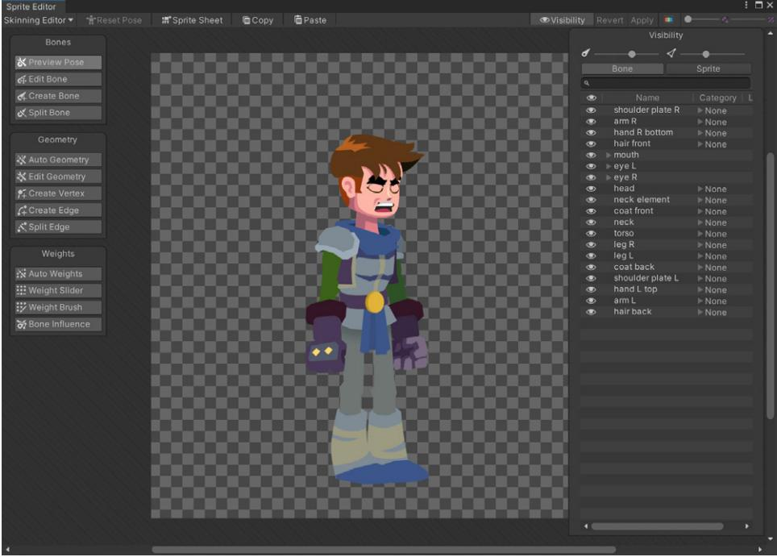

The Skinning Editor with options for animating a character

In this window, you can:

- Create and edit bones
- Create and edit Sprite Geometry
- Edit Bone Influence on sprites
- Create Categories and Labels for use in Skins and Sprite Swap

#### **Creating the skeleton**

Start by making the character's skeleton. Choose the Create Bone button and left-click on the main window area. The first click will create a bone center, and the second will mark the bone tip location. This tool chains and nests bones inside one another.

If you want to change the bone placement, press the right mouse button and leftclick where you want the new bone to be located. To control which existing bone will be the parent of the bones to be created, select the existing bone with the left mouse button, then create the new bone.

Use the Edit Bone button to refine bones. The Split Bone button allows you to split bones in two. This is a good option for making limbs. If you make one leg bone and click where the knee should be, the bone will then split into thigh and calf.

The Bone tab opened to organize parent and children bones

You can also reparent and rename bones in the bone list view. To open this view, click the Visibility button on the right of the top bar, then select the Bone tab. To change the bone's parent, simply drag it in the list view. You can rename bones by clicking on the active bone's name. Giving bones a name will help you find them later. To verify that the hierarchy is correct, select the Preview Pose button and test some poses. To reset bones positions, press the Reset Pose button on the toolbar.

#### **Sprite Geometry**

In order to assign sprites to bones, they'll need to have geometry created. Start by pressing the Auto Geometry button. A small pop-up window will open, allowing you to define how the geometry will be created.

It's a good idea to set all sliders to 0 to keep the geometry as simple as possible. Enable the Weights option to bind bones to the sprites automatically. Clicking the Generate For All Visible button will create and set bone weights for all sprites. To do this for an individual sprite, simply double-click on the sprite. This is useful for tweaking the geometry of certain sprites.

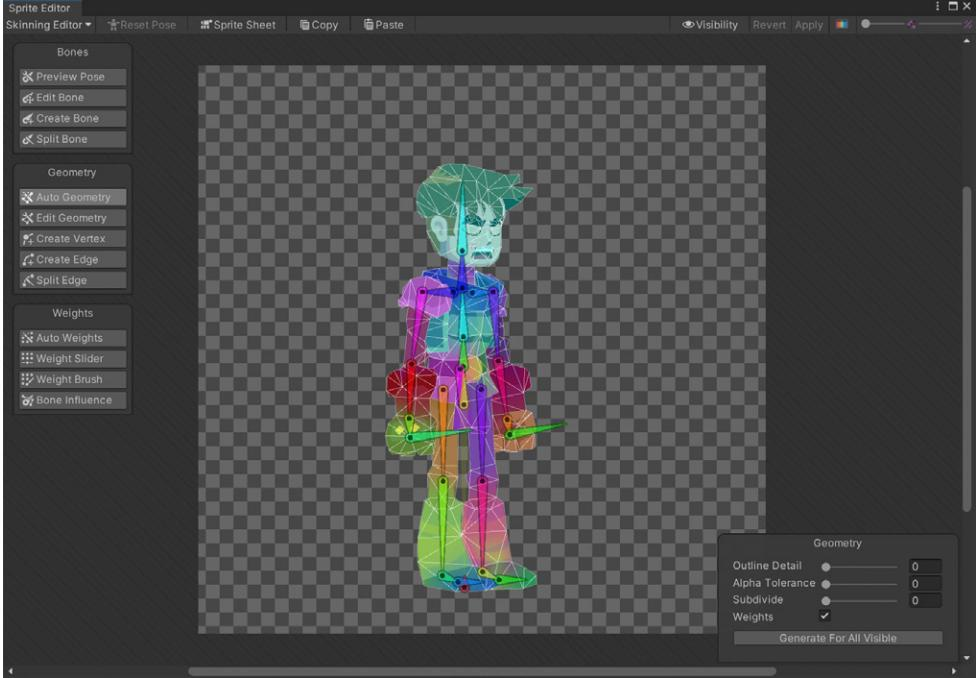

Autogenerating sprites' geometry

To go beyond this generated geometry and have full control on a number of vertices and how the geometry bends, the mesh will need to be edited manually. Use the following [tools](https://docs.unity3d.com/Packages/com.unity.2d.animation@5.0/manual/SkinEdToolsShortcuts.html?utm_source=demand-gen&utm_medium=pdf&utm_campaign=asset-links-gmg-choose-unity-for-2d&utm_content=2d-game-art,-animation-and-lighting-ebook):

- Create Vertex: Create new vertices (or points), or move or delete those points
- Create Edge: Creates edges, either between two existing points or by creating a new point using the left mouse button; the right mouse button deselects the currently selected point and lets you make an edge between other vertices
- Edit Geometry: Move vertices
- Split Edge: Splits an edge by creating a vertex in the middle

Use as few vertices as possible. Fewer vertices will help you save on performance, since each vertex position needs to be calculated based on the bones' rotation. Fewer vertices also make for better-looking mesh bending since it's easier to set weights for fewer points. Additionally, each target platform will have an ideal game vertex count, so it's always a good idea to optimize geometry.

#### **Weights**

Once the geometry is nice and clean for all of your sprites, it's time to [set up](https://docs.unity3d.com/Packages/com.unity.2d.animation@5.0/manual/CharacterRig.html?utm_source=demand-gen&utm_medium=pdf&utm_campaign=asset-links-gmg-choose-unity-for-2d&utm_content=2d-game-art,-animation-and-lighting-ebook)  [weights.](https://docs.unity3d.com/Packages/com.unity.2d.animation@5.0/manual/CharacterRig.html?utm_source=demand-gen&utm_medium=pdf&utm_campaign=asset-links-gmg-choose-unity-for-2d&utm_content=2d-game-art,-animation-and-lighting-ebook) Weights define bone influence on each vertex from 0 to 1, where 0 means that a bone has no influence over the vertex, and 1 means that the vertex will move like it's glued to the bone. Good weights on the mesh can allow for great-looking bending. Setting weights incorrectly can break the game's illusion and distort your sprites.

To start setting up weights, you need to define which bones will affect a certain sprite. Click the Bone Influence button, and select a sprite.

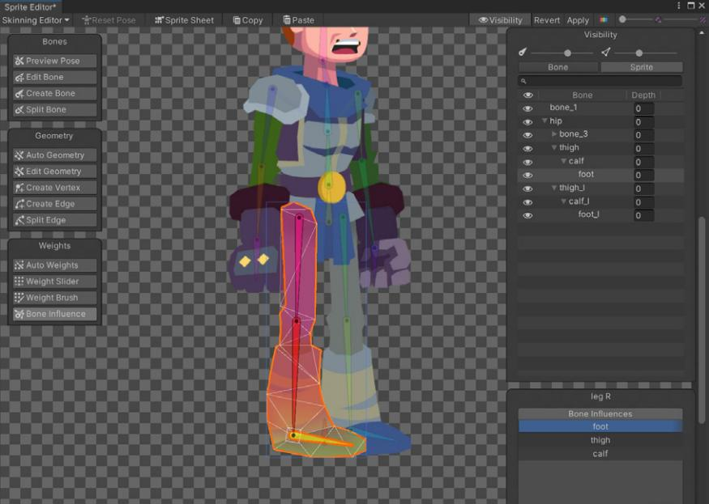

Setting bone influence on a sprite

In the small pop-up window, you can set which bones influence the selected sprite. Set only the relevant bones that need to affect the sprite, and remove the rest.

From here, set up weight by using the Weight Brush and Weight Slider. The Weight Brush quickly adds the influence of the selected bone to the vertices by painting on them with the mouse. The Weight Slider is more precise, allowing you to select one or more points, then determine the exact influence of each bone with a slider. The brush is useful for quick weight setting, and the slider is useful for fine-tuning the areas where bones bend, like elbows and knees.

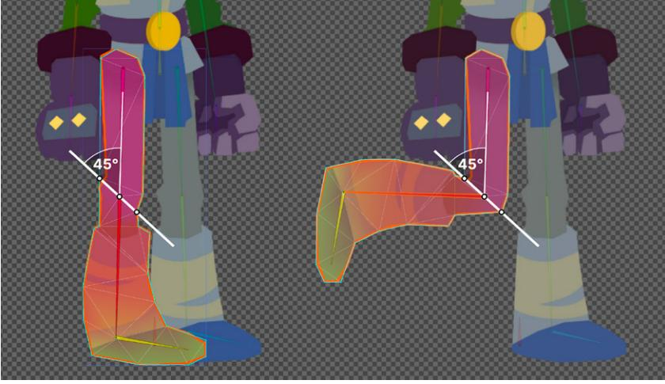

How to place vertices for the best looking limb bending

**Tip:** When you're working with elbows and knees, get the best-looking results by aligning the inner and outer vertices to a line which runs through the middle of the bending point where the two bones meet. This line should cross the bones at a 45-degree angle. These vertices should be influenced only by the upper bone. However, every character will be different, so feel free to fiddle with the weights and customize for the best results.

To speed things along, open the *[Dragon Crashers](https://assetstore.unity.com/packages/essentials/tutorial-projects/dragon-crashers-2d-sample-project-190721?utm_source=demand-gen&utm_medium=pdf&utm_campaign=asset-links-gmg-choose-unity-for-2d&utm_content=2d-game-art,-animation-and-lighting-ebook)* project, and find the following character Prefabs in the section for Prefabs and Prefab Variants:

- Prefab\_Character\_Base
	- *PV\_Character\_Witch* (uses a different Sprite Library for auto rebinding)
	- *PV\_Character\_Knight*
	- *PV\_Character\_Wolfman*
	- *PV\_Character\_Skeleton*

These Prefabs are great examples of shareable animations between characters of the same structure.

## 2D Inverse Kinematics

You probably don't think about it every day, but the human body's movement is very complex. If you want to grab a glass of water off of a table, your hand must move to the point in space that the glass occupies. You do all this without even thinking about rotating your arm and forearm, as your brain processes these calculations in the background.

To animate the same movement in a game, the rotation of both arm and forearm need to be animated at the same time. It's a challenging task to match both rotations while making a believable hand movement. The 2D Inverse Kinematics [\(2D IK\)](https://docs.unity3d.com/Packages/com.unity.2d.ik@3.0/manual/index.html?utm_source=demand-gen&utm_medium=pdf&utm_campaign=asset-links-gmg-choose-unity-for-2d&utm_content=2d-game-art,-animation-and-lighting-ebook) tool, which is a part of the 2D Animation package, calculates the rotations and allows a chain of bones to move them to target positions.

To begin, you'll first need to add an IK Manager 2D on the object at the top of the hierarchy. This component will be responsible for managing all the [IK Solvers](https://docs.unity3d.com/Packages/com.unity.2d.ik@3.0/manual/index.html#ik-solversa-idiksolversa?utm_source=demand-gen&utm_medium=pdf&utm_campaign=asset-links-gmg-choose-unity-for-2d&utm_content=2d-game-art,-animation-and-lighting-ebook) on the character.

| ▼ B √ IK Manager 2D (Script) |                      | 8 花 |
|------------------------------|----------------------|-----|
| IK Solvers                   |                      |     |
| J None (Solver 2D)           |                      | 0   |
|                              |                      | +   |
| Weight                       |                      | 0   |
|                              | Restore Default Pose |     |

IK Manager 2D component

Clicking the **+** button will add a new solver. The solver will calculate bones' rotation to match the target transform. There are three solvers available:

- Limb: This is the standard solver used for legs and arms, which can solve up to two bones and the Effector.
- Chain (CCD) Cyclic Coordinate Descent: This solver gradually becomes more accurate the more times the algorithm is run and is suitable for a longer chain of bones.
- Chain (FABRIK) Forward And Backward Reaching Inverse Kinematics: Like Chain (CCD), this solution becomes more accurate the more times its algorithm is run. It adapts quickly if the bones are manipulated in real-time to different positions.

In humanoid characters, the Limb Solver is the best choice because it is fastest and optimized for two-bone limbs. Start by adding Limb Solver to IK Manager 2D's list, which will create a new GameObject that will include the Limb Solver 2D component. Rename this GameObject to something descriptive like "Leg R LimbSolver2D" or "Arm L LimbSolver2D."

| # √ Limb Solver 2D (Script) 2 |               |                      | 8 14 |   |
|----------------------------------|---------------|----------------------|---------|---|
| Effector                         |               | None (Transform)     |         | O |
| Target                           |               | None (Transform)     |         | O |
| Flip                             |               | .                    |         |   |
| Constrain Rotation               |               | >                    |         |   |
| Solve from Default Pose          |               | >                    |         |   |
| Weight                           |               | 200                  |         |   |
|                                  | Create Target | Restore Default Pose |         |   |
|                                  |               |                      |         |   |

Limb Solver 2D component

In order to work, the solver needs two GameObject Transforms: [the Effector and](https://docs.unity3d.com/Packages/com.unity.2d.ik@3.0/manual/index.html#creating-an-effector-and-its-targeta-idtargeta?utm_source=demand-gen&utm_medium=pdf&utm_campaign=asset-links-gmg-choose-unity-for-2d&utm_content=2d-game-art,-animation-and-lighting-ebook)  [Target](https://docs.unity3d.com/Packages/com.unity.2d.ik@3.0/manual/index.html#creating-an-effector-and-its-targeta-idtargeta?utm_source=demand-gen&utm_medium=pdf&utm_campaign=asset-links-gmg-choose-unity-for-2d&utm_content=2d-game-art,-animation-and-lighting-ebook). The Effector is placed inside the last bone in a chain, for example, the tip bone of a finger, and from there, it will try to reach the Target's position.

First, create the Effector. When creating an IK for a leg, there are two bones: the thigh and calf (or shin). Place the Effector as a child of the calf bone by selecting it and creating a new Empty GameObject. Rename the GameObject as Leg Effector, and move the Effector to the tip of the bone.

Add the newly created Effector to the Effector field on the Limb Solver 2D, and press the Create Target button. A target GameObject will be created inside of the Limb Solver object.

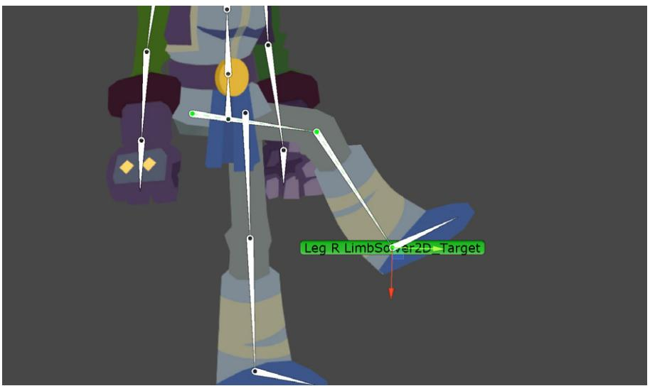

Now, when the Target object moves the leg will follow.

2D IK in action: When you move the Target GameObject, thigh and calf rotations will be calculated automatically to match the Target's position.

Repeat the whole process of adding IKs with the other limbs. IKs can also be added on non-limb bones, for example, on the head and neck, which allows the character to look around at things.

Once you've mastered this, there are more advanced use cases. For example, you can set up IKs to make your character aim a gun or to create a procedural walking animation.

## Sprite Swap and Skins

Not everything can be animated by rotating a bone. Sometimes you need another facial expression or hand pose. In this case, you can exchange one sprite with another by using Sprite Swap.

Start using Sprite Swap by assigning a category and label to each of the character's sprites. The fastest way to assign to sprites is from the Skinning Editor. Press the Visibility button, then go to the Sprite tab, where you will find a list of all sprites. If you've put the layers for swap into separate groups before exporting to PSB, they should be grouped now. This is important because grouped sprites will be added to the Sprite Resolver to allow Sprite Swapping.

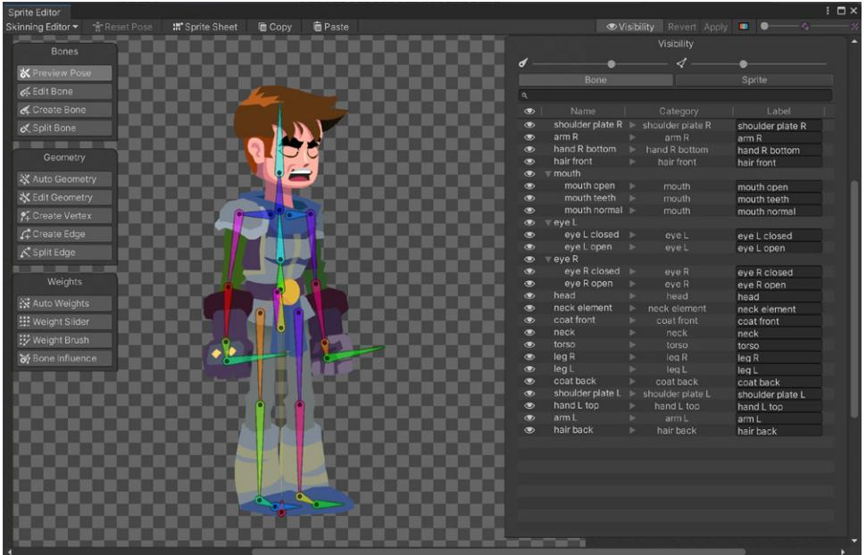

Assigning Category and Label to each sprite in Skinning Editor (sprites with the same category can be used and swapped in Sprite Resolver)

Select all the sprites and groups in the list, and right-click on them. Next, select the following two options in order: Convert Layer to Category and Convert Group to Category. These options will assign an appropriate Category and Label to each sprite automatically.

Sprites that are meant to be swapped will be in one category based on group name. Click the Apply button on top. A Sprite Library asset will be created inside the character Prefab, containing all the categories and labels created so far. Remember this asset, as it will be needed later.

If you take a look at the sprites which were in the groups, you'll see there's now one sprite per category, with the Sprite Resolver component added.

| ▼ Sprite Resolver (Experimental) |              | 8 花 |   |
|----------------------------------|--------------|-----|---|
| Category                         | mouth        |     |   |
| Label                            | mouth normal |     | > |
| F                                |              |     |   |

Sprite Resolver component

Sprites that were meant to be swapped have been added to the Sprite Resolver, and you can now implement sprite swap by clicking on them.

Use Sprite Swap to animate facial expressions, eyes and mouths, make lipsynced animations, change hand gestures, and more. Sprite Swap also allows character equipment like hats and armor to be swapped.

#### **Skins**

Sprite Library assets let you create skins for your character. A skin changes the look of the character while retaining its animations, which is a great timesaver, indeed. One base character can have all the scripts, and any change will be also applied to other characters.

Here is the workflow for setting up skin support on characters:

- 1. Finish a base character: Rig it, set up IKs and Sprite Library. Make a Prefab from the character. You can animate the character at any point.
- 2. Go to the Skinning Editor of the base character, and click the Copy button on the toolbar. This will copy bones and meshes with weights.
- 3. Create a Prefab Variant of this character this will be the new character with a new look.
- 4. Import the PSB of the new character, and open its Skinning Editor.
- 5. Paste in the skeleton copied from step 2 by clicking the Paste button on the toolbar. Make sure Bones and Mesh options are selected in the pop-up window, and click the Paste button to confirm.
- 6. Fix the geometry so it fits the new sprites. Double check the weights.
- 7. Press the Visibility button, and go to the Sprite tab. Select all the sprites and groups in the list, right click on them and select two options: Convert Layer to Category and Convert Group to Category. Hit the Apply button on top.
- 8. Go to the Prefab variant created in step 3. Go to the Sprite Library component and swap the Sprite Library asset for a new character.
- 9. To create new characters, follow steps 2 through 8.

Choosing Sprite Library Asset in Sprite Library component

By following this workflow, you'll have one base character Prefab. Other characters will be Variants of this Prefab, so they will have the same components as the base Prefab. If changes are made to the base character, for example, adding or changing IKs or Sorting Groups, other characters will inherit those changes.

#### Animation basics

Animations are very important if you want to create convincing characters.

Creating great animation requires you to learn animation principles and the tools to apply them. Learning basic animation principles is often neglected, but your game will benefit greatly if you spend a little time polishing your character movement.

To create your first animation, open an Animation window by going to **Window > Animation > Animation.**

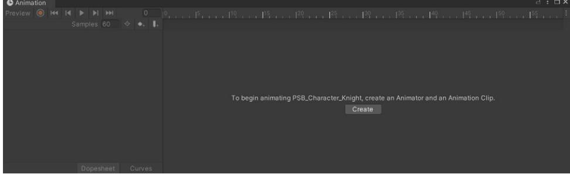

Select your character. Clicking the Create button will create the first Animation Clip, and you can start by giving the clip a name. An Animation Clip is like a linear recording of how an object's position, rotation, scale, and other properties change over time. It also creates an Animator Controller, which takes charge of all animation clips and keeps track of which clip should be playing and when the animations should change or blend together.

Start animating by clicking the red Record button. Now, all the changes made to the character will be recorded to an animation clip.

When the Record button is pressed, every change will create a keyframe on the Animation Timeline.

On the right side of the Animation View is the timeline for the current clip. The keyframes for each animated property appear in this timeline. The white vertical head line shows the current frame – be sure it's on the frame 0. Pose your character however you like. One or more keyframes will be created on the timeline, and on the left the names of current animated properties will show.

Now, move the head line a few frames forward and change the character pose. A new keyframe (or keyframes) will pop up.

Adding another keyframe along the Timeline creates an animation that will interpolate the keyframes.

When you press the Play button, you'll see your character moving. You've now created your first animation.

#### **Animating Sprite Swap – facial expressions**

Animating Sprite Swap works similarly, but it requires one additional step when setting keyframes.

How to animate Sprite Resolver by disabling keyframe interpolation

Set the new keyframes by choosing a sprite in the Sprite Resolver component. By default, the values between keyframes are interpolated, meaning that if you want to change from the first sprite in the list to the last one in a later frame, all the sprites in between would be shown. Sprite Resolver uses integer numbers to define the index of each sprite, so the interpolation in this case is not desired. To avoid that, select all the keyframes containing Sprite Resolver values, right click and select Both Tangents – Constant. Now the animation timeline will "hold" the values after keyframes, instead of interpolating them, and the Sprite Swap animation should play correctly.

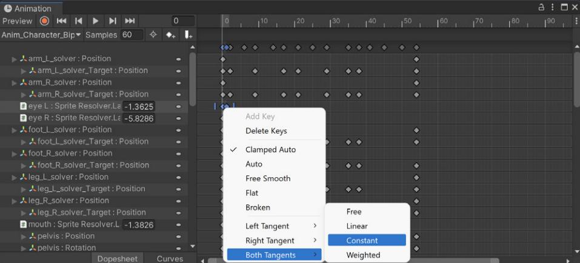

Setting Constant Tangents on Sprite Resolver keyframes so the values are not interpolated

## Optimization tips

- Install Burst Package to improve 2D Animation performance.
- When making a skeleton, avoid using more bones and sprites than you need.
- Simplify skeleton meshes by using as few vertices as possible.
- Turn on Culling in the animators. This option will be turned off when the animated character is offscreen to save performance.
- Avoid using skeletal animations for objects or characters that are small or come in large numbers, such as background birds, flies, or small animals. Instead, use different techniques like frame-by-frame animation or shaders.

## **2D Lights**

Unity's advanced [2D dynamic lighting system](https://docs.unity3d.com/Packages/com.unity.render-pipelines.universal@13.1/manual/Lights-2D-intro.html?utm_source=demand-gen&utm_medium=pdf&utm_campaign=asset-links-gmg-choose-unity-for-2d&utm_content=2d-game-art,-animation-and-lighting-ebook), in conjunction with normal maps and mask maps, makes your characters pop with gorgeous silhouette lightning and clearly shaded details.

Lit environments are more immersive and believable because of the subtle interactions between characters, objects, and the lighting system.

2D Lights can be an integral part of the gameplay. For example, you can use them to create a player's flashlight as it illuminates just part of a pitch-black corridor, or to show a surveillance camera's cone of vision that the player needs to avoid.

Dynamic lighting can dramatically change a level's mood, bring out the details of a cave's torchlit wall, act as light beams coming through a window to illuminate sparkling dust motes, or simply be animated to simulate the day and night cycle.

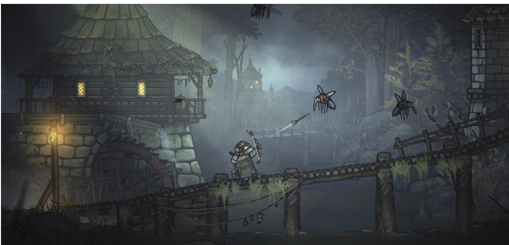

Let's look at the variety of 2D Lights you can create and how to customize them.

Image from *[Tails of Iron](https://store.steampowered.com/app/1283410/Tails_of_Iron/)* by Oddbug Studio

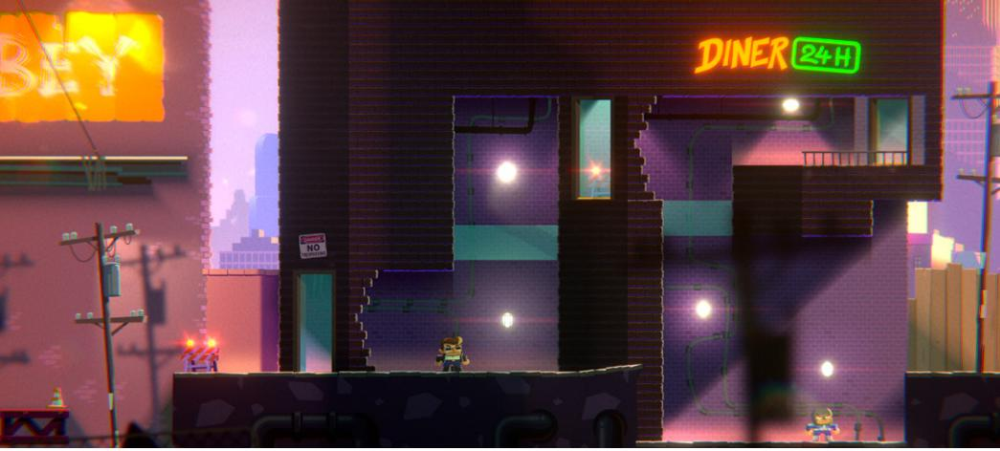

An image from *Ultimate Action Hero*, a game in development by Jarek Majewski.

## Types and use cases

To add a new 2D Light, go to **GameObject > Light > 2D**, and select a light type.

Adding a 2D Light to the scene

There are [five types](https://docs.unity3d.com/Packages/com.unity.render-pipelines.universal@13.1/manual/LightTypes.html?utm_source=demand-gen&utm_medium=pdf&utm_campaign=asset-links-gmg-choose-unity-for-2d&utm_content=2d-game-art,-animation-and-lighting-ebook) of 2D Lights shapes.

#### **Freeform**

This kind of light has a polygonal shape that can be edited in a similar way to Sprite Shape. This is a good tool for efficiently lighting a large part of the environment (such as a lava pool), simulating light shapes (such as god rays coming through a ceiling hole), or conforming to the shape of a window where the light is projected.

Editing the Freeform 2D Light

#### **Sprite**

This shape allows the use of any sprite as a light's texture. This comes in handy if you want a particular shape that is impossible to achieve with other light types. Some good examples of possible textures are lens flares, glares, light cookies, light shape projections like disco ball lights, or baby lamps projecting stars against the wall.

Sprite Light in action

#### **Parametric**

These lights can be shaped like an n-sided polygon. This is a specific type of light that can be used in inorganic or stylized environments. In future Unity versions, these light types will be default shapes inside the Freeform light options.

Parametric Lights with 3, 5, and 8 sides

#### **Point/Spot**

The shape of this light can be a circle or a circle sector. This option is good for spotlights or to light a specific point with torch fires, candles, car lights, flashlights, volumetric light, and so on.

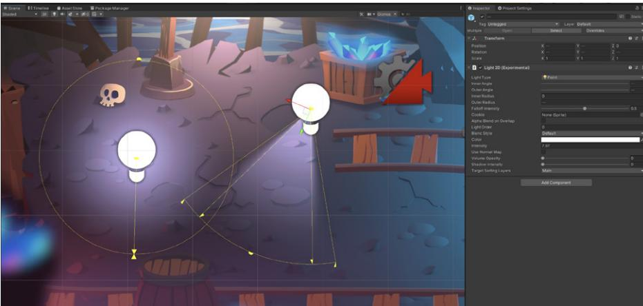

Point light with full and partial arcs

#### **Global**

A Global Light doesn't have a shape and instead lights all objects on the targeted sorting layers. Only one Global Light can be used per Blend Style (the method of interaction between light and the sprites), and per sorting layer. Use it first to add a base environment light.

| O Inspector Project Settings |               |               |        |        | a : |
|---------------------------------|---------------|---------------|--------|--------|-----|
| ✔ Light_Global_Main 8        |               |               |        | Static |     |
| Tag Untagged                    | >             | Layer Default |        |        | œ   |
| 1 Transform >             |               |               |        | 3 2 |     |
| Position                        | X 0.011       | Y 2.043       | Z O    |        |     |
| Rotation                        | × O        | Y O           | Z O |        |     |
| Scale                           | × 1        | Y 1           | Z 1 |        |     |
| ▼ ■ ▼ Light 2D (Experimental)   |               |               |        | 8 花    |     |
| Light Type                      | Global        |               |        |        | œ   |
| Light Order                     | O             |               |        |        |     |
| Blend Style                     | Default       |               |        |        | V   |
| Color                           |               |               |        |        | P   |
| Intensity                       | 0.32          |               |        |        |     |
| Target Sorting Layers           | Mixed         |               |        |        | ▶   |
|                                 | Add Component |               |        |        |     |
|                                 |               |               |        |        |     |

Option for Global Light

## How to use 2D Lights

2D Lights work with the Sprite Renderer, the Sprite Shape Renderer, and the Tilemap Renderer. To fit the workflow, they use Sorting Layers. Each light can affect one or more sorting layers. Select which layers will be affected in the Target Sorting Layers dropdown list.

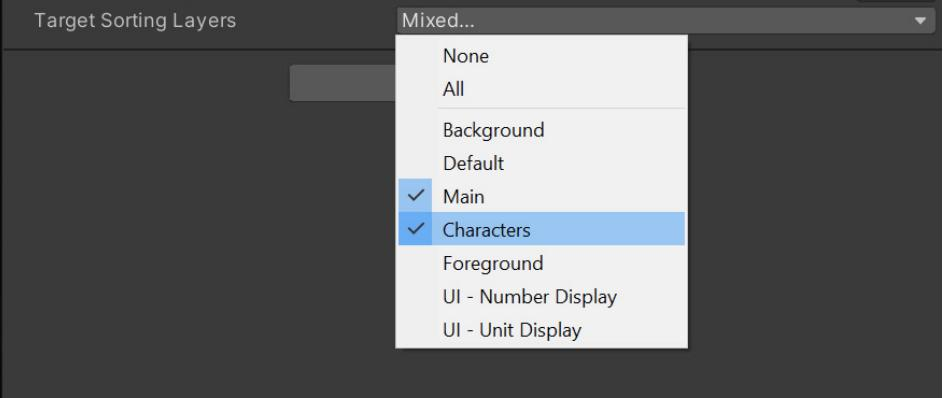

Selecting which Sorting Layers should be affected by 2D Light

Setting up 2D Lights in *[Tails of Iron](https://store.steampowered.com/app/1283410/Tails_of_Iron/)* by Oddbug Studio

To control the rendering order of lights that are on the same Sorting Layer, use the Light Order option.

The [Blend Style](https://docs.unity3d.com/Packages/com.unity.render-pipelines.universal@13.1/manual/LightBlendStyles.html) option allows you to select the blend style used by this Light. Different blend styles can be customized in the 2D Renderer Asset. Read more about common properties used by the different Light types [here](https://docs.unity3d.com/Packages/com.unity.render-pipelines.universal@13.1/manual/2DLightProperties.html?utm_source=demand-gen&utm_medium=pdf&utm_campaign=asset-links-gmg-choose-unity-for-2d&utm_content=2d-game-art,-animation-and-lighting-ebook).

The Alpha Blend on Overlap option blends overlapping lights instead of multiplying their intensity. This option can change 2D light into shadows. Simply set the light's intensity below 1, and choose a light blue color. You can also attach it to a character to cast a subtle shadow.

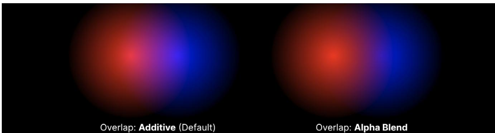

2D Lights overlap modes

Using Alpha Blend on Overlap to change 2D light into shadow

#### Secondary Texture (sprite maps)

Adding Secondary Textures to sprites

[Normal maps and mask maps](https://docs.unity3d.com/Packages/com.unity.render-pipelines.universal@13.1/manual/SecondaryTextures.html?utm_source=demand-gen&utm_medium=pdf&utm_campaign=asset-links-gmg-choose-unity-for-2d&utm_content=2d-game-art,-animation-and-lighting-ebook) are optional when using 2D Lights, but they can take your game's visuals to a whole new level if you have the budget, time, and art resources for it. Characters and the environment will have even more details that react to light, making their shapes look more defined and threedimensional.

Every sprite asset can have optional Secondary Textures assigned. These textures can be used by Materials. Change the Secondary Textures by going into **Sprite Editor > Secondary Textures**. By default, you can assign two types of textures: normal map and mask map. Normal map contains the angle of every pixel on the object, and mask map can be used for rim lighting and more. You can add your own textures and reference them by name in [Shader Graph](https://docs.unity3d.com/Packages/com.unity.render-pipelines.universal@13.1/manual/ShaderGraph.html?utm_source=demand-gen&utm_medium=pdf&utm_campaign=asset-links-gmg-choose-unity-for-2d&utm_content=2d-game-art,-animation-and-lighting-ebook) shaders.

Adding Secondary Textures to sprites

There are some good reasons to assign textures on an asset level instead of in the material.

One benefit is that Sprite Renderers and other renderers that use sprites can share a material, even when the sprites and secondary textures are different. This means they can be batched to render more efficiently.

You'll need to add normal maps and mask maps to a material when you have a sprite shader. Every sprite would need its own material with a sprite, normal map, and mask map. That would quickly escalate to hundreds of materials in the project. However, when setting the additional textures for every sprite, you can use just one Sprite Material. One material also means one draw call instead of hundreds.

| Frame Debug                                   |                                  |           |                    |   |                        |                           |                                                               |        |               | : 0 × |
|-----------------------------------------------|----------------------------------|-----------|--------------------|---|------------------------|---------------------------|---------------------------------------------------------------|--------|---------------|-------|
| Disable Editor                             |                                  |           |                    |   | 22                     |                           | of 207                                                        |        | 4             | 4     |
| UniversalRenderPipeline.RenderSingleCam 207 A | RenderTarget                     |           | CameraColorTexture |   |                        |                           |                                                               |        |               |       |
| ScriptableRenderer.Execute: New 2D Rei 207    | - Channels All R RT 0         | G         | B                  | A | Levels C               |                           |                                                               |        |               |       |
| ColorGradingLUT                               |                                  |           |                    |   |                        |                           |                                                               |        |               |       |
| > ScriptableRenderPass.Configure 1         | 3840x2160 B10G11R11_UFloatPack32 |           |                    |   |                        |                           |                                                               |        |               |       |
| 201 T Render 2D Lighting                   | Event #22: Draw Dynamic          |           |                    |   |                        |                           |                                                               |        |               |       |
| 2 Default                                  | Shader                           |           |                    |   |                        |                           | Universal Render Pipeline/2D/Sprite-Lit-Default, SubShader #0 |        |               |       |
| T RenderLoop.Draw 199                      | Pass                             |           | #0 (Universal2D)   |   |                        |                           |                                                               |        |               |       |
| Draw Dynamic                                  | Keywords                         |           |                    |   | USE SHAPE LIGHT TYPE O |                           |                                                               |        |               |       |
| Draw Dynamic                                  | Blend                            |           |                    |   |                        | SrcAlpha OneMinusSrcAlpha |                                                               |        |               |       |
| Draw Dynamic Draw Dynamic                  | ZClip                            | True      |                    |   |                        |                           |                                                               |        |               |       |
| Draw Dynamic                                  |                                  |           |                    |   |                        |                           |                                                               |        |               |       |
| Draw Dynamic                                  | ZTest                            | LessEqual |                    |   |                        |                           |                                                               |        |               |       |
| Draw Dynamic                                  | ZWrite                           | Off       |                    |   |                        |                           |                                                               |        |               |       |
| Draw Dynamic                                  | Cull                             | Off       |                    |   |                        |                           |                                                               |        |               |       |
| Draw Dynamic                                  | Conservative                     | False     |                    |   |                        |                           |                                                               |        |               |       |
| Draw Dynamic                                  |                                  |           |                    |   |                        |                           |                                                               |        |               |       |
| Draw Dynamic                                  | Preview ShaderProperties         |           |                    |   |                        |                           |                                                               |        |               |       |
| Draw Dynamic                                  |                                  |           |                    |   |                        |                           |                                                               |        |               |       |
| Draw Dynamic                                  | Textures                         |           |                    |   |                        |                           |                                                               |        |               |       |
| Draw Dynamic                                  | MainTex                          |           |                    |   | f                      | 34                        | albedo                                                        |        |               |       |
| Draw Dynamic                                  | _MaskTex                         |           |                    |   | f                      |                           | Unity White                                                   |        |               |       |
| Draw Dynamic                                  | _ShapeLight Texture0             |           |                    |   | 1                      |                           | _ShapeLightTexture0                                           |        |               |       |
| Draw Dynamic                                  | Floats                           |           |                    |   |                        |                           |                                                               |        |               |       |
| Draw Dynamic                                  | _HDREmulation Scale              |           |                    |   | f                      | 1                         |                                                               |        |               |       |
| Draw Dynamic Draw Dynamic                  | UseSceneLighting                 |           |                    |   | f                      | 1                         |                                                               |        |               |       |
| Draw Dynamic                                  | Vectors                          |           |                    |   |                        |                           |                                                               |        |               |       |
| Draw Dynamic                                  | _ProjectionParams _MainTex_ST |           |                    |   | V V                 | (1, 1, 0, 0)              | (-1, 0.3, 1000, 0.001)                                        |        |               |       |
| Draw Dynamic                                  | _ShapeLightBlendFactors0         |           |                    |   | f                      | (1, 0, 0, 0)              |                                                               |        |               |       |
| Draw Dynamic                                  | _ShapeLightMaskFilter0           |           |                    |   | f                      | (0, 0, 0, 0)              |                                                               |        |               |       |
| Draw Dynamic                                  | _ShapeLightInvertedFilter0       |           |                    |   | f                      | (0, 0, 0, 0)              |                                                               |        |               |       |
| Draw Dynamic                                  | _RendererColor                   |           |                    |   | 1                      | (1, 1, 1)                 |                                                               |        |               |       |
| Draw Dynamic                                  | Matrices                         |           |                    |   |                        |                           | 0                                                             |        |               |       |
| Draw Dynamic                                  | unity_MatrixVP                   |           |                    |   | V                      | 0.11 0                 | 0 O -0.2                                                |        | 2.1 -0.082 |       |
| Draw Dynamic                                  |                                  |           |                    |   |                        | 0                         | 0                                                             | -0.001 | 0.96          |       |
| Draw Dynamic                                  |                                  |           |                    |   |                        | 0                         | O O                                                        |        | 1             |       |
| Draw Dynamic                                  |                                  |           |                    |   |                        |                           |                                                               |        |               |       |

Using the Frame Debugger allows you to observe every step taken to render a frame. Having many Materials that can't be batched takes a toll on performance.

## Normal maps

A normal map done well can make or break the illusion of a sprite being 3D. Every pixel in a normal map stores data about the angles of the main texture. The red, green, and blue (RGB) channels store angle data for the X, Y, and Z coordinates. Every light that uses a normal map has a direction, and pixels on a texture with a normal map are shaded based on this direction and the direction of the pixel. This works the way it does in real life – if a pixel is facing the light's direction then it will be lit, and if it's facing away it receives no light.

Now, take a look at how RGB values affect the angles of a normal map.

A normal map

The above image is a normal map in which the pixels are facing the camera. Its RGB values are 127, 127, and 255, respectively. Each color channel can have a value from 0 to 255, so 127 is near the middle. To face the surface left (-90 degrees), the R color value needs to be set to 0. To face the surface right, set R to 255. To face straight down or up, set the G channel to 0 or 255, respectively.

#### **Preparing sprites for 2D lighting**

Take note of the base-color sprite. If you plan to use 2D lighting extensively in your game and want to make the most of the normal maps, don't paint the light and shadow onto the sprite.

2D lighting doesn't look good on a sprite that already has shadows painted on. You will also end up doing double the amount of work because you'll be painting the lighting in the normal maps. Instead, paint some non-directional shadows, and your sprite will look better as long as you avoid any directional light, such as from the sun.

With 2D Lights turned off, the sprite has the color information (albedo) but looks flat because it doesn't contain light or shadow information.

#### **Normal map painting techniques**

One way to paint a normal map is to make drawings of your sprite that are lit from different angles, then combine them into one texture. The sprite will be lit with one light from the right in the R channel and one light from the top in the G channel. In the B channel, the sprite is lit from the front, but for the sake of simplicity, you can omit this channel when using a normal map with 2D sprites. This is because front lighting in 2D won't add that much to the overall shading.

However, this approach can be time-consuming, as you will need to paint your shading at least twice for the X and Y axis.

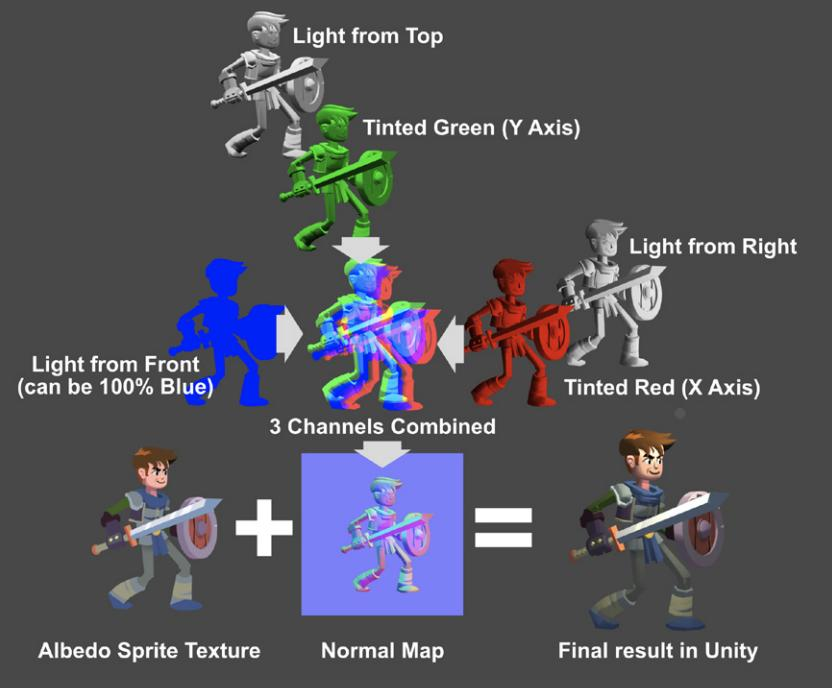

How to combine two shaded grayscale (lit from top and from right ) images into a normal map

Another painting approach is to use a normal map-generator app. Open a sprite in a generator app, and you can generate a normal map with just a couple of clicks. Generator apps do not take into account the angles of your sprite, so avoid using them on the entire sprite. They also don't recognize the objects. They instead estimate shapes from the sprite colors or by adding a general filter similar to bevel or emboss from image editing apps or a relief sculpture. They can't recognize the angles of the face, for example, but attempt to guess where there should be a change in an angle. It's a limitation, but they're still useful for generating the normal maps of sprite sections that are beveled, like chains, cables, or a dragon's tail, and also surface normals for bricks, stones, wood, and others.

Import a section into the normal map generator, tweak the values, export, and then add the necessary parts and details yourself.

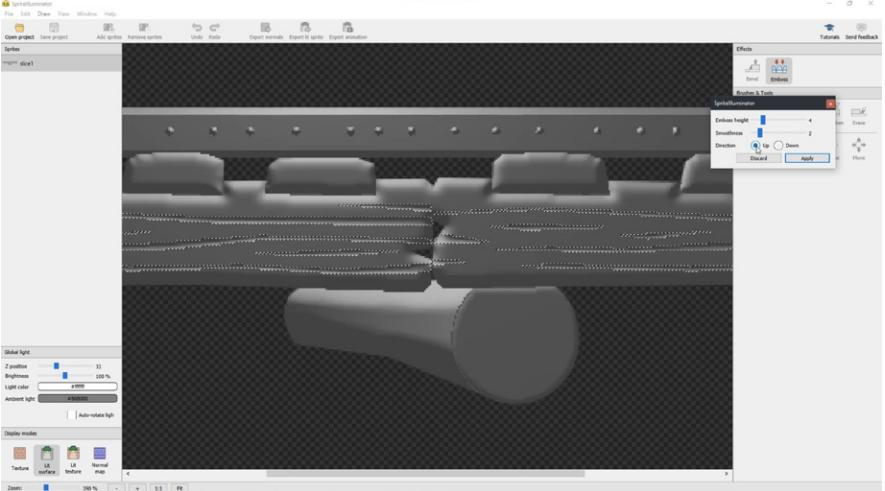

Generating crevices in normal map by using Emboss tool in Sprite Illuminator

For the last technique, Unity offers a way to generate normal maps from a grayscale heightmap. This is a texture where black represents the minimum surface height and white the maximum height. You need to import an image as a normal map and check the Create from Grayscale option. This technique is handy for quickly generating normal maps without ever leaving the engine.

When using this method, the Bumpiness slider will appear in the Inspector. Unity uses pixel brightness and converts the height differences to normal map angles, and this slider controls the steepness of those angles. A low bumpiness value means that even a sharp contrast in the heightmap will be translated into softer angles and bumps.

| Texture Type                                   | Normal map | D    |
|------------------------------------------------|------------|------|
| Texture Shape                                  | 2D         | D    |
| Ignore PNG file gamma Create from Grayscale | >          |      |
| Bumpiness                                      |            | 0.12 |
| Filtering                                      | Smooth     | D    |

Converting texture to normal map using Create from Grayscale option

#### **How to paint normal maps onto sprites**

To paint a normal map, start by learning which colors to use for different angles.

First, obtain a normal map palette so you can sample the colors used to represent the surface angles. Find palettes online, or simply use the palette of colors from the normal maps chapter image. No matter how your painting workflow looks, you'll only need to copy a palette to your favorite painting app and use the color picker to select a color to paint on your normal map.

Angle colors don't need to be 100% accurate; a few degrees won't make a difference. However, be sure to keep the overall shape of the sprite believable. If you use an angle color that doesn't make sense in-context, the whole shape will fall apart when lit.

Painting normal maps can be tricky initially because it requires a good spatial imagination. A great place to start is with something simple like the base planes of the head. This simplified model of a human head has a low-poly look, and you can check out this prepared [example here](https://images.response.unity3d.com/Web/Unity/%7B9c8dcb76-9772-4a8a-8295-ef9b30147ca8%7D_base-head-template-image.zip).

When painting a normal map, try to imagine the basic 3D shapes that are parts of your sprite, then visualize the angles of each individual part. If you know the angle, you'll know from which part of the palette sprite to sample the color.

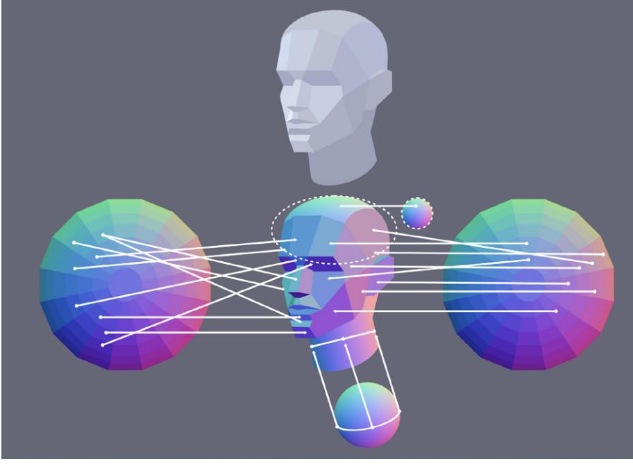

How to sample an angle from a normal map palette.

This example is working on a flat surface, but the process is similar when you're painting with softer brushes. You can blend hard edges to achieve a more natural look.

A couple of shortcuts to note: When there's a spherical shape, you can paste the normal sphere from your palette. When you have a cylindrical shape, you can take a part of the sphere, paste and stretch it, or make a gradient.

Be aware that copying and pasting parts of normal maps and rotating them breaks the shading. However, this can also be used to your advantage. For example, when you need a concave spherical shape, just rotate the sphere 180 degrees to create a hole.

For a normal map to show on one or more sprites, you need to enable normal map function on lights.

| Use Normal Map | >             |
|----------------|---------------|
| Distance       | 4             |
| Quality        | Accurate D |
|                |               |

Normal map support settings on 2D Light

Choose the method of generating normal maps that works best for you. Most likely there will be many assets made for your game, so focus on the objects that will be most visible and simplify the other parts of the game.

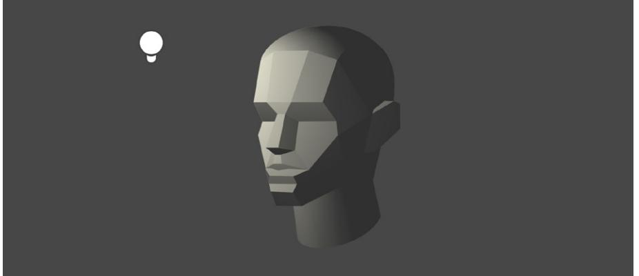

This is how the normal map looks on a white sprite in-engine.

#### Some tools that can help include:

- [NormalPainter](https://green-frisbee.itch.io/normalpainter)
- [Krita's Tangent Normal Brush](https://docs.krita.org/en/reference_manual/brushes/brush_engines/tangen_normal_brush_engine.html)
- [SpriteIlluminator](https://www.codeandweb.com/spriteilluminator)
- [Laigter](https://azagaya.itch.io/laigter)
- [Sprite Lamp](http://www.snakehillgames.com/spritelamp/)

## Adding rim lighting with Mask Maps

Rim lighting is an effect that's used to highlight the contours of a character. It simulates light coming from behind an object and the natural properties of light scattering. This is called the Fresnel effect. In real life, more light reflects from objects when the angle where the light hits the surface is wider.

Illustration of the Fresnel effect

That's why the water in a lake is more reflective from a distance, but we can see our feet in the water when we look down. This is also why objects are more reflective on their edges.

In 2D graphics, you can simulate this effect by using an additional texture called Mask Map and a special light called Blend Style.

[Blend Styles](https://docs.unity3d.com/Packages/com.unity.render-pipelines.universal@10.7/manual/LightBlendStyles.html) determine the way a particular light interacts with sprites in a scene. Light Blend Styles are located in the 2D Renderer asset.

| 0 Inspector                             |                                       |     | a    | : ■× |   |
|-----------------------------------------|---------------------------------------|-----|------|------|---|
| New 2D Renderer Data (Renderer 2D Data) |                                       |     |      | @ :  |   |
|                                         |                                       |     |      | Open |   |
| Transparency Sort Mode                  | Custom Axis                           |     |      |      | ▶ |
| Transparency Sort Axis                  | X 0                                   | Y 1 | Z O  |      |   |
| HDR Emulation Scale                     | 1                                     |     |      |      |   |
| Light Blend Styles                      |                                       |     |      |      |   |
| ▼ Default                               |                                       |     |      |      |   |
| Name                                    | Default                               |     |      |      |   |
| Mask Texture Channel                    | None                                  |     |      |      |   |
| Render Texture Scale                    |                                       |     |      | 0.5  |   |
| Blend Mode                              | Multiply                              |     |      |      | V |
| ▼ Rim Light                             |                                       |     |      |      |   |
| Name                                    | Rim Light                             |     |      |      |   |
| Mask Texture Channel                    | R                                     |     |      |      |   |
| Render Texture Scale                    |                                       |     |      | 0.5  |   |
| Blend Mode                              | Additive                              |     |      |      |   |
| Unused                                  |                                       |     |      |      |   |
| > Unused                                |                                       |     |      |      |   |
| Use Depth /Stencil Buffer               | >                                     |     |      |      |   |
| Post-processing Data                    | C PostProcessData (Post Process Data) |     |      |      | 0 |
| Default Material Type                   | Lit                                   |     |      |      |   |
|                                         |                                       |     |      |      |   |
|                                         |                                       |     |      |      |   |
|                                         |                                       |     |      |      |   |
|                                         |                                       |     |      |      |   |
|                                         |                                       |     |      |      |   |
| Asset Labels                            |                                       |     |      |      |   |
|                                         |                                       |     |      |      |   |
| AssetBundle None                     |                                       | >   | None |      |   |

Setting Light Blend Styles options in 2D Renderer Data asset

Under Light Bend Styles are four options for different blending styles. Leave the first option untouched because it's the default one, and instead work on the second option.

Give it a name like "Rim Light" or "Fresnel" or whatever works for you. Set the Mask Texture channel to R – lights will use the red color of our Mask Map texture. Lastly, set the Blend Mode to Additive. This will make lights be added on top of existing lighting, increasing the brightness.

#### **Painting the Mask Map**

Fresnel light uses the red channel of the Mask Map, but for the sake of simplicity, let's paint in black and white. The parts that will reflect light will be white, and the unreflective parts will be black. The Fresnel effect impacts the edges of objects, so copy the base sprite, paint it black, then highlight the edges white. It should start to resemble an object that has a bright light shining behind it. To speed things up, add an Inner Glow effect on the object, and paint some details on top. Unfortunately, there's no app that can speed up this process, so you'll need to rely on your painting skills here.

|             |  |  | Mask Map for a base plane |
|-------------|--|--|---------------------------|
| head sprite |  |  |                           |

#### **Setting Fresnel light**

To make the light affect the Mask Map, change its Blend Style to the one created earlier.

| Alpha Blend on Overlap |           |   |
|------------------------|-----------|---|
| Light Order            | O         |   |
| Blend Style            | Rim Light | > |
| Color                  |           | 0 |
| Intensity              | 7.23      |   |
| Use Normal Map         | >         |   |
| Distance               | 0.21      |   |
| Quality                | Accurate  | > |
|                        |           |   |

Changing light's Blend Style to Rim Light

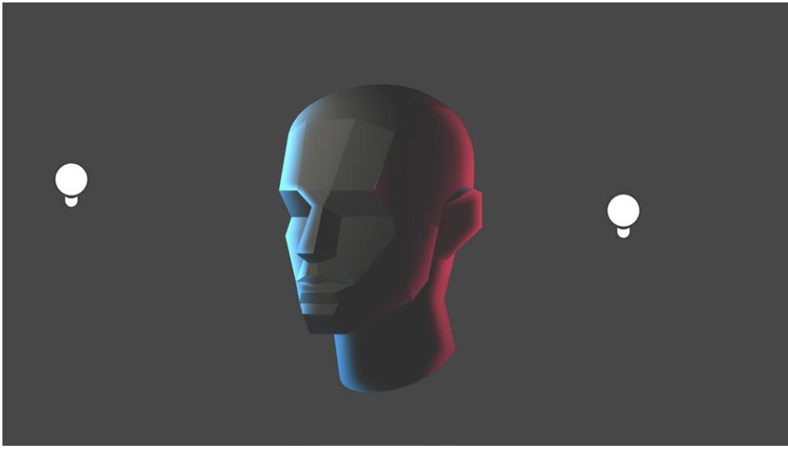

Editing shapes in the Shadow Caster 2D component

Fresnel lights work best with the Use Normal Maps option enabled and with Distance set to a low value. This prevents highlighting the other side of the object.

#### Adding 2D shadows with 2D Lights

2D Lights can also cast shadows onto a scene. For a GameObject to cast a shadow from 2D light, add a Shadow Caster 2D component to the object.

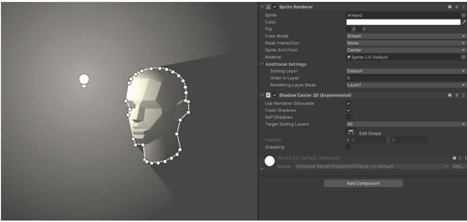

Rim lighting effect on a sprite in the Unity Editor

Use the Shadow Caster's shape editor to edit its geometry so it fits the object's silhouette. The light also needs to have some options set to cast a shadow.

| Volume Opacity          |         | 0.407 |
|-------------------------|---------|-------|
| Shadow Intensity        | 0 1     |       |
| Shadow Volume Intensity |         |       |
| Target Sorting Layers   | Default |       |
|                         |         |       |

2D Lights options used when using shadows

Use the Shadow Intensity option to see the shadow. This setting determines the light's opacity on other objects that are in the shadows. When it's set to 1, the light will not illuminate anything in the shadow area.

You can also make the area affected by light visible by using the Volume Opacity option. The Shadow Volume Intensity controls the opacity of the light volume in the shadow area.

*Among Us* by InnerSloth. Apart from enhancing the visual side of games, shadows can also be a crucial part of the gameplay.

## How to use 2D Lights on different renderers

2D Lights can be used together with normal maps and mask maps on sprites, but you can also use them on different renderers. Let's see how.

#### **2D Tilemap**

To use 2D Lights on Tilemaps, assign the normal map and mask map textures to the sprites that are used as tiles by using the Sprite Editor's Secondary Textures module. Secondary textures will be used automatically by the 2D Lights system.

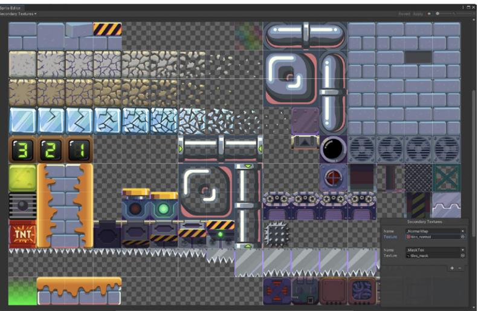

*Tilemaps with Secondary Maps*

2D Lights with normal mapping and mask maps on 2D Tilemap

#### **2D Sprite Shape**

The [Sprite Shape Renderer](https://docs.unity3d.com/Packages/com.unity.2d.spriteshape@5.1/manual/index.html) uses two different materials per object: one for Fill and one for Edge. The Edge Material uses Secondary Maps from the Sprite asset. For the Fill area, use the texture with wrap mode set to Repeat for tiling instead of the sprite. You'll need to create a new Fill material with Material Property Block enabled for setting secondary textures.

| T B V Sprite Shape Renderer |                                                        |                    |     | 3 | 2         |    |
|-----------------------------|--------------------------------------------------------|--------------------|-----|---|-----------|----|
| Color                       |                                                        |                    |     |   |           | 00 |
| Mask Interaction            |                                                        | None               |     |   |           | V  |
| Fill Material               |                                                        | @ grass_dirt       |     |   |           | 0  |
| Edge Material               |                                                        | Sprite-Lit-Default |     |   |           | 0  |
| Additional Settings         |                                                        |                    |     |   |           |    |
| Sorting Layer               |                                                        | Default            |     |   |           | >  |
| Order in Layer              |                                                        | O                  |     |   |           |    |
| Rendering Layer Mask        |                                                        | Layer1             |     |   |           |    |
|                             | Sprite-Lit-Default (Material)                          |                    |     |   | 0 花 :     |    |
|                             | Shader Universal Render Pipeline/2D/Sprite-Lit-Default |                    |     |   | Edit      |    |
|                             |                                                        |                    |     |   |           |    |
|                             | Grass_dirt (Material)                                  |                    |     |   | 2 花       |    |
|                             | Shader Universal Render Pipeline/2D/Sprite-Lit-Default |                    |     |   | Edit      |    |
| Diffuse                     |                                                        |                    |     |   | None      |    |
|                             |                                                        |                    |     |   | (Texture) |    |
| X Tiling                 | 1                                                      |                    | Y 1 |   |           |    |
| Offset                      | × 0                                                    |                    | Y O |   | Select    |    |
| Mask                        |                                                        |                    |     |   |           |    |
| Tiling                      | × 1                                                 |                    | Y 1 |   |           |    |
| × Offset                 | 0                                                      |                    | Y O |   |           |    |
| Normal Map                  |                                                        |                    |     |   |           |    |
| × Tiling                 | 1                                                      |                    | Y 1 |   |           |    |
| Offset                      | × 0                                                    |                    | Y O |   |           |    |

Example of Sprite Shape GameObjects using normal maps

Example of Sprite Shape GameObjects using normal maps

#### **2D PSD Importer for animated characters**

Setting Secondary Textures in the 2D PSD Importer works similarly, with one minor difference regarding normal maps.

The fastest way to make a normal map and mask map for a 2D PSD imported character is by working from a base character .PSB file.

- 1. Complete these steps to add a normal map to an animated character:
- 2. Duplicate the base character .PSB file. Rename the duplicated file by adding a suffix to its name, for example: \_normal
- 3. Open this file in your preferred image editor, and paint a normal map onto each layer. Save the file.
- 4. When a PSB with a normal map is imported into Unity, you'll need to set the Texture Type to Sprite and go into Advanced settings to uncheck sRGB(Color Texture) option. A normal map doesn't contain color sRGB data, only angle values.
- 5. Assign this PSB file as a Secondary Texture of your base character.

To make a mask map, repeat the process, give the duplicated file another suffix, and just skip step 3.

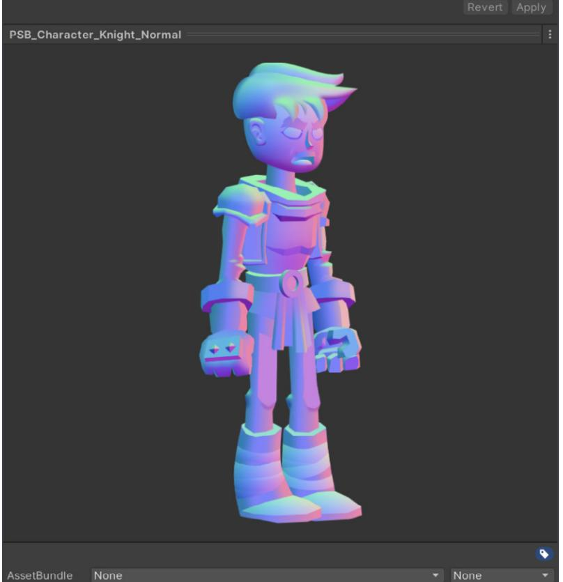

Adding a normal map to an animated character

## Optimization tips

- Avoid using too many lights in a Scene.
- Use as few Sorting layers and Light Blend Styles as possible.
- Set a lower value for the Render Texture Scale in Light Blend Styles of 2D Renderer assets.
- When using normal maps, set normal lighting Quality of lights to Fast instead of Accurate.
- Use 2D Shadows on only a few lights.

## **Advanced visual effects**

Visual effects (VFX) are the cherry on top of any great-looking game, and they're vital to the gamers' experience as they play. VFX communicate game events such as environmental hazards and healing zones, and they [visually](
https://resources.unity.com/games/game-designer-playbook?ungated=true)  [reward the player](
https://resources.unity.com/games/game-designer-playbook?ungated=true) [f](https://create.unity3d.com/game-designer-playbook?utm_source=demand-gen&utm_medium=pdf&utm_campaign=asset-links-gmg-choose-unity-for-2d&utm_content=2d-game-art,-animation-and-lighting-ebook)or well-executed actions, like an action scene culminating in a big, fiery explosion.

Unity provides lots of options to add VFX to your game. You can add frameby-frame animations made in other software, animate particles, or add animated shaders.

### Frame-by-frame animations

Frame-by-frame (or flipbook) animation lets you add effects quickly in Unity. Simply import frames as sprites, then animate the Sprite Property over time in the Animation window. You can also select and drag all the frame sprites into the Scene, which will then animate them automatically.

While importing frames is fast, drawing each frame to be animated is not, and this process can require much more time and skill than you have available. To save time, you can instead export VFX as frames from other apps.

Another shortcut you can use is to select all of the animation frame assets from the Project view, and drag them to the Hierarchy view or Scene. A new GameObject will then be created with an animation that uses the sequence made of the previously selected images.

The flipbook animation technique is very performant, so use it when you want to have many instances of the effect onscreen. Remember that many frames in high resolution will require more memory.

|                                                         |     |        | O |    |    |    |    |
|---------------------------------------------------------|-----|--------|---|----|----|----|----|
|                                                         |     |        |   |    |    |    |    |
|                                                         |     |        |   |    |    |    |    |
|                                                         |     |        |   |    |    |    |    |
| Animation Preview ® He IE D DI DH                    | 1 1 | 0      |   | 12 | 13 | 14 | 15 |
| New Animation - - - - Samples 12 - Samples 12 - - -   - |     |        |   |    |    |    |    |
| ▼ [s fire_animation : Sprite                            | �   | � C |   |    |    | 6  |    |
| Add Property                                            |     |        |   |    |    |    |    |

Frame-by-frame animation of a flame

Frame-by-frame animation can also be used in [Particle Systems,](https://docs.unity3d.com/Manual/ParticleSystems.html) where it is referred to as Texture Sheet Animation.

| V Texture Sheet Animation |                 |     |  |
|---------------------------|-----------------|-----|--|
| Mode                      | Sprites         |     |  |
|                           | · None (Sprite) | 0 4 |  |
| Time Mode                 | Lifetime        | L   |  |
| Frame over Time           |                 | œ   |  |
| Start Frame               | O               | >   |  |
| Cycles                    |                 |     |  |
| Affected UV Channels      | Everything      | b   |  |

Setting up frame-by-frame animation in Particle System

Flipbook animations can also be used in the Shader Graph by animating the UV position of texture over time, which creates the illusion of moving frames.

Flipbook animation in Shader Graph

## Particles

The Particle System allows you to display and animate many smaller images or meshes in order to achieve a single visual effect. Particle properties like size, velocity, color, and rotation can be animated over time using certain predefined rules and randomization. This allows you to create dynamic effects like fire, explosions, smoke, magic spells, and so on.

You create a new Particle System by selecting the menu option **GameObject > Effects > Particle System**.

| ್ಕೆ > Particle System  |           | 8 花      |
|------------------------------|-----------|-------------|
|                              |           | Open Editor |
| Particle System              |           | +           |
| Duration                     | 5         |             |
| Looping                      | >         |             |
| Prewarm                      |           |             |
| Start Delay                  | 0         | 4           |
| Start Lifetime               | 5         | 4           |
| Start Speed                  | 5         | 4           |
| 3D Start Size                |           |             |
| Start Size                   | 1         |             |
| 3D Start Rotation            |           |             |
| Start Rotation               | O         | >           |
| Flip Rotation                | 0         |             |
| Start Color                  |           | >           |
| Gravity Modifier             | O         | ◀           |
| Simulation Space             | Local     | ▶           |
| Simulation Speed             | 1         |             |
| Delta Time                   | Scaled    | >           |
| Scaling Mode                 | Local     | >           |
| Play On Awake*               | >         |             |
| Emitter Velocity             | Rigidbody | ▶           |
| Max Particles                | 1000      |             |
| Auto Random Seed             | >         |             |
| Stop Action                  | None      | >           |
| Culling Mode                 | Automatic | >           |
| Ring Buffer Mode             | Disabled  | >           |
| V Emission                   |           |             |
| Shape                        |           |             |
| Velocity over Lifetime       |           |             |
| Limit Velocity over Lifetime |           |             |
| Inherit Velocity             |           |             |
| Lifetime by Emitter Speed    |           |             |
| Force over Lifetime          |           |             |
| Color over Lifetime          |           |             |
| Color by Speed               |           |             |
| Size over Lifetime           |           |             |
| Size by Speed                |           |             |
| Rotation over Lifetime       |           |             |
| Rotation by Speed            |           |             |
| External Forces              |           |             |
| Noise                        |           |             |
| Collision                    |           |             |
| Triggers                     |           |             |
| Sub Emitters                 |           |             |
| Texture Sheet Animation      |           |             |
| Lights                       |           |             |
| Trails                       |           |             |
| Custom Data                  |           |             |
| V Renderer                   |           |             |
|                              |           |             |

Particle System properties

#### **Main Module properties**

The Particle System has many modules, but let's cover a few of the essentials.

The first module contains basic particle properties:

- Duration: How long the system will run
- Looping: Whether the whole system will loop forever
- Speed: The initial speed of the particles
- Start Size: The initial size of the particles
- Color: The initial color of the particles
- Gravity: Gravity force applied to the particles

#### **Emission**

Emission controls the rate and timing of emitted particles, while Rate controls how many particles are emitted per unit of time. You can also create bursts of particles, specifying how many to spawn and when.

#### **Shape**

This module defines the volume or surface from which particles can be emitted, and the direction that they will travel. The Shape property defines the shape of the emission volume.

#### **Color over Lifetime**

You can control the particles' color and opacity over its lifetime by evaluating the gradient. On the left of the gradient is the starting color, and on the right is the color particles will have when they die.

#### **Size Over Lifetime**

This setting defines the size of a particle along the horizontal axis of a curve.

#### **Rotation Over Lifetime**

Rotation over Lifetime gives particles a rotation speed.

#### **Noise**

This module will add randomness to the particle movement. It's a very quick way to add interesting and complex-looking effects like magic spells, sci-fi energy, exhaust fire, dust motes, and more.

#### **Renderer**

| ✓ Renderer               |                      |   |   |   |   |   |
|--------------------------|----------------------|---|---|---|---|---|
| Render Mode              | Billboard            |   |   |   |   | D |
| Normal Direction         |                      |   |   |   |   |   |
| Material                 | C Sprite-Lit-Default |   |   |   |   | 0 |
| Sort Mode                | None                 |   |   |   |   | > |
| Sorting Fudge            | 0                    |   |   |   |   |   |
| Min Particle Size        | O                    |   |   |   |   |   |
| Max Particle Size        | 0.5                  |   |   |   |   |   |
| Render Alignment         | View                 |   |   |   |   |   |
| Flip                     | X O               | Y | 0 | Z | 0 |   |
| Allow Roll               | V                    |   |   |   |   |   |
| Pivot                    | × O               | Y | 0 | Z | 0 |   |
| Visualize Pivot          |                      |   |   |   |   |   |
| Masking                  | No Masking           |   |   |   |   | > |
| Apply Active Color Space | >                    |   |   |   |   |   |
| Custom Vertex Streams    |                      |   |   |   |   |   |
| Cast Shadows             | Off                  |   |   |   |   | œ |
| Shadow Bias              | O                    |   |   |   |   |   |
| Sorting Layer ID         | Default              |   |   |   |   | > |
| Order in Layer           | O                    |   |   |   |   |   |
| Light Probes             | Off                  |   |   |   |   | ▶ |
| Reflection Probes        | Off                  |   |   |   |   | ▶ |
| Rendering Layer Mask     | Layer1               |   |   |   |   | ▶ |

The Renderer module

The Renderer module, as seen above, allows you to change how particles will look. There are many settings, but the most important to change is the Material setting, where you can add a new material with a texture.

#### **Randomized particles**

| 3D Start Size     |        |                              |
|-------------------|--------|------------------------------|
| Start Size        |        | V                            |
| 3D Start Rotation |        | V Constant                |
| Start Rotation    | O      |                              |
| Flip Rotation     | O      | Curve                        |
| Start Color       |        | Random Between Two Constants |
| Gravity Modifier  | 0      |                              |
| Simulation Space  | Local  | Random Between Two Curves    |
| Simulation Speed  |        |                              |
| Delta Time        | Scaled | D                            |
| Scaling Mode      | Local  | D                            |

Random particle property

Most of the particle properties can be randomized to achieve an unpredictable and natural look.

The dropdown menu to the right of the particle property allows you to choose from different randomization options.

Particle Systems can also be nested within one another. Nesting causes systems to play simultaneously, which allows you to achieve some very complex effects. For example, to create an explosion, you could combine one system for smoke, one for small sparks, and one for flying debris.

The Particle System is a very powerful tool that allows you to create almost any VFX for your game. You can even make your effects glow using HDR unlit shader and Bloom post-processing. Test out every property, for even the simplest particles will make your game feel polished.

To speed up your game creation process significantly, check the Asset Store for [premade particle VFX.](https://assetstore.unity.com/vfx/particles?utm_source=demand-gen&utm_medium=pdf&utm_campaign=asset-links-gmg-choose-unity-for-2d&utm_content=2d-game-art,-animation-and-lighting-ebook)

## Shader Graph

Another way to make VFX is using shaders. Shaders are a set of instructions for the graphics processor, and they can, for example, calculate pixel colors or vertex positions.

[Shader Graph](https://docs.unity3d.com/Packages/com.unity.shadergraph@10.7/manual/index.html) enables you to build shaders visually. Instead of writing code, you create and connect nodes in a graph framework. Shader Graph gives instant feedback that reflects your changes, and it's simple enough for users who are new to shader creation.

With the Shader Graph you can:

- Warp and animate UVs
- Procedurally alter surface appearance
- Ad image filters similar to image editing apps
- Change an object's surface based on information like world location, normals, distance from the camera, and more
- Tweak shader visuals in a Scene's context by exposing properties to Material Inspector

#### **Using the Shader Graph**

To start using the Shader Graph for 2D, go to the Project window, right-click, and select **Create > Shader > Universal Render Pipeline > Sprite Lit Shader Graph** (or **Sprite Unlit Shader Graph**).

Use Sprite Lit Shader when you want your sprite to be affected by lights, which will be the case for almost all characters and objects. Use Sprite Unlit for unlit or emissive surfaces such as fire, light sources, electricity, spells, holograms, or special characters like ghosts.

To start creating a shader, name the file first. This will create your initial shader. Then, double-click the file to enter Edit mode.

| First Shader Save Asset   Save As _ Show In Project Check Out |                                                                                                                                                                                                                                                                                  |                                                   | ×0 ! Color Mode > < None> Blackboard Graph Inspector Main Preview                                                                     |
|------------------------------------------------------------------|----------------------------------------------------------------------------------------------------------------------------------------------------------------------------------------------------------------------------------------------------------------------------------|---------------------------------------------------|------------------------------------------------------------------------------------------------------------------------------------------|
| First Shader + Chadler Graphs Properties Keywords    | Vertex Object Space · - O Position(3) Object Space · - O Normal (3) Object Space · - O Tangent(3) Fragment                                                                                                                                                           | Procision Universal v Universal Material | Graph Inspector Node Settings Graph Settings Singlo Target Settings Active Targets + - Sprito Lit Custom Editor GUI |
|                                                                  | · - O Base Collor(3) · - O Sprite Mask(4) Tangent Space · · · O Normal (Tangent Space)(3) · · · · · · · · · · · · · · · · · · · · · · · · · · · · · · · · · · · · · · · · · · · · · · · · · · · · · · · · · · · · · · · · · · · · · · · · · · · · · · · · · · · · · · · |                                                   | Main Preview                                                                                                                             |

This opens the Shader Graph window. Within the central part, called the Workspace, is the Master Stack. This is the final output of the Shader Graph, which is responsible for the shader's ultimate look. There should only be one Master Stack per shader.

The Master Stack contains two Contexts, which correspond to vertex and fragment (or pixel) functions.

On the left hand, you'll see a Blackboard. This contains properties that will be visible in the Inspector and Keywords.

At the top right is a Graph Inspector, which has two tabs: Node settings, which allows you to change a selected Node's settings, and Graph Settings, which changes the entire graph's settings. From the Inspector, you can switch the Precision mode; this is a good idea to set it to half on low-end devices. You can also swap the shader Material between lit and unlit.

The Main Preview at the bottom is where you can view the final shader.

The nodes in Shader Graph are the building blocks that hold inputs, effects, and interactions. A graph proceeds from left to right, so nodes will have input slots on the left, and outputs on the right.

To add a new node, right-click anywhere on the workspace, and choose **Create Node** from the context menu. You'll be presented with a list of all nodes grouped by type. Select **Input > Texture > Sample Texture 2D**.

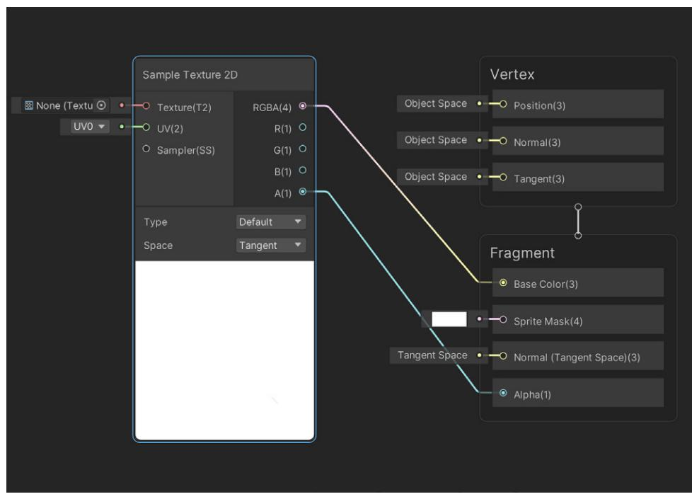

An example of a Texture 2D node

Connect the RGBA(4) slot of the Sample Texture 2D node to the Base Color(3) in the Master Stack's input slot. Connect the A(1) slot to Alpha(1). Now, the Master Stack's Fragment Context will use the color and alpha of the texture you provide to the Sample Texture 2D node.

To reference this texture from outside the shader, you need a property.

Exposed properties will show in the Inspector view where you can modify the parameters that will be used in the Graph.

Click the Plus button located on the Blackboard, and select Texture 2D. Select the newly created property, and options will appear in the Graph Inspector. You can change the property's name, but more important is the Reference option – change this to \_MainTex.

For the texture, use the sprite, which is set in every Sprite Renderer. Sprite Renderer will check for \_MainTex property in the current Material's shader and will set its sprite texture as the texture in the shader. Finally, drag this property from the Blackboard to the workspace, and connect it to the Texture(T2) input slot on the Sample Texture 2D node. Hit the Save Asset button on the toolbar, and the shader will be compiled.

You can use the Shader Graph just like any other shader in Unity. Right-click in the Project window, choose **Create > Material**, and select your shader from the list. All of its properties will be available to customize.

You can test your shader by applying the created material to a sprite. Of course, this is the simplest shader with just a texture. Feel free to experiment and try out the rest of the nodes. Or maybe you can try to add a normal map and Mask Map (Sprite Mask) to this shader? Hints: Sample Texture 2D Type needs to be set to Normal to correctly display normal map, and you can check reference names of Normal Map and Mask Map textures in the Secondary Textures window in the Sprite Editor. Good luck!

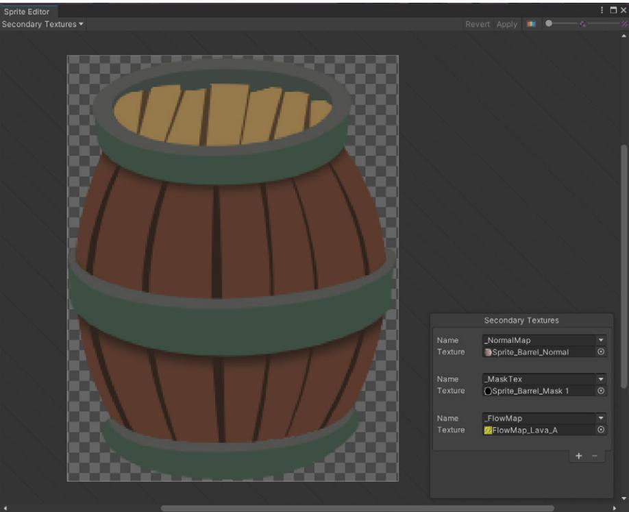

Secondary Textures for the barrel sprite. You can check their names and add your own textures that can be referenced in Shader Graph by name.

## Vertex displacement

The Vertex displacement shader affects the positions of vertices in a geometry of the mesh. You can displace vertices in many ways, and the simplest way is to apply a moving noise. This shader is good for waving objects: foliage, hanging vines and ropes, flags, and so on. You can find an example of this Shader Graph file in the *Dragon Crashers* project, with the file name *ShaderGraph\_Sprite\_Lit\_Waving.*

Main part of Waving shader

To achieve the wave animation, Gradient Noise is used as a wave mask. Its UV Offset is animated by the Time node multiplied by a Float named Speed. These all affect the position of vertices in the Vertex Context.

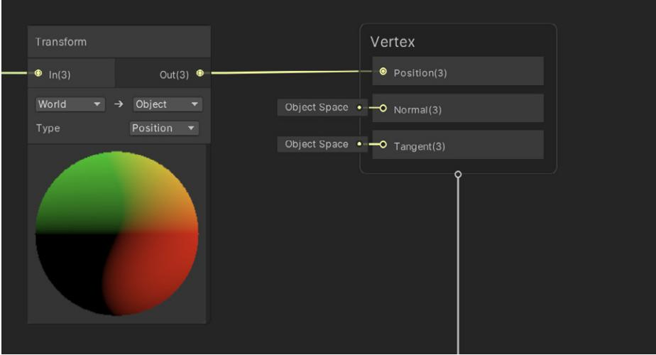

The Vertex context in Shader Graph modifies the vertices position and the Fragment master stack the pixel information.

The sprite that will be affected by the Waving shader needs to have a sufficient vertex count, otherwise the animation will look rough. To edit the vertices, use Skinning Editor Geometry tools.

Editing vertices

Cobweb shader in action [\(click](https://www.google.com/url?q=https://youtu.be/gJ40FxUJnZ4&sa=D&source=docs&ust=1639508737131000&usg=AOvVaw3Vj0uwRHjGjY34apt20QUW) through to see the animation).

#### Flow maps

Flow maps are textures that store directional information. You can find a flow map shader in the Dragon Crashers demo, with the name ShaderGraph\_Lava. The shader uses the flow map texture to control the direction of the main texture's UV coordinates. The colors red and green are used to indicate the XY direction that pixels follow in every frame, making the pixels of the main texture "flow."

Open the SubGraph FlowMap to learn how to achieve this effect.

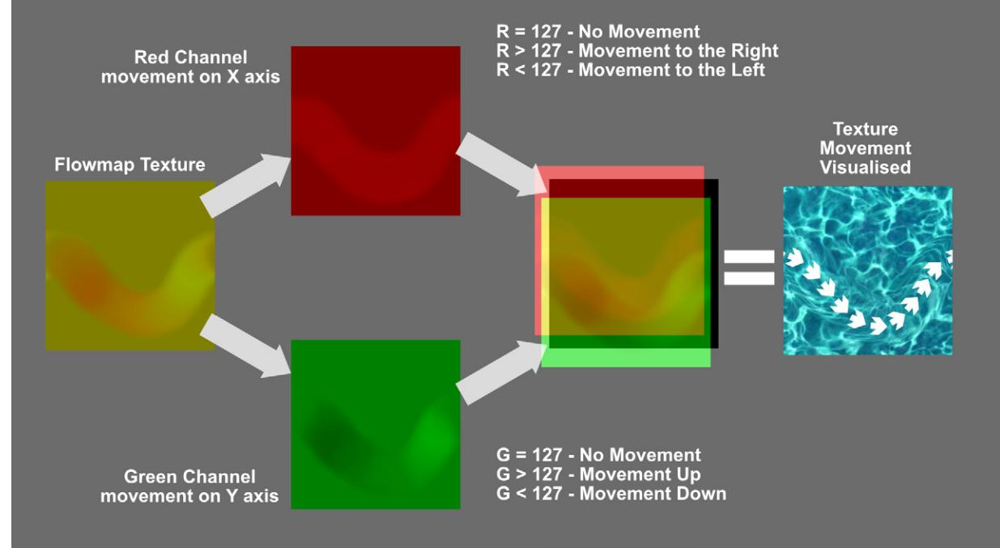

Flow map texture colors explained: The red color controls pixel movement on X axis, green color determines on the Y axis. The shader moves the pixels of the main texture in the directions that are visualized by the arrows.

The hand-painted flow map gives the stream of lava a viscous and cartoonish effect, which matches the project's art direction. A couple of tools you can use for flow map creation include [Flow Map Generator / Visualizer](https://cables.gl/p/ntZfmv) and [Flow map painter](https://clemensbeute.gumroad.com/#heZDT).

## Threshold animations for fluid prop animation

Another shader animation technique you can try is called "animated alpha clipping," which creates smooth animation from a single texture. This occurs by showing a specific range of pixels in each frame based on their alpha values. The texture is single channel, so the effect is simple to achieve. Find an example of it in *Dragon Crashers* with the name *ShaderGraph\_Sprite\_Unlit\_ ThresholdAnim*.

Animated alpha clipping

To achieve this effect, a Smoothstep node is used. The texture's red channel is connected to the In(1) slot, and Vertex Color alpha controls the evaluation of the edge and smoothness of the Smoothstep effect. Vertex Color is controlled by the Color property of the Sprite Renderer, so when you change the opacity of the sprite, the texture is animated. This allows the shader to be usable, even on particles.

If you use Affinity Photo, you can paint the texture for this shader black and white, then preview the animation by using Threshold Adjustment while moving the value slider.

Previewing threshold animation in Affinity Photo

Texture used for the lava effect and how it looks in-game (see how it looks animated [here](https://blog-api.unity.com/sites/default/files/2021-03/splatteralphafading.gif))

This effect achieves the look of fluids or splatters, without the need for frameby-frame animation. You can learn more about this animation in the [Surface](https://www.gdcvault.com/play/1020476/Surface-Tension-Liquid-Effects-in)  [Tension](https://www.gdcvault.com/play/1020476/Surface-Tension-Liquid-Effects-in) community post.

#### **Reflections and refractions**

One of the most common 2D techniques deals with reflections and refractions, like those you see on water, ice, glass, or in hot air. To achieve this effect, another camera outputs the parts that will be reflected or refracted into a render texture. This texture is then used in a shader, distorted and adjusted as needed, and finally outputted onto the screen.

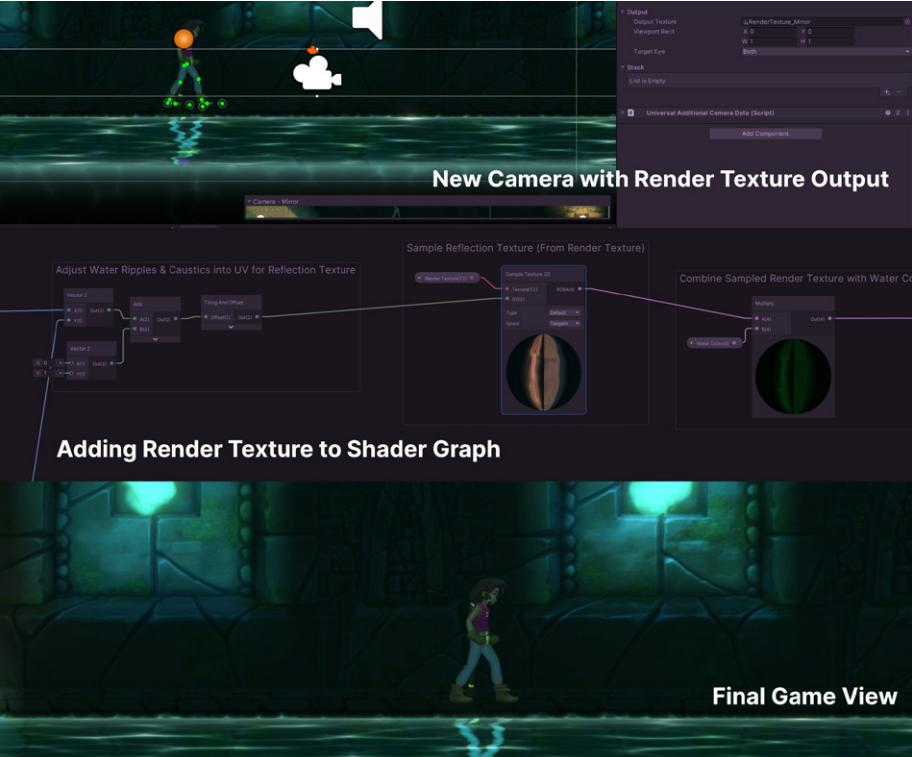

The setup process for water reflections, created with *[Lost Crypt](https://assetstore.unity.com/packages/essentials/tutorial-projects/lost-crypt-2d-sample-project-158673?utm_source=blog&utm_medium=pdf&utm_campaign=asset-links-gmg-choose-unity-for-2d&utm_content=2d-game-art,-animation-and-lighting-ebook)* demo shader files named ShaderGraph Water Unlit

## Adding glow around lights

To make sprites glow with blinding light, combine the HDR enhanced sprite shader with the Bloom post-processing effect.

HDR shader in *Dragon Crashers* (ShaderGraph\_Sprite\_Unlit\_HDRTint)

To make this blinding light effect, multiply texture by a Color node that uses HDR Color Mode. In the Material, crank up the HDR value over 1, with the Bloom post-processing effect enabled on the main camera.

#### Sprite masking

Sprite Masks are used to either hide or reveal parts of a sprite or group of sprites. For example, you could hide part of an image to produce a portal effect or make a collectible card with a 3D effect.

To create a Sprite Mask, go to the menu and select **GameObject > 2D Object > Sprite Mask.** Next, choose a sprite to be used as a mask shape. Keep in mind that the mask sprite itself will not be visible. Set the Sorting Layers on which the mask will work.

Portal Effect created with Sprite Mask and the Particle System

The sprite used as the mask image can itself be animated with the animation tool. This enables you to create some interesting effects. For example, you can make a portal appear, then grow bigger or change shape.

Mask Sprites need to have their Mask Interaction set in the Sprite Renderer in order to be affected by a Sprite Mask. In the URP's 2D Renderer, the Depth/ Stencil Buffer must be enabled.

Depth/Stencil Buffer option used for masking

## Comparison of tools

#### **2D skeletal animation vs frame-by-frame animation**

| Frame by frame                                                                                                                        |                                                                                                                                                                                                                                                                                                                                    | 2D skeletal                                                                                                                                                                                                                                                                                                                                                              |                                                                                                                                   |  |
|---------------------------------------------------------------------------------------------------------------------------------------|------------------------------------------------------------------------------------------------------------------------------------------------------------------------------------------------------------------------------------------------------------------------------------------------------------------------------------|--------------------------------------------------------------------------------------------------------------------------------------------------------------------------------------------------------------------------------------------------------------------------------------------------------------------------------------------------------------------------|-----------------------------------------------------------------------------------------------------------------------------------|--|
| Pros                                                                                                                                  | Cons                                                                                                                                                                                                                                                                                                                               | Pros                                                                                                                                                                                                                                                                                                                                                                     | Cons                                                                                                                              |  |
| • Artistic look • Can animate everything (easy rotation of character) • Little runtime cost                               | • Costly to make (time, skill) • Difficult to edit later • Consumes large amounts of memory • The animation will always be limited to the frames per second that it was created forthey need to be manually authored if changes to the speed or frame rate of the animation are required | • Easy to set up and animate • Easy to edit later • Small texture size • Can support multiple characters or skins per skeleton • Can be edited at runtime to add clothes, weapons, animating IK, and so on • Animation will always be smooth – interpolation • animations can be blended to create smooth transitions | • Some runtime cost • Animations like rotating around Y axis are more difficult • Doesn't work well with pixel art |  |
| Use when you:                                                                                                                         |                                                                                                                                                                                                                                                                                                                                    | Use when you:                                                                                                                                                                                                                                                                                                                                                            |                                                                                                                                   |  |
| • Want a great aesthetic or specific style • Focus on pixel art animation • Want simple animation of just a few frames |                                                                                                                                                                                                                                                                                                                                    | • Don't have strong animation skills • Want to make animation quickly • Want multiple skins or characters • Want a better runtime control • Want to save texture space                                                                                                                                                                        |                                                                                                                                   |  |
| expressions can be driven by sprite swaps.                                                                                            |                                                                                                                                                                                                                                                                                                                                    | Both techniques can be mixed. The movement of limbs can be driven by bones, but facial                                                                                                                                                                                                                                                                                   |                                                                                                                                   |  |

#### **Shaders animation vs animation clips for VFX vs Particle System**

| Shaders                                                                                                                                                                                                                                                       |                                      | Animation clips                                                                                                                           |                                                                                                                | Particle System                                                                                           |                                                                                                |
|---------------------------------------------------------------------------------------------------------------------------------------------------------------------------------------------------------------------------------------------------------------|--------------------------------------|-------------------------------------------------------------------------------------------------------------------------------------------|----------------------------------------------------------------------------------------------------------------|-----------------------------------------------------------------------------------------------------------|------------------------------------------------------------------------------------------------|
| Pros                                                                                                                                                                                                                                                          | Cons                                 | Pros                                                                                                                                      | Cons                                                                                                           | Pros                                                                                                      | Cons                                                                                           |
| • Achieves effects not possible with other techniques • Procedural effects • Fast creation time • Small texture size                                                                                                         | • Runtime calculation are hard | • Looks great • Artistic control on animation and its frames                                                               | • Texture size • Takes more time to create individual frames • Hard to customize later | • Easy to make and edit later • Can randomize to define a unique look                   | • Complex effects • Require a lot of particles which can be taxing to CPU |
| Use when you: • Want simple animation of just a few frames Good for effects that otherwise would take a lot of space/memory when done frame by frame • Great when you need customization • Great for applying effects on materials |                                      | Use when you: • Good for natural- or cartoon looking animations (insects, birds, smoke effects, etc.) • Very low runtime cost |                                                                                                                | Use when you: • Good for effects with a bit of randomization like fire, fluids, and magic spells |                                                                                                |

#### **Tilemaps vs Sprite vs Sprite Shape**

| Tilemaps                                                                                                                     |                                                                                    | Sprites                                                                                             |                                                                                                     | Sprite Shape                                                                |                                                                                                     |
|------------------------------------------------------------------------------------------------------------------------------|------------------------------------------------------------------------------------|-----------------------------------------------------------------------------------------------------|-----------------------------------------------------------------------------------------------------|-----------------------------------------------------------------------------|-----------------------------------------------------------------------------------------------------|
| Pros                                                                                                                         | Cons                                                                               | Pros                                                                                                | Cons                                                                                                | Pros                                                                        | Cons                                                                                                |
| • Fast creation process for painting, tiles, and rule tiles • Precise • Good for optimizing games | • Difficult to to make organic shapes when constrained to a grid | • Great for placing objects manually                                                       | • Hard to paint multiple sprites • Not optimized when used in large numbers | • Easy editing of both polygonal and organic shapes             | • Doesn't allow for pixel perfect • placement easily • Textures can be repetitive |
| Use when you: • Good for precise placement of level elements • Grid is good for pathfinding                         |                                                                                    | Use when you: • Good for additional elements, as a supplement to Tilemaps and Sprite Shape |                                                                                                     | Use when you: • Great for organic-looking shapes • Fast level editing |                                                                                                     |
| • Very versatile                                                                                                             |                                                                                    |                                                                                                     |                                                                                                     |                                                                             |                                                                                                     |

## Optimization tips

- Try to maintain a low frame count/texture size when using frame-by-frame animation.
- With [Object Pooling](https://learn.unity.com/tutorial/introduction-to-object-pooling), you can avoid instantiating and destroying VFX assets. Simply activate and deactivate GameObjects.
- In the Shader Graph, use half precision whenever possible.

## **Post-processing**

## Overview

Post-processing enhances the look of your game by adding effects on the final image frame. These effects can simulate a physical video camera look or be completely stylized. The URP includes [post-processing capabilities](https://docs.unity3d.com/Packages/com.unity.render-pipelines.universal@10.7/manual/integration-with-post-processing.html?utm_source=blog&utm_medium=pdf&utm_campaign=asset-links-gmg-choose-unity-for-2d&utm_content=2d-game-art,-animation-and-lighting-ebook), so there's no need to install a separate package, and configuring the effects is straight-forward.

On the left is an image of a camera output without post-processing. On the right is the same image with post-processing added. The effects have been exaggerated to show the difference. Apply post-processing effects cautiously, especially in mobile games.

#### To begin, select the main camera, and select the Post Processing option.

| T Rendering     |                                         |   |
|-----------------|-----------------------------------------|---|
| Renderer        | Default Renderer (New 2D Renderer Data) | D |
| Post Processing | >                                       |   |
| Anti-aliasing   | None                                    | D |
| Stop NaN        |                                         |   |
| Dithering       |                                         |   |

Enabling Post Processing in the main camera

Post-processing uses the [Volume](https://docs.unity3d.com/Packages/com.unity.render-pipelines.universal@10.7/manual/Volumes.html?utm_source=blog&utm_medium=pdf&utm_campaign=asset-links-gmg-choose-unity-for-2d&utm_content=2d-game-art,-animation-and-lighting-ebook) system so to add a new post-processing Volume, select **GameObject > Volume > Global Volume.**

| ▼ ▼ √ Volume |                       |     | 9 花 : |   |
|--------------|-----------------------|-----|-------|---|
| Mode         | Global                |     |       | D |
| Weight       |                       | 3 1 |       |   |
| Priority     | 0                     |     |       |   |
| Profile      | None (Volume Profile) | 0   | New   |   |
|              |                       |     |       |   |

Defining a Volume Profile

Now, create a Volume Profile by clicking the New button. Volume Profile will store your post-processing effects and can be easily shared between Volumes and Scenes.

To start adding post-processing effects, click the Add Override button, then select a desired effect from the list.

Selecting the Bloom post-processing effect

Let's choose Bloom to start with.

| J Bloom > All None                                                                                                                                                                        |                | 8   |
|-------------------------------------------------------------------------------------------------------------------------------------------------------------------------------------------------|----------------|-----|
| Bloom                                                                                                                                                                                           |                |     |
| > Threshold                                                                                                                                                                                  | 0.87           |     |
| > Intensity                                                                                                                                                                                  | 1.48           |     |
| Scatter                                                                                                                                                                                         |                | 0.7 |
| 1 Tint                                                                                                                                                                                       |                | A   |
| Clamp                                                                                                                                                                                           | 65472          |     |
| _ High Quality Filtering                                                                                                                                                                        |                |     |
| Skip Iterations 1                                                                                                                                                                            |                |     |
| Lens Dirt                                                                                                                                                                                       |                |     |
| Dirt Texture                                                                                                                                                                                    | None (Texture) | O   |
| Dirt Intensity ﺎ ﺍﻟﻤﺴﺎﺣﺔ ﺍﻟﻤﺴﺘﻮﻯ ﺍﻟﻤﺴﺘﻮﻯ ﺍﻟﻤﺴﺘﻮﻯ ﺍﻟﻤﺴﺘﻮﻯ ﺍﻟﻤﺴﺘﻮﻯ ﺍﻟﻤﺴﺘﻮﻯ ﺍﻟﻤﺴﺘﻮﻯ ﺍﻟﻤﺴﺘﻮﻯ ﺍﻟﻤﺴﺘﻮﻯ ﺍﻟﻤﺴﺘﻮﻯ ﺍﻟﻤﺴﺘﻮﻯ ﺍﻟﻤﺴﺘﻮﻯ ﺍﻟﻤﺴﺘﻮﻯ ﺍﻟﻤﺴﺘﻮﻯ ﺍﻟﻤﺴﺘﻮﻯ ﺍﻟﻤﺴﺘﻮﻯ ﺍﻟﻤﺴﺘﻮﻯ ﺍﻟﻤﺴﺘﻮﻯ ﺍﻟﻤﺴﺘﻮﻯ ﺍﻟﻤﺴﺘﻮﻯ ﺍﻟﻤ | 0              |     |

Defining Bloom effect properties

To adjust the effect's property, select the adjacent checkbox.

A quick reminder: Ensure that the Global Volume's GameObject layer matches the layer selected in the Mask option on the main camera.

| 8 Static ▼ V Main Camera Static ▼ V Global Volume B · Layer Post Processing Tag Untagged Tag MainCamera · Layer Default J Transform 9 2 V 2 Transform 0 2 : 11 Position X 30,54515 Y 2.711628 Z 0.02922535 Position × 0 Y O Z -10 Rotation × 0 Y O ZO Rotation × 0 Y O Z O Z 1 Scale × 1 Y 1 Z 1 Scale × 1 Y 1 0 2 1 v Camera V Volume 9 # 1 Base - Mode Global Render Type @ 1 Weight v Projection 0 Priority Orthographic Projection Profile Global Volume Profile (Volume Profile) O New Clone Sizo 5 V J Bloom  Clipping Planes Near 0.3 All None Far 1000 Bloom v Rendering Threshold 0.87 Renderer Default Renderer (New 2D Renderer Data) V Intensity 1.48 Scatter 0.7 > Post Processing Tint Anti-aliasing None Clamp 65472 Stop NaN High Quality Filtering Dithering Skip Iterations 1 V Render Shadows Lens Dirt -1 Priority Dirt Texture 0 None (Texture) Use Pipeline Settings Opaque Texture Dirt Intensity 0 4 Depth Texture Use Pipeline Settings Culling Mask Everything 4 Add Override Occlusion Culling > Add Component v Environment - Background Type Skybox Volumes Post Processing Mask 0 Trigger Nothing Update Mode Everything Default T Output 0 Output Texture TransparentFX HDR Ignore Raycast MSAA Water Viewport Rect UI Post Processing Allow Dynamic Resolution 4 Target Display Display 1 Both Target Eye v Stack List is Empty + - | O Inspector |  |  |  | a : D× 0 Inspector |  |  | a : Ox |
|---------------------------------------------------------------------------------------------------------------------------------------------------------------------------------------------------------------------------------------------------------------------------------------------------------------------------------------------------------------------------------------------------------------------------------------------------------------------------------------------------------------------------------------------------------------------------------------------------------------------------------------------------------------------------------------------------------------------------------------------------------------------------------------------------------------------------------------------------------------------------------------------------------------------------------------------------------------------------------------------------------------------------------------------------------------------------------------------------------------------------------------------------------------------------------------------------------------------------------------------------------------------------------------------------------------------------------------------------------------------------------------------------------------------------------------------------------------------------------------------------------------------------------------------------------------------------------------------------------------------------------------------------------------------------------------------------------------------------------------------------------------------------------------------------------------|-------------|--|--|--|--------------------|--|--|--------|
|                                                                                                                                                                                                                                                                                                                                                                                                                                                                                                                                                                                                                                                                                                                                                                                                                                                                                                                                                                                                                                                                                                                                                                                                                                                                                                                                                                                                                                                                                                                                                                                                                                                                                                                                                                                                               |             |  |  |  |                    |  |  |        |
|                                                                                                                                                                                                                                                                                                                                                                                                                                                                                                                                                                                                                                                                                                                                                                                                                                                                                                                                                                                                                                                                                                                                                                                                                                                                                                                                                                                                                                                                                                                                                                                                                                                                                                                                                                                                               |             |  |  |  |                    |  |  |        |
|                                                                                                                                                                                                                                                                                                                                                                                                                                                                                                                                                                                                                                                                                                                                                                                                                                                                                                                                                                                                                                                                                                                                                                                                                                                                                                                                                                                                                                                                                                                                                                                                                                                                                                                                                                                                               |             |  |  |  |                    |  |  |        |
|                                                                                                                                                                                                                                                                                                                                                                                                                                                                                                                                                                                                                                                                                                                                                                                                                                                                                                                                                                                                                                                                                                                                                                                                                                                                                                                                                                                                                                                                                                                                                                                                                                                                                                                                                                                                               |             |  |  |  |                    |  |  |        |
|                                                                                                                                                                                                                                                                                                                                                                                                                                                                                                                                                                                                                                                                                                                                                                                                                                                                                                                                                                                                                                                                                                                                                                                                                                                                                                                                                                                                                                                                                                                                                                                                                                                                                                                                                                                                               |             |  |  |  |                    |  |  |        |
|                                                                                                                                                                                                                                                                                                                                                                                                                                                                                                                                                                                                                                                                                                                                                                                                                                                                                                                                                                                                                                                                                                                                                                                                                                                                                                                                                                                                                                                                                                                                                                                                                                                                                                                                                                                                               |             |  |  |  |                    |  |  |        |
|                                                                                                                                                                                                                                                                                                                                                                                                                                                                                                                                                                                                                                                                                                                                                                                                                                                                                                                                                                                                                                                                                                                                                                                                                                                                                                                                                                                                                                                                                                                                                                                                                                                                                                                                                                                                               |             |  |  |  |                    |  |  |        |
|                                                                                                                                                                                                                                                                                                                                                                                                                                                                                                                                                                                                                                                                                                                                                                                                                                                                                                                                                                                                                                                                                                                                                                                                                                                                                                                                                                                                                                                                                                                                                                                                                                                                                                                                                                                                               |             |  |  |  |                    |  |  |        |
|                                                                                                                                                                                                                                                                                                                                                                                                                                                                                                                                                                                                                                                                                                                                                                                                                                                                                                                                                                                                                                                                                                                                                                                                                                                                                                                                                                                                                                                                                                                                                                                                                                                                                                                                                                                                               |             |  |  |  |                    |  |  |        |
|                                                                                                                                                                                                                                                                                                                                                                                                                                                                                                                                                                                                                                                                                                                                                                                                                                                                                                                                                                                                                                                                                                                                                                                                                                                                                                                                                                                                                                                                                                                                                                                                                                                                                                                                                                                                               |             |  |  |  |                    |  |  |        |
|                                                                                                                                                                                                                                                                                                                                                                                                                                                                                                                                                                                                                                                                                                                                                                                                                                                                                                                                                                                                                                                                                                                                                                                                                                                                                                                                                                                                                                                                                                                                                                                                                                                                                                                                                                                                               |             |  |  |  |                    |  |  |        |
|                                                                                                                                                                                                                                                                                                                                                                                                                                                                                                                                                                                                                                                                                                                                                                                                                                                                                                                                                                                                                                                                                                                                                                                                                                                                                                                                                                                                                                                                                                                                                                                                                                                                                                                                                                                                               |             |  |  |  |                    |  |  |        |
|                                                                                                                                                                                                                                                                                                                                                                                                                                                                                                                                                                                                                                                                                                                                                                                                                                                                                                                                                                                                                                                                                                                                                                                                                                                                                                                                                                                                                                                                                                                                                                                                                                                                                                                                                                                                               |             |  |  |  |                    |  |  |        |
|                                                                                                                                                                                                                                                                                                                                                                                                                                                                                                                                                                                                                                                                                                                                                                                                                                                                                                                                                                                                                                                                                                                                                                                                                                                                                                                                                                                                                                                                                                                                                                                                                                                                                                                                                                                                               |             |  |  |  |                    |  |  |        |
|                                                                                                                                                                                                                                                                                                                                                                                                                                                                                                                                                                                                                                                                                                                                                                                                                                                                                                                                                                                                                                                                                                                                                                                                                                                                                                                                                                                                                                                                                                                                                                                                                                                                                                                                                                                                               |             |  |  |  |                    |  |  |        |
|                                                                                                                                                                                                                                                                                                                                                                                                                                                                                                                                                                                                                                                                                                                                                                                                                                                                                                                                                                                                                                                                                                                                                                                                                                                                                                                                                                                                                                                                                                                                                                                                                                                                                                                                                                                                               |             |  |  |  |                    |  |  |        |
|                                                                                                                                                                                                                                                                                                                                                                                                                                                                                                                                                                                                                                                                                                                                                                                                                                                                                                                                                                                                                                                                                                                                                                                                                                                                                                                                                                                                                                                                                                                                                                                                                                                                                                                                                                                                               |             |  |  |  |                    |  |  |        |
|                                                                                                                                                                                                                                                                                                                                                                                                                                                                                                                                                                                                                                                                                                                                                                                                                                                                                                                                                                                                                                                                                                                                                                                                                                                                                                                                                                                                                                                                                                                                                                                                                                                                                                                                                                                                               |             |  |  |  |                    |  |  |        |
|                                                                                                                                                                                                                                                                                                                                                                                                                                                                                                                                                                                                                                                                                                                                                                                                                                                                                                                                                                                                                                                                                                                                                                                                                                                                                                                                                                                                                                                                                                                                                                                                                                                                                                                                                                                                               |             |  |  |  |                    |  |  |        |
|                                                                                                                                                                                                                                                                                                                                                                                                                                                                                                                                                                                                                                                                                                                                                                                                                                                                                                                                                                                                                                                                                                                                                                                                                                                                                                                                                                                                                                                                                                                                                                                                                                                                                                                                                                                                               |             |  |  |  |                    |  |  |        |
|                                                                                                                                                                                                                                                                                                                                                                                                                                                                                                                                                                                                                                                                                                                                                                                                                                                                                                                                                                                                                                                                                                                                                                                                                                                                                                                                                                                                                                                                                                                                                                                                                                                                                                                                                                                                               |             |  |  |  |                    |  |  |        |
|                                                                                                                                                                                                                                                                                                                                                                                                                                                                                                                                                                                                                                                                                                                                                                                                                                                                                                                                                                                                                                                                                                                                                                                                                                                                                                                                                                                                                                                                                                                                                                                                                                                                                                                                                                                                               |             |  |  |  |                    |  |  |        |
|                                                                                                                                                                                                                                                                                                                                                                                                                                                                                                                                                                                                                                                                                                                                                                                                                                                                                                                                                                                                                                                                                                                                                                                                                                                                                                                                                                                                                                                                                                                                                                                                                                                                                                                                                                                                               |             |  |  |  |                    |  |  |        |
|                                                                                                                                                                                                                                                                                                                                                                                                                                                                                                                                                                                                                                                                                                                                                                                                                                                                                                                                                                                                                                                                                                                                                                                                                                                                                                                                                                                                                                                                                                                                                                                                                                                                                                                                                                                                               |             |  |  |  |                    |  |  |        |
|                                                                                                                                                                                                                                                                                                                                                                                                                                                                                                                                                                                                                                                                                                                                                                                                                                                                                                                                                                                                                                                                                                                                                                                                                                                                                                                                                                                                                                                                                                                                                                                                                                                                                                                                                                                                               |             |  |  |  |                    |  |  |        |
|                                                                                                                                                                                                                                                                                                                                                                                                                                                                                                                                                                                                                                                                                                                                                                                                                                                                                                                                                                                                                                                                                                                                                                                                                                                                                                                                                                                                                                                                                                                                                                                                                                                                                                                                                                                                               |             |  |  |  |                    |  |  |        |
|                                                                                                                                                                                                                                                                                                                                                                                                                                                                                                                                                                                                                                                                                                                                                                                                                                                                                                                                                                                                                                                                                                                                                                                                                                                                                                                                                                                                                                                                                                                                                                                                                                                                                                                                                                                                               |             |  |  |  |                    |  |  |        |
|                                                                                                                                                                                                                                                                                                                                                                                                                                                                                                                                                                                                                                                                                                                                                                                                                                                                                                                                                                                                                                                                                                                                                                                                                                                                                                                                                                                                                                                                                                                                                                                                                                                                                                                                                                                                               |             |  |  |  |                    |  |  |        |
|                                                                                                                                                                                                                                                                                                                                                                                                                                                                                                                                                                                                                                                                                                                                                                                                                                                                                                                                                                                                                                                                                                                                                                                                                                                                                                                                                                                                                                                                                                                                                                                                                                                                                                                                                                                                               |             |  |  |  |                    |  |  |        |
|                                                                                                                                                                                                                                                                                                                                                                                                                                                                                                                                                                                                                                                                                                                                                                                                                                                                                                                                                                                                                                                                                                                                                                                                                                                                                                                                                                                                                                                                                                                                                                                                                                                                                                                                                                                                               |             |  |  |  |                    |  |  |        |
|                                                                                                                                                                                                                                                                                                                                                                                                                                                                                                                                                                                                                                                                                                                                                                                                                                                                                                                                                                                                                                                                                                                                                                                                                                                                                                                                                                                                                                                                                                                                                                                                                                                                                                                                                                                                               |             |  |  |  |                    |  |  |        |
|                                                                                                                                                                                                                                                                                                                                                                                                                                                                                                                                                                                                                                                                                                                                                                                                                                                                                                                                                                                                                                                                                                                                                                                                                                                                                                                                                                                                                                                                                                                                                                                                                                                                                                                                                                                                               |             |  |  |  |                    |  |  |        |
|                                                                                                                                                                                                                                                                                                                                                                                                                                                                                                                                                                                                                                                                                                                                                                                                                                                                                                                                                                                                                                                                                                                                                                                                                                                                                                                                                                                                                                                                                                                                                                                                                                                                                                                                                                                                               |             |  |  |  |                    |  |  |        |
|                                                                                                                                                                                                                                                                                                                                                                                                                                                                                                                                                                                                                                                                                                                                                                                                                                                                                                                                                                                                                                                                                                                                                                                                                                                                                                                                                                                                                                                                                                                                                                                                                                                                                                                                                                                                               |             |  |  |  |                    |  |  |        |
|                                                                                                                                                                                                                                                                                                                                                                                                                                                                                                                                                                                                                                                                                                                                                                                                                                                                                                                                                                                                                                                                                                                                                                                                                                                                                                                                                                                                                                                                                                                                                                                                                                                                                                                                                                                                               |             |  |  |  |                    |  |  |        |
|                                                                                                                                                                                                                                                                                                                                                                                                                                                                                                                                                                                                                                                                                                                                                                                                                                                                                                                                                                                                                                                                                                                                                                                                                                                                                                                                                                                                                                                                                                                                                                                                                                                                                                                                                                                                               |             |  |  |  |                    |  |  |        |
|                                                                                                                                                                                                                                                                                                                                                                                                                                                                                                                                                                                                                                                                                                                                                                                                                                                                                                                                                                                                                                                                                                                                                                                                                                                                                                                                                                                                                                                                                                                                                                                                                                                                                                                                                                                                               |             |  |  |  |                    |  |  |        |
|                                                                                                                                                                                                                                                                                                                                                                                                                                                                                                                                                                                                                                                                                                                                                                                                                                                                                                                                                                                                                                                                                                                                                                                                                                                                                                                                                                                                                                                                                                                                                                                                                                                                                                                                                                                                               |             |  |  |  |                    |  |  |        |
|                                                                                                                                                                                                                                                                                                                                                                                                                                                                                                                                                                                                                                                                                                                                                                                                                                                                                                                                                                                                                                                                                                                                                                                                                                                                                                                                                                                                                                                                                                                                                                                                                                                                                                                                                                                                               |             |  |  |  |                    |  |  |        |
|                                                                                                                                                                                                                                                                                                                                                                                                                                                                                                                                                                                                                                                                                                                                                                                                                                                                                                                                                                                                                                                                                                                                                                                                                                                                                                                                                                                                                                                                                                                                                                                                                                                                                                                                                                                                               |             |  |  |  |                    |  |  |        |
|                                                                                                                                                                                                                                                                                                                                                                                                                                                                                                                                                                                                                                                                                                                                                                                                                                                                                                                                                                                                                                                                                                                                                                                                                                                                                                                                                                                                                                                                                                                                                                                                                                                                                                                                                                                                               |             |  |  |  |                    |  |  |        |
|                                                                                                                                                                                                                                                                                                                                                                                                                                                                                                                                                                                                                                                                                                                                                                                                                                                                                                                                                                                                                                                                                                                                                                                                                                                                                                                                                                                                                                                                                                                                                                                                                                                                                                                                                                                                               |             |  |  |  |                    |  |  |        |
|                                                                                                                                                                                                                                                                                                                                                                                                                                                                                                                                                                                                                                                                                                                                                                                                                                                                                                                                                                                                                                                                                                                                                                                                                                                                                                                                                                                                                                                                                                                                                                                                                                                                                                                                                                                                               |             |  |  |  |                    |  |  |        |

If everything is working correctly, the Bloom effect should be visible in the Game view.

Make sure the Post Processing check box in the camera is enabled and that the Layer of the Volume's GameObject is selected in the Volumes Mask drop list of the camera

Global Volume was used, so the effects should always be visible when the Volume object is active in the Scene.

#### **Local Volumes**

You can add post-processing effects to an entire level, but it's also possible to configure effects for parts of a level, such as when the player enters a building.

To do that, another Volume Object must be created with a different postprocessing Profile attached.

Volume's Mode needs to be set as Local, then add the 3D Box Collider to the

Adding a 3D Box Collider to a Volume Object

Volume Object. Post-processing will be applied when the camera enters the Box Collider's bounds, so make sure its along the Z axis is large enough to contain the camera object. By default, the collider will be too small, so double check the size by in Scene view.

Increasing the Blend Distance value will prevent the effects turning on abruptly when the camera enters the Volume zone.

## Overview of effects for 2D graphics

Post-processing in URP has many built-in effects, and almost every effect can be used in a 2D game. Here's a quick overview of the effects.

#### **Bloom**

The Bloom effect creates a glow around the brightest areas of the image, giving the impression that parts are brighter to simulate how a lens captures light. To further enhance the look, try adding a Lens Dirt texture, which will simulate the imperfections on a camera lense. For best performance, disable High Quality Filtering, especially on mobile.

#### **Chromatic Aberration**

This effect creates color distortion on the edges of an image. This simulates lenses that split colors further away from the center.

#### **Color Grading**

This is a group of effects rather than a single one. The purpose of color grading is to alter the colors of an image to stylize or change the mood of a scene. Color grading can simulate the time of day or temperature of an environment by adjusting its color temperature. These effects have the potential to give a game a very distinct look.

The URP uses the following effects to control Color Grading.

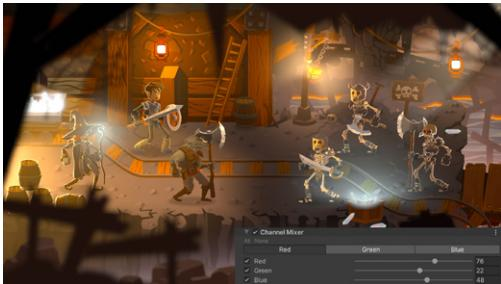

Channel Mixer: Modifies the influence of each input color channel on the final image

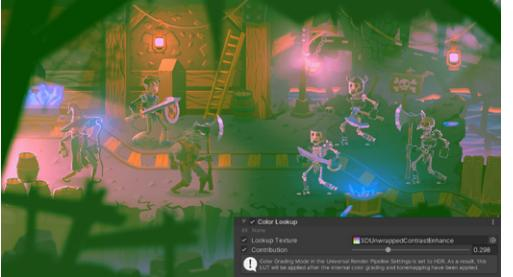

Color Lookup: Performant way of color grading by using a single texture

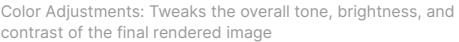

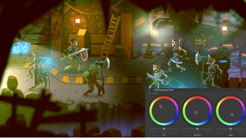

Lift Gamma Gain: Performs three-way color grading

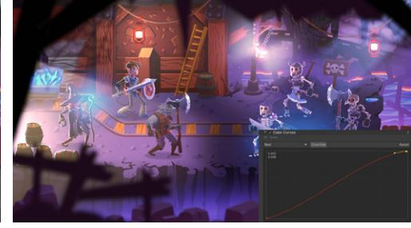

Color Curves: Allows precise color and luminance adjustments to an image

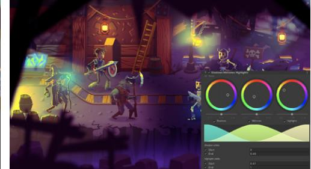

Shadows Midtones Highlights: Separately controls the shadows, midtones, and highlights of an image

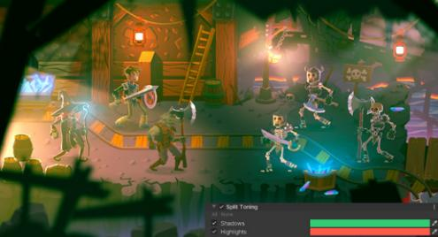

Split Toning: Tints different areas of the image based on luminance values, adding hints of different colors to shadows, midtones, and highlights

Tonemapping: Allows remapping the HDR values of an image to a new range of values

White Balance: Balances color temperature and can also cool or warm the tone of an image

#### **Lens Distortion**

This will create a barrel distortion effect commonly seen in real-world wide-angle lenses. This curves the straight lines on an image inwards, and it will be more pronounced closer to edges. This effect can be used to replicate an old CRT TV curvature or add a fisheye lens effect.

#### **Vignette**

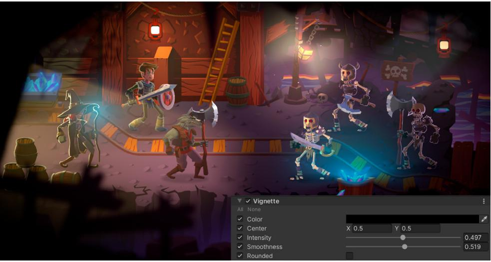

Vignette darkens the image towards the edges, which is another real-life lens property that draws attention to the center of an image.

#### **Film Grain**

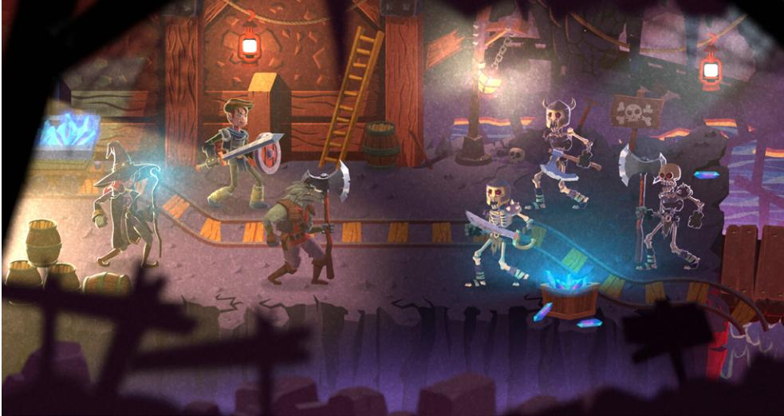

Film Grain applies subtle noise over the image, producing an effect similar to a film negative's emulsion structure and resulting visible grain in analog movies.

#### **Panini Projection**

Designed to help render perspective views with a very large field of view, Panini Projection can also be used in 2D to stylize the image with a cylindrical distortion.

## Optimization tips

- Use as few post-processing effects as possible.
- Use less intensive effects, such as Bloom, Chromatic Aberration, Color Grading, Lens Distortion, or Vignette, wherever possible.
- Film Grain and Panini Projection are more costly.
- Disable High Quality Filtering on Bloom

## **Conclusion**

You've come a long way by getting to the end of this guide. I hope the steps and knowledge presented here will help you start on your journey to creating beautiful 2D games in Unity.

Over the years, we've encountered many people who struggle with game development, those who seem to think there is always one more step to learn or tutorial to watch before they can really start. But the best way to learn is by doing. So start now.

Once you take that first step, yes, there's a good chance you'll hit a few roadblocks. But then you might have to dive into a tutorial or technical article or get some good tips from a fellow developer, and you'll be back on your way again.

Game development requires you to both do and learn. It will always be a balance between the two.

It's not possible to explore every area of 2D game development in just one e-book. But this is a good reference to keep close at hand as you kick off your project and deepen your knowledge of these tools. There are many additional resources for developers and artists, including Unity [Documentation,](https://docs.unity.com/?utm_source=blog&utm_medium=pdf&utm_campaign=asset-links-gmg-choose-unity-for-2d&utm_content=2d-game-art,-animation-and-lighting-ebook) [Unity](https://learn.unity.com/?utm_source=blog&utm_medium=pdf&utm_campaign=asset-links-gmg-choose-unity-for-2d&utm_content=2d-game-art,-animation-and-lighting-ebook)  [Learn,](https://learn.unity.com/?utm_source=blog&utm_medium=pdf&utm_campaign=asset-links-gmg-choose-unity-for-2d&utm_content=2d-game-art,-animation-and-lighting-ebook) and [the Unity Blog](https://blog.unity.com/?utm_source=blog&utm_medium=pdf&utm_campaign=asset-links-gmg-choose-unity-for-2d&utm_content=2d-game-art,-animation-and-lighting-ebook)

Good luck!

– Jarek Majewski and the Unity 2D team

[unity.com](https://unity.com/)